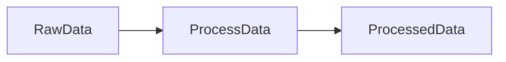

# Flowthru Starter Tutorial

This tutorial walks you through building your first data pipeline with Flowthru. You'll create a complete working project that processes data through multiple stages with compile-time type safety.

## 1. Core

### 1.1 Creating CS Project, Directory Structure, Seed Data

**Create the project:**
```bash
dotnet new console -n MyPipeline
cd MyPipeline
```

**Add Flowthru reference:**

*For NuGet package (production):*
```xml
<ItemGroup>
  <PackageReference Include="Flowthru" Version="1.0.0" />
</ItemGroup>
```

*For local development with ProjectReference:*
```xml
<ItemGroup>
  <ProjectReference Include="../path/to/Flowthru/Flowthru.csproj" />
  <!-- Required for local development. When using NuGet, this is automatic. -->
  <ProjectReference Include="../path/to/Flowthru.SourceGenerators/Flowthru.SourceGenerators.csproj"
                    ReferenceOutputAssembly="false"
                    OutputItemType="Analyzer" />
</ItemGroup>
```

**Create directory structure:**
```
MyPipeline/
├── Program.cs
├── Data/
│   ├── Catalog.cs
│   ├── _01_Raw/
│   │   ├── Catalog.Raw.cs
│   │   ├── Datasets/
│   │   │   └── input.csv
│   │   └── Schemas/
│   │       └── InputSchema.cs
│   ├── _02_Cleaned/
│   │   ├── Catalog.Cleaned.cs
│   │   ├── Datasets/
│   │   │   └── <pipeline-generated data>
│   │   └── Schemas/
│   │       └── CleanedSchema.cs
├── Pipelines/
│   ├── DataProcessing/
│   │   ├── DataProcessingPipeline.cs
│   │   └── Nodes/
│   │       └── ProcessNode.cs
└── appsettings.json
└── MyPipeline.csproj
```

**Copy data files to output:**
```xml
<ItemGroup>
  <None Update="appsettings.json">
    <CopyToOutputDirectory>PreserveNewest</CopyToOutputDirectory>
  </None>
</ItemGroup>
```

### 1.2 Creating the Flowthru CLI Entry Point

**Create `Program.cs`:**
```csharp
using Flowthru.Cli;
using Microsoft.Extensions.Logging;
using MyPipeline.Data;
using MyPipeline.Pipelines.DataProcessing;

namespace MyPipeline;

public class Program
{
  public static async Task<int> Main(string[] args)
  {
    var cli = FlowthruCliBuilder
      .Create(flowthru =>
      {
        // Load configuration from appsettings.json
        flowthru.UseConfiguration();
        flowthru.UseCatalog<MyCatalog>();

        // Register your pipeline
        flowthru
          .RegisterPipeline<MyCatalog>(
            label: "DataProcessing",
            pipeline: DataProcessingPipeline.Create
          )
          .WithDescription("Processes raw data into cleaned output");
      })
      .ConfigureLogging(logging =>
      {
        logging.AddConsole();
        logging.SetMinimumLevel(LogLevel.Information);
      })
      .Build();

    return await cli.RunAsync(args);
  }
}
```

**For pipelines with parameters:**
```csharp
flowthru
  .RegisterPipelineWithConfiguration<MyCatalog, MyPipeline.Params>(
    label: "DataScience",
    pipeline: DataSciencePipeline.Create,
    configurationSection: "Flowthru:Pipelines:DataScience"
  )
  .WithDescription("Trains ML model");
```

**Run your pipeline:**
```bash
dotnet run -- DataProcessing
```

### 1.3 Pipeline Space (Creating a New Pipeline)

**Create `Pipelines/DataProcessing/DataProcessingPipeline.cs`:**
```csharp
using Flowthru.Pipelines;
using MyPipeline.Data;
using MyPipeline.Pipelines.DataProcessing.Nodes;

namespace MyPipeline.Pipelines.DataProcessing;

public static class DataProcessingPipeline
{
  public static Pipeline Create(MyCatalog catalog)
  {
    return PipelineBuilder.CreatePipeline(pipeline =>
    {
      // Single input → single output
      pipeline.AddNode(
        label: "ProcessData",
        description: "Processes the data into strongly-typed schema"
        transform: ProcessNode.Create(),
        input: catalog.RawData,
        output: catalog.ProcessedData
      );
    });
  }
}
```

**For multi-input nodes:**
```csharp
pipeline.AddNode(
  label: "JoinData",
  description: """
    Joints the processed data tables into the dataset used for model training
  """
  transform: JoinNode.Create(),
  input: (catalog.Companies, catalog.Shuttles, catalog.Reviews),
  output: catalog.JoinedData
);
```

**For multi-output nodes:**
```csharp
pipeline.AddNode(
  label: "SplitData",
  description: """
    Performs a test-train split on the model training dataset
  """
  transform: SplitNode.Create(),
  input: catalog.InputData,
  output: (catalog.TrainData, catalog.TestData)
);
```

**For parameterized pipelines:**
```csharp
public static class DataSciencePipeline
{
  public record Params
  {
    public ModelConfig ModelParams { get; init; } = new();
  }

  public static Pipeline Create(MyCatalog catalog, Params parameters)
  {
    return PipelineBuilder.CreatePipeline(pipeline =>
    {
      pipeline.AddNode(
        label: "TrainModel",
        transform: TrainModelNode.Create(parameters.ModelParams),
        input: catalog.TrainingData,
        output: catalog.Model
      );
    });
  }
}
```

### 1.4 Data Space (Declaring New Data Catalog Entries, Schemas)

#### Creating the Data Catalog

**Create `Data/Catalog.cs`:**
```csharp
using Flowthru.Data;

namespace MyPipeline.Data;

public partial class Catalog : DataCatalogBase
{
  private readonly string _basePath;

  public Catalog(string basePath)
  {
    _basePath = basePath;
    InitializeCatalogProperties();  // Required!
  }
}
```

**Create `Data/_01_Raw/Catalog.Raw.cs`:**
```csharp
using Flowthru.Data;
using MyPipeline.Data._01_Raw.Schemas;

namespace MyPipeline.Data;

public partial class Catalog
{
  // CSV file entry
  public ICatalogEntry<IEnumerable<InputSchema>> RawData =>
    GetOrCreateEntry(() =>
      CatalogEntries.Enumerable.Csv<InputSchema>(
        label: "RawData",
        filePath: $"{_basePath}/_01_Raw/Datasets/input.csv"
      )
    );
}
```

**Create `Data/_02_Cleaned/Catalog.Cleaned.cs`:**
```csharp
using Flowthru.Data;
using MyPipeline.Data._02_Cleaned.Schemas;

namespace MyPipeline.Data;

public partial class Catalog
{
  // Parquet file entry
  public ICatalogEntry<IEnumerable<CleanedSchema>> ProcessedData =>
    GetOrCreateEntry(() =>
      CatalogEntries.Enumerable.Parquet<CleanedSchema>(
        label: "ProcessedData",
        filePath: $"{_basePath}/_02_Cleaned/Datasets/output.parquet"
      )
    );

  // In-memory only (not persisted to disk)
  public ICatalogEntry<IEnumerable<FeatureRow>> Features =>
    GetOrCreateEntry(() =>
      CatalogEntries.Enumerable.Memory<FeatureRow>(label: "Features")
    );
}
```

**For models and reporting (optional):**
```csharp
// Data/_03_Models/Catalog.Models.cs
public partial class Catalog
{
  // Single object (not a collection)
  public ICatalogEntry<ModelMetrics> ModelMetrics =>
    GetOrCreateEntry(() =>
      CatalogEntries.Single.Json<ModelMetrics>(
        label: "ModelMetrics",
        filePath: $"{_basePath}/_03_Models/Datasets/model_metrics.json"
      )
    );
}
```

**Why use partial classes?**
Partial classes allow you to split your catalog across multiple files organized by data layer. This keeps catalog entries co-located with their schemas and makes large projects more maintainable.

**Available entry types:**
```csharp
// Collections (IEnumerable<T>)
CatalogEntries.Enumerable.Csv<T>(label, filePath)
CatalogEntries.Enumerable.Parquet<T>(label, filePath)
CatalogEntries.Enumerable.Json<T>(label, filePath)
CatalogEntries.Enumerable.Excel<T>(label, filePath, sheetName)
CatalogEntries.Enumerable.Memory<T>(label)

// Single objects
CatalogEntries.Single.Json<T>(label, filePath)
CatalogEntries.Single.Memory<T>(label)
```

#### Creating Data Schemas

**Create `Data/_01_Raw/Schemas/InputSchema.cs`:**
```csharp
using Flowthru.Abstractions;

namespace MyPipeline.Data._01_Raw.Schemas;

[FlowthruSchema]
public partial record InputSchema
{
  [SerializedLabel("id")]
  public required string Id { get; init; }

  [SerializedLabel("name")]
  public required string Name { get; init; }

  [SerializedLabel("value")]
  public string? Value { get; init; }  // Nullable - may be missing

  [SerializedLabel("count")]
  public required string Count { get; init; }
}
```

**Create `Data/_02_Cleaned/Schemas/CleanedSchema.cs`:**
```csharp
using Flowthru.Abstractions;

namespace MyPipeline.Data._02_Cleaned.Schemas;

[FlowthruSchema]
public partial record CleanedSchema
{
  [SerializedLabel("id")]
  public required string Id { get; init; }

  [SerializedLabel("name")]
  public required string Name { get; init; }

  [SerializedLabel("value")]
  public decimal Value { get; init; }  // Parsed to decimal

  [SerializedLabel("count")]
  public int Count { get; init; }  // Parsed to int
}
```

**Schema requirements:**
- Add `[FlowthruSchema]` attribute to enable automatic interface generation
- Mark the type as `partial` to allow source generator to add marker interfaces
- Use `required` modifier for non-nullable properties
- The source generator automatically determines:
  - `IFlatSchema` vs `INestedSchema` based on property types (primitives vs collections/objects)
  - `ITextSerializable`, `IBinarySerializable`, `IStructuredSerializable` based on schema structure
```

### 1.5 Node Space (Creating New Functional Nodes, Declaring Inputs & Outputs)

#### Single-Input, Single-Output Node

**Create `Pipelines/DataProcessing/Nodes/ProcessNode.cs`:**
```csharp
using MyPipeline.Data._01_Raw.Schemas;
using MyPipeline.Data._02_Cleaned.Schemas;

namespace MyPipeline.Pipelines.DataProcessing.Nodes;

public static class ProcessNode
{
  public static Func<IEnumerable<InputSchema>, Task<IEnumerable<CleanedSchema>>> Create()
  {
    return async (input) =>
    {
      var processed = input
        .Select(raw => Parse(raw))
        .Where(item => item != null)
        .Cast<CleanedSchema>();

      return await Task.FromResult(processed);
    };
  }

  private static CleanedSchema? Parse(InputSchema raw)
  {
    // Parse string fields to proper types
    if (!decimal.TryParse(raw.Value, out var value))
      return null;  // Skip invalid records

    if (!int.TryParse(raw.Count, out var count))
      return null;

    return new CleanedSchema
    {
      Id = raw.Id,
      Name = raw.Name,
      Value = value,
      Count = count
    };
  }
}
```

#### Multi-Input, Single-Output Node

**Create `Pipelines/DataProcessing/Nodes/JoinNode.cs`:**
```csharp
public static class JoinNode
{
  public static Func<
    (IEnumerable<CompanySchema>, IEnumerable<ShuttleSchema>, IEnumerable<ReviewSchema>),
    Task<IEnumerable<JoinedSchema>>
  > Create()
  {
    return async (input) =>
    {
      // Destructure the tuple
      var (companies, shuttles, reviews) = input;

      // Perform joins
      var joined = reviews
        .Join(shuttles, r => r.ShuttleId, s => s.Id, (r, s) => new { Review = r, Shuttle = s })
        .Join(companies, rs => rs.Shuttle.CompanyId, c => c.Id,
          (rs, c) => new JoinedSchema
          {
            ShuttleId = rs.Shuttle.Id,
            CompanyName = c.Name,
            ReviewScore = rs.Review.Score,
            // ... map other fields
          });

      return await Task.FromResult(joined);
    };
  }
}
```

#### Single-Input, Multi-Output Node

**Create `Pipelines/DataScience/Nodes/SplitNode.cs`:**
```csharp
public static class SplitNode
{
  public static Func<
    IEnumerable<InputSchema>,
    Task<(IEnumerable<TrainSchema>, IEnumerable<TestSchema>)>
  > Create(double testSize = 0.2)
  {
    return async (input) =>
    {
      var data = input.ToList();
      var splitIndex = (int)(data.Count * (1 - testSize));

      var train = data.Take(splitIndex).Select(d => new TrainSchema { /* ... */ });
      var test = data.Skip(splitIndex).Select(d => new TestSchema { /* ... */ });

      return await Task.FromResult((train, test));
    };
  }
}
```

#### Node with Parameters

**Create `Pipelines/DataScience/Nodes/TrainModelNode.cs`:**
```csharp
public static class TrainModelNode
{
  public record ModelParams
  {
    public double LearningRate { get; init; } = 0.01;
    public int Epochs { get; init; } = 100;
  }

  public static Func<IEnumerable<TrainingData>, Task<Model>> Create(ModelParams? params = null)
  {
    var config = params ?? new ModelParams();

    return async (input) =>
    {
      // Use config.LearningRate, config.Epochs in training logic
      var model = TrainModel(input, config);
      return await Task.FromResult(model);
    };
  }

  private static Model TrainModel(IEnumerable<TrainingData> data, ModelParams config)
  {
    // Training implementation
  }
}
```

## 2. Auxiliary

### 2.1 Configuration Setup (appsettings)

**Create `appsettings.json`:**
```json
{
  "Flowthru": {
    "Catalog": {
      "Type": "MyPipeline.Data.Catalog",
      "ConstructorArgs": {
        "basePath": "Data"
      }
    },
    "Pipelines": {
      "DataScience": {
        "ModelParams": {
          "LearningRate": 0.01,
          "Epochs": 100
        }
      }
    },
    "Metadata": {
      "OutputDirectory": "Data/Metadata",
      "Providers": ["json", "mermaid"],
      "Json": {
        "WriteIndented": true
      },
      "Mermaid": {
        "Direction": "LR"
      }
    },
    "Logging": {
      "LogLevel": {
        "Default": "Information",
        "Flowthru": "Debug",
        "Microsoft": "Warning"
      }
    }
  }
}
```

**Configuration sections:**
- `Catalog.Type` - Fully qualified class name of your catalog
- `Catalog.ConstructorArgs` - Arguments passed to catalog constructor (property names must match parameter names)
  - `basePath` - Root directory for data files (typically `"Data"`)
- `Pipelines.{PipelineName}` - Parameters for pipelines registered with `RegisterPipelineWithConfiguration`
- `Metadata` - Automatic documentation generation settings
- `Logging` - Standard .NET logging configuration

**Environment-specific configs:**
```bash
# Create environment overrides
appsettings.Development.json  # Loaded when DOTNET_ENVIRONMENT=Development
appsettings.Production.json   # Loaded when DOTNET_ENVIRONMENT=Production
appsettings.Local.json        # Loaded last (add to .gitignore)
```

### 2.2 Metadata Setup

Metadata is automatically generated when you run pipelines. The generated files include:

**JSON metadata (`Data/Metadata/pipeline-name.json`):**
```json
{
  "pipelineName": "DataProcessing",
  "nodes": [
    {
      "name": "ProcessData",
      "inputs": ["RawData"],
      "outputs": ["ProcessedData"]
    }
  ],
  "catalogEntries": [
    {
      "label": "RawData",
      "type": "IEnumerable<InputSchema>",
      "storageType": "Csv"
    }
  ]
}
```

**Mermaid diagram (`Data/Metadata/pipeline-name.mmd`):**


View Mermaid diagrams at https://mermaid.live or with VS Code extensions.

---

## Complete Working Example

Here's a minimal complete pipeline project:

**Directory structure:**
```
MyPipeline/
├── Program.cs
├── appsettings.json
├── Data/
│   ├── Catalog.cs
│   └── _01_Raw/
│       ├── Catalog.Raw.cs
│       ├── Schemas/
│       │   └── DataSchema.cs
│       └── Datasets/
│           ├── input.csv
│           └── output.parquet
└── Pipelines/
    └── ProcessingPipeline.cs
```

**`Data/_01_Raw/Schemas/DataSchema.cs`:**
```csharp
using Flowthru.Abstractions;

namespace MyPipeline.Data._01_Raw.Schemas;

public record DataSchema : IFlatSchema, ITextSerializable, IBinarySerializable
{
  [SerializedLabel("id")]
  public string Id { get; init; } = null!;

  [SerializedLabel("value")]
  public string Value { get; init; } = null!;
}
```

**`Data/Catalog.cs`:**
```csharp
using Flowthru.Data;

namespace MyPipeline.Data;

public partial class Catalog : DataCatalogBase
{
  private readonly string _basePath;

  public Catalog(string basePath)
  {
    _basePath = basePath;
    InitializeCatalogProperties();
  }
}
```

**`Data/_01_Raw/Catalog.Raw.cs`:**
```csharp
using Flowthru.Data;
using MyPipeline.Data._01_Raw.Schemas;

namespace MyPipeline.Data;

public partial class Catalog
{
  public ICatalogEntry<IEnumerable<DataSchema>> Input =>
    GetOrCreateEntry(() => CatalogEntries.Enumerable.Csv<DataSchema>(
      label: "Input", filePath: $"{_basePath}/_01_Raw/Datasets/input.csv"));

  public ICatalogEntry<IEnumerable<DataSchema>> Output =>
    GetOrCreateEntry(() => CatalogEntries.Enumerable.Parquet<DataSchema>(
      label: "Output", filePath: $"{_basePath}/_01_Raw/Datasets/output.parquet"));
}
```

**`Pipelines/ProcessingPipeline.cs`:**
```csharp
using Flowthru.Pipelines;
using MyPipeline.Data;

namespace MyPipeline.Pipelines;

public static class ProcessingPipeline
{
  public static Pipeline Create(MyCatalog catalog)
  {
    return PipelineBuilder.CreatePipeline(pipeline =>
    {
      pipeline.AddNode(
        label: "PassThrough",
        transform: async (IEnumerable<DataSchema> input) => await Task.FromResult(input),
        input: catalog.Input,
        output: catalog.Output
      );
    });
  }
}
```

**`Program.cs`:**
```csharp
using Flowthru.Cli;
using Microsoft.Extensions.Logging;
using MyPipeline.Data;
using MyPipeline.Pipelines;

var cli = FlowthruCliBuilder
  .Create(flowthru =>
  {
    flowthru.UseConfiguration();
    flowthru.UseCatalog<Catalog>();
    flowthru.RegisterPipeline<Catalog>("Processing", ProcessingPipeline.Create);
  })
  .ConfigureLogging(logging => logging.AddConsole())
  .Build();

return await cli.RunAsync(args);
```

**Run it:**
```bash
dotnet run -- Processing
```

---

## Next Steps

- Add more nodes to create multi-stage pipelines
- Implement data validation and error handling in nodes
- Use parameterized pipelines for different model configurations
- Add logging within nodes for debugging
- Explore different storage formats (Parquet, JSON, Excel)
- Chain multiple pipelines together by sharing catalog entries
