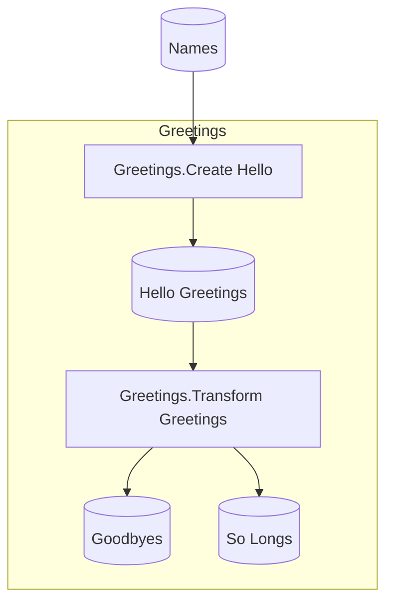

To get started with the Spaceflights template — as well as any starter templates Flowthru provides — we'll walk you through:

1. How to install the Flowthru project template
2. How to create your first pipeline project.

## Install the Flowthru Template

The Flowthru template provides the scaffolding for new pipeline projects. Install it globally with:

```bash
dotnet new install Flowthru
```

This makes the `Flowthru` templates available for all future projects. If you've already installed it, running this command again will update to the latest version.

## Create the Project

Navigate to the folder where you want to store your project, then generate the Spaceflights project from the template:

```bash
dotnet new Flowthru.Minimal --name Spaceflights
```

This creates a new directory `Spaceflights/` with the following structure:

```
Spaceflights/
├── Program.cs                 # Application entry point
├── KedroSpaceflights.csproj   # Project file
├── appsettings.json           # Configuration
├── Data/                      # Data catalog and schemas
│   ├── Catalog.cs
│   ├── _01_Raw/
│   ├── _02_Intermediate/
│   └── ...
└── Pipelines/                 # Pipeline definitions
│   ├── DataProcessing/
│   ├── DataScience/
    └── Reporting/
```

Navigate into the project directory:

```bash
cd Spaceflights
```

## Verify the Installation

Build the project to confirm everything is set up correctly:

```bash
dotnet build
```

You should see output indicating a successful build:

```
Build succeeded.
    0 Warning(s)
    0 Error(s)
```

You can also run the template's example pipeline to verify that it runs:

```bash
dotnet run
```

If everything ran successfully, the run should end with something like:

```
═══════════════════════════════════════════════════════════
Pipeline: Pipelines
Status: ✓ SUCCESS
Duration: 00:00:00.051
Nodes: 2 executed
═══════════════════════════════════════════════════════════
```

The template includes a minimal, "Hello, World!" example pipeline that takes in a list of names, generates salutations for each, and then generates two types of farewells:



Obviously, this isn't answering our original Spaceflights questions yet — so let's move onto changing the minimal pipeline to do just that!

## What's Next?

Now that your project is set up, you'll add the Spaceflights datasets and define their schemas.

**Continue to: [Set Up Data](02-set-up-data.md)**
