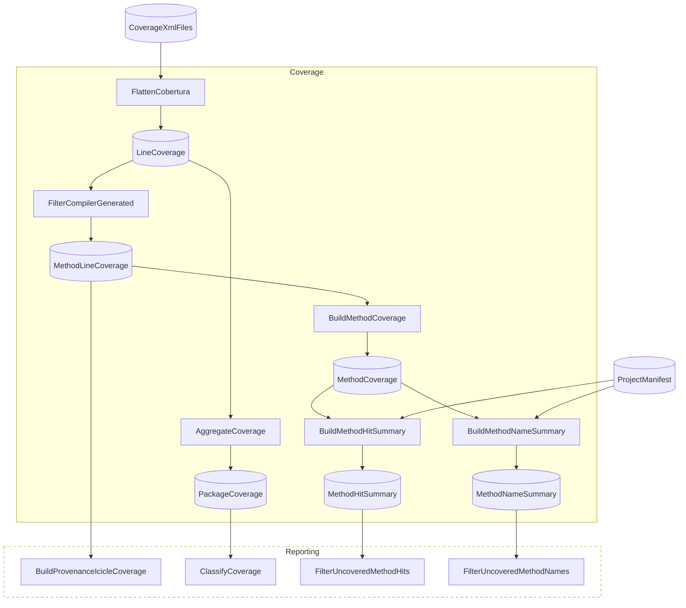

# FlowthruCoverage Advanced

> [!NOTE]
> How does Flowthru analyze its own test coverage with full control over the output shape?

Flowthru is the analytical workload analyzing itself here. This pipeline reads the Cobertura XML produced by `dotnet test` across the Flowthru monorepo and renders a custom artifact set — per-library provenance icicles with RGB unit/integration encoding, a coverage heatmap, two forms of uncovered-method audit, and a templated Markdown work-queue — that off-the-shelf tools like ReportGenerator and CodeCov don't surface. It exists because the team wanted analytical shapes those tools wouldn't give them.

This project:

- Stages 18+ Cobertura XML files from monorepo `dotnet test` results, plus a generated [`project_manifest.csv`](./scripts/generate-project-manifest.sh) and [`src_inventory.csv`](./scripts/generate-src-inventory.sh), into [`Data/_01_Raw/Datasets/`](./Data/_01_Raw/Datasets/) via three checked-in shell scripts.
- Runs a `Coverage` Flow (six C# Steps) that flattens Cobertura XML to row form, filters compiler-generated methods, and joins coverage rows against the project manifest into method-level summaries.
- Runs a `Reporting` Flow (mixed C# + Python) that classifies coverage by project type, renders a Plotly heatmap (Python) and per-library provenance icicle SVGs (Python), produces two forms of uncovered-method audit (rows with zero hits vs. methods absent from coverage data), and templates a Markdown work-queue from a checked-in `.md` template.
- Runs on demand via `nx run FlowthruCoverage:run`, not gated into CI — the artifacts surface the *state* of coverage for the team to act on, not pass/fail.

**This is not a template** — `dotnet new` does not scaffold it, and the analysis is hard-wired to the Flowthru monorepo's directory structure, project-naming conventions, and Cobertura XML schema. Assumes you've worked through [Spaceflights](../../starter/Spaceflights/) and [SpaceflightsPython](../../starter/SpaceflightsPython/).

## Getting Started

Requires Python 3.10+ and the [`uv`](https://docs.astral.sh/uv/) CLI. Uses existing `dotnet test` runs across the monorepo when present — the staging script copies the most recent `coverage.cobertura.xml` files into the example's input directory. If no test runs exist, the staging script finds no XMLs and the analysis produces empty reports (not an error).

Run all three commands from the **repo root**:

```bash
uv sync --project examples/advanced/FlowthruCoverage           # bootstrap the Python venv
dotnet test --collect:"XPlat Code Coverage"                    # produce Cobertura XML across the monorepo
nx run FlowthruCoverage:run                                    # stage inputs, then run the analysis
```

The headline outputs in [`Data/_04_Reporting/Datasets/`](./Data/_04_Reporting/Datasets/):

- [`unit_coverage_report.md`](./Data/_04_Reporting/Datasets/unit_coverage_report.md) — the prescriptive work-queue: scoreboard, quick-wins, cold-spots, and a per-library checklist.
- [`coverage_heatmap.png`](./Data/_04_Reporting/Datasets/coverage_heatmap.png) — coverage % by project × source package.
- [`icicles_provenance/`](./Data/_04_Reporting/Datasets/icicles_provenance/) — per-library SVG icicle trees with RGB-encoded provenance.
- [`uncovered_method_hits.csv`](./Data/_04_Reporting/Datasets/uncovered_method_hits.csv) and [`uncovered_method_names.csv`](./Data/_04_Reporting/Datasets/uncovered_method_names.csv) — two forms of the uncovered-method audit.

## Concepts

> **Reminder:** the patterns below illustrate how a real analytical workload composes in Flowthru, **not** a template to clone. The XML schemas, project-naming conventions, RGB encoding scheme, and report layout are tuned to the Flowthru monorepo specifically.

- **[Cobertura XML → flat row Schema](./Flows/CoverageAnalysis/Steps/FlattenCoberturaStep.cs):** the entire pipeline downstream of `FlattenCobertura` is Schema-to-Schema transformations over flat rows. The XML traversal happens exactly once, in one Step; every other Step composes by joining and projecting typed records. This is the analytical-pipeline reason to use Flowthru over an ad-hoc script — the XML never re-enters the picture.
- **[Mixed C# + Python in one Reporting Flow](./Flows/Reporting/Steps/generate_coverage_heatmap.py):** the C# Steps build the data shape the visualizations need (`PivotCoverageRow`, `ProvenanceIcicleNode`); the Python Steps render the artifacts via Plotly. The seam is at the Catalog — C# writes a typed Item, Python reads it as a DataFrame via the same Arrow IPC bridge from [SpaceflightsPythonEFCore](../SpaceflightsPythonEFCore/).
- **[Provenance icicle visualization with RGB encoding](./Flows/Reporting/Steps/BuildProvenanceIcicleStep.cs):** per library, render a hierarchical icicle (project → directory → file → method) where each tile's R/G/B channels independently encode unit-test coverage, integration coverage, and combined coverage. This is the analytical shape ReportGenerator and CodeCov don't give you — it's why the dogfood exists.
- **[Templated Markdown work-queue](./Data/_01_Raw/Templates/unit_coverage_report.md):** the Markdown template is a checked-in Catalog Item — a Raw input, not a generated artifact. [`BuildUnitCoverageReportStep`](./Flows/Reporting/Steps/BuildUnitCoverageReportStep.cs) fills in tokens (scoreboard table, quick-wins count, cold-spots list, per-library drill-downs) from coverage data and a threshold config Item. Updating the report layout is a template edit, not a Step rewrite.
- **[Two forms of uncovered-method audit](./Flows/Reporting/Steps/FilterRemoteSourceFilesStep.cs):** `uncovered_method_hits.csv` lists methods with zero recorded hits; `uncovered_method_names.csv` lists methods that don't appear in the coverage data at all (likely never instantiated by any test). Both flow through a final `FilterRemoteSourceFiles` Step that drops methods belonging to ASP.NET internals and other remote sources Flowthru doesn't own.
- **[Pre-pipeline staging scripts](./scripts/stage-coverage-xml.sh):** three checked-in shell scripts — [`stage-coverage-xml.sh`](./scripts/stage-coverage-xml.sh), [`generate-project-manifest.sh`](./scripts/generate-project-manifest.sh), [`generate-src-inventory.sh`](./scripts/generate-src-inventory.sh) — run from the nx target before the Flowthru harness starts. They handle the "input data is dynamic, derived from monorepo state" problem outside Flowthru's purview, then hand off typed CSV/XML inputs to the Catalog.

## Structure

### Diagram

<!-- flowthru:mermaid:start -->
#### Coverage



#### Reporting

```mermaid
flowchart TB

    %% External Data Inputs
    ProjectManifest[("ProjectManifest")]
    SrcInventory[("SrcInventory")]
    UnitCoverageReportOptions{{"UnitCoverageReportOptions"}}
    UnitCoverageReportTemplate[("UnitCoverageReportTemplate")]

    subgraph Coverage_us["Coverage"]
        MethodHitSummary[("MethodHitSummary")]
        MethodLineCoverage[("MethodLineCoverage")]
        MethodNameSummary[("MethodNameSummary")]
        PackageCoverage[("PackageCoverage")]
    end

    subgraph Reporting["Reporting"]
        ClassifyCoverage["ClassifyCoverage"]
        PivotCoverage[("PivotCoverage")]
        BuildProvenanceIcicleCoverage["BuildProvenanceIcicleCoverage"]
        ProvenanceIcicleCoverage[("ProvenanceIcicleCoverage")]
        GenerateCoverageHeatmap["GenerateCoverageHeatmap<br>──<br>IPythonExecutor"]
        CoverageHeatmap[("CoverageHeatmap")]
        AggregatePackageCoverage["AggregatePackageCoverage"]
        PackageCoverageMax[("PackageCoverageMax")]
        GenerateProvenanceCoverageIcicle["GenerateProvenanceCoverageIcicle<br>──<br>IPythonExecutor"]
        ProvenanceCoverageIcicles[("ProvenanceCoverageIcicles")]
        BuildUnitCoverageReport["BuildUnitCoverageReport"]
        UnitCoverageReport[("UnitCoverageReport")]
        FilterUncoveredMethodHits["FilterUncoveredMethodHits"]
        UncoveredMethodHitsRaw[("UncoveredMethodHitsRaw")]
        FilterUncoveredMethodNames["FilterUncoveredMethodNames"]
        UncoveredMethodNamesRaw[("UncoveredMethodNamesRaw")]
        FilterRemoteSourceFilesHits["FilterRemoteSourceFilesHits"]
        UncoveredMethodHits[("UncoveredMethodHits")]
        FilterRemoteSourceFilesNames["FilterRemoteSourceFilesNames"]
        UncoveredMethodNames[("UncoveredMethodNames")]
    end

    %% Service legend
    subgraph service_legend["services"]
        svc_Flowthru_Step_Python_IPythonExecutor["IPythonExecutor<br>• cache: neutral<br>• cap: 1"]
    end
    style service_legend fill:#EEF4FF,stroke:#3B6FB0
    classDef serviceNode fill:#EEF4FF,stroke:#3B6FB0
    class svc_Flowthru_Step_Python_IPythonExecutor serviceNode

    %% Edges
    PackageCoverage --> ClassifyCoverage
    ProjectManifest --> ClassifyCoverage
    ClassifyCoverage --> PivotCoverage
    MethodLineCoverage --> BuildProvenanceIcicleCoverage
    ProjectManifest --> BuildProvenanceIcicleCoverage
    SrcInventory --> BuildProvenanceIcicleCoverage
    BuildProvenanceIcicleCoverage --> ProvenanceIcicleCoverage
    PivotCoverage --> GenerateCoverageHeatmap
    GenerateCoverageHeatmap --> CoverageHeatmap
    PivotCoverage --> AggregatePackageCoverage
    AggregatePackageCoverage --> PackageCoverageMax
    ProvenanceIcicleCoverage --> GenerateProvenanceCoverageIcicle
    GenerateProvenanceCoverageIcicle --> ProvenanceCoverageIcicles
    ProvenanceIcicleCoverage --> BuildUnitCoverageReport
    UnitCoverageReportTemplate --> BuildUnitCoverageReport
    UnitCoverageReportOptions --> BuildUnitCoverageReport
    BuildUnitCoverageReport --> UnitCoverageReport
    MethodHitSummary --> FilterUncoveredMethodHits
    FilterUncoveredMethodHits --> UncoveredMethodHitsRaw
    MethodNameSummary --> FilterUncoveredMethodNames
    FilterUncoveredMethodNames --> UncoveredMethodNamesRaw
    UncoveredMethodHitsRaw --> FilterRemoteSourceFilesHits
    FilterRemoteSourceFilesHits --> UncoveredMethodHits
    UncoveredMethodNamesRaw --> FilterRemoteSourceFilesNames
    FilterRemoteSourceFilesNames --> UncoveredMethodNames

    classDef collapsed stroke-dasharray:5 5,fill:transparent
    class Coverage_us collapsed
```


<!-- flowthru:mermaid:end -->

### Files

<!-- flowthru:filetree:start -->
```
FlowthruCoverage/
├── Program.cs  # entry point
├── Data/
│   ├── _01_Raw/
│   │   ├── Datasets/
│   │   │   ├── Flowthru.Cli.Tests.xml
│   │   │   ├── Flowthru.Core.Architecture.Tests.xml
│   │   │   ├── Flowthru.Core.CodeFixes.Tests.xml
│   │   │   ├── Flowthru.Core.SourceGenerators.Tests.xml
│   │   │   ├── Flowthru.Core.Tests.xml
│   │   │   ├── Flowthru.Extensions.Csv.Tests.xml
│   │   │   ├── Flowthru.Extensions.EFCore.Bulk.Tests.xml
│   │   │   ├── Flowthru.Extensions.EFCore.Tests.xml
│   │   │   ├── Flowthru.Extensions.Excel.Tests.xml
│   │   │   ├── Flowthru.Extensions.GQL.Tests.xml
│   │   │   ├── Flowthru.Extensions.Http.Tests.xml
│   │   │   ├── Flowthru.Extensions.Metadata.Diagnostics.Tests.xml
│   │   │   ├── Flowthru.Extensions.Metadata.Json.Tests.xml
│   │   │   ├── Flowthru.Extensions.Metadata.Mermaid.Tests.xml
│   │   │   ├── Flowthru.Extensions.Parquet.Tests.xml
│   │   │   ├── Flowthru.Extensions.Python.SourceGenerators.Tests.xml
│   │   │   ├── Flowthru.Extensions.Python.Tests.xml
│   │   │   ├── Flowthru.Extensions.Xml.Tests.xml
│   │   │   ├── Flowthru.FUnit.CodeFixes.Tests.xml
│   │   │   ├── Flowthru.FUnit.SourceGenerators.Tests.xml
│   │   │   ├── Flowthru.FUnit.Tests.xml
│   │   │   ├── Flowthru.Misc.DataFrames.SourceGenerators.Tests.xml
│   │   │   ├── Flowthru.Misc.DataFrames.Tests.xml
│   │   │   ├── Flowthru.Tests.xml
│   │   │   ├── FlowthruCoverage.xml
│   │   │   ├── Iris.xml
│   │   │   ├── IrisFUnit.xml
│   │   │   ├── IrisPython.xml
│   │   │   ├── KedroIris.xml
│   │   │   ├── KedroIrisFUnit.xml
│   │   │   ├── KedroIrisPython.xml
│   │   │   ├── KedroSpaceflights.xml
│   │   │   ├── KedroSpaceflightsCustom.xml
│   │   │   ├── KedroSpaceflightsFUnit.xml
│   │   │   ├── KedroSpaceflightsGQL.xml
│   │   │   ├── KedroSpaceflightsPython.xml
│   │   │   ├── Minimal.xml
│   │   │   ├── project_manifest.csv
│   │   │   ├── RetailDataSplitFlow.xml
│   │   │   ├── SimpleEffectsExample.xml
│   │   │   ├── Spaceflights.xml
│   │   │   ├── SpaceflightsDistributed.xml
│   │   │   ├── SpaceflightsEFCore.xml
│   │   │   ├── SpaceflightsEnhanced.xml
│   │   │   ├── SpaceflightsFUnit.xml
│   │   │   ├── SpaceflightsGQL.xml
│   │   │   ├── SpaceflightsHybridCatalog.xml
│   │   │   ├── SpaceflightsNewTypes.xml
│   │   │   ├── SpaceflightsPython.xml
│   │   │   ├── SpaceflightsPythonEFCore.xml
│   │   │   ├── SpaceflightsStagingSchema.xml
│   │   │   └── src_inventory.csv
│   │   ├── Schemas/
│   │   │   ├── CoberturaReport.cs
│   │   │   ├── ProjectManifestEntry.cs
│   │   │   └── SrcInventoryEntry.cs
│   │   └── Templates/
│   │       └── unit_coverage_report.md
│   ├── ...
│   └── _04_Reporting/
│       ├── Datasets/
│       │   ├── coverage_heatmap.csv
│       │   ├── coverage_heatmap.png
│       │   ├── icicle_coverage_provenance.csv
│       │   ├── package_coverage_max.csv
│       │   ├── uncovered_method_hits.csv
│       │   ├── uncovered_method_names.csv
│       │   ├── unit_coverage_report.md
│       │   └── icicles_provenance/
│       │       ├── Flowthru.Cli.svg
│       │       ├── Flowthru.Core.CodeFixes.svg
│       │       ├── Flowthru.Core.SourceGenerators.svg
│       │       ├── Flowthru.Core.svg
│       │       ├── Flowthru.Extensions.Csv.svg
│       │       ├── Flowthru.Extensions.EFCore.Bulk.svg
│       │       ├── Flowthru.Extensions.EFCore.svg
│       │       ├── Flowthru.Extensions.Excel.svg
│       │       ├── Flowthru.Extensions.GQL.svg
│       │       ├── Flowthru.Extensions.Http.svg
│       │       ├── Flowthru.Extensions.Metadata.Diagnostics.svg
│       │       ├── Flowthru.Extensions.Metadata.Json.svg
│       │       ├── Flowthru.Extensions.Metadata.Mermaid.svg
│       │       ├── Flowthru.Extensions.Parquet.svg
│       │       ├── Flowthru.Extensions.Python.SourceGenerators.svg
│       │       ├── Flowthru.Extensions.Python.svg
│       │       ├── Flowthru.Extensions.Xml.svg
│       │       ├── Flowthru.FUnit.CodeFixes.svg
│       │       ├── Flowthru.FUnit.SourceGenerators.svg
│       │       ├── Flowthru.FUnit.svg
│       │       ├── Flowthru.Misc.DataFrames.SourceGenerators.svg
│       │       └── Flowthru.Misc.DataFrames.svg
│       └── Schemas/
│           ├── PackageCoverageMaxRow.cs
│           ├── PivotCoverageRow.cs
│           └── ProvenanceIcicleNode.cs
├── Flows/
│   ├── CoverageAnalysis/
│   │   ├── CoverageFlow.cs
│   │   └── Steps/
│   │       ├── AggregateCoverageStep.cs
│   │       ├── BuildMethodCoverageStep.cs
│   │       ├── BuildMethodHitSummaryStep.cs
│   │       ├── BuildMethodNameSummaryStep.cs
│   │       ├── CompilerGeneratedFilter.cs
│   │       ├── FilterCompilerGeneratedStep.cs
│   │       └── FlattenCoberturaStep.cs
│   └── Reporting/
│       ├── __init__.py
│       ├── __pycache__/
│       │   ├── __init__.cpython-310.pyc
│       │   └── __init__.cpython-313.pyc
│       └── Steps/
│           ├── __init__.py
│           ├── AggregatePackageCoverageStep.cs
│           ├── BuildProvenanceIcicleStep.cs
│           ├── BuildUnitCoverageReportStep.cs
│           ├── ClassifyCoverageStep.cs
│           ├── FilterRemoteSourceFilesStep.cs
│           ├── generate_coverage_heatmap.py
│           ├── generate_coverage_icicle.py
│           └── __pycache__/
│               ├── __init__.cpython-310.pyc
│               ├── __init__.cpython-313.pyc
│               ├── generate_coverage_heatmap.cpython-310.pyc
│               ├── generate_coverage_heatmap.cpython-313.pyc
│               ├── generate_coverage_icicle.cpython-310.pyc
│               └── generate_coverage_icicle.cpython-313.pyc
└── scripts/
    ├── generate-project-manifest.sh
    ├── generate-src-inventory.sh
    └── stage-coverage-xml.sh
```
<!-- flowthru:filetree:end -->
