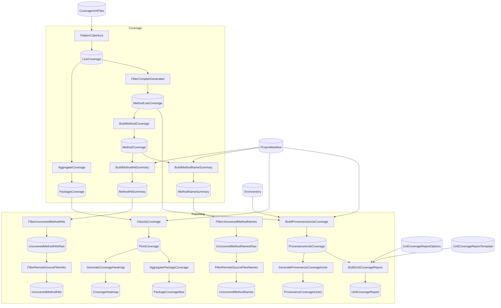

# FlowthruCoverage

<!-- flowthru:mermaid:start -->

<!-- flowthru:mermaid:end -->

<!-- flowthru:filetree:start -->
```
FlowthruCoverage/
├── Program.cs  # entry point
├── Data/
│   ├── _01_Raw/
│   │   ├── Datasets/
│   │   │   ├── Flowthru.Cli.Tests.xml
│   │   │   ├── Flowthru.Core.Architecture.Tests.xml
│   │   │   ├── Flowthru.Core.CodeFixes.Tests.xml
│   │   │   ├── Flowthru.Core.SourceGenerators.Tests.xml
│   │   │   ├── Flowthru.Core.Tests.xml
│   │   │   ├── Flowthru.Extensions.Csv.Tests.xml
│   │   │   ├── Flowthru.Extensions.EFCore.Bulk.Tests.xml
│   │   │   ├── Flowthru.Extensions.EFCore.Tests.xml
│   │   │   ├── Flowthru.Extensions.Excel.Tests.xml
│   │   │   ├── Flowthru.Extensions.GQL.Tests.xml
│   │   │   ├── Flowthru.Extensions.Http.Tests.xml
│   │   │   ├── Flowthru.Extensions.Metadata.Diagnostics.Tests.xml
│   │   │   ├── Flowthru.Extensions.Metadata.Json.Tests.xml
│   │   │   ├── Flowthru.Extensions.Metadata.Mermaid.Tests.xml
│   │   │   ├── Flowthru.Extensions.Parquet.Tests.xml
│   │   │   ├── Flowthru.Extensions.Python.SourceGenerators.Tests.xml
│   │   │   ├── Flowthru.Extensions.Python.Tests.xml
│   │   │   ├── Flowthru.Extensions.Xml.Tests.xml
│   │   │   ├── Flowthru.FUnit.CodeFixes.Tests.xml
│   │   │   ├── Flowthru.FUnit.SourceGenerators.Tests.xml
│   │   │   ├── Flowthru.FUnit.Tests.xml
│   │   │   ├── Flowthru.Misc.DataFrames.SourceGenerators.Tests.xml
│   │   │   ├── Flowthru.Misc.DataFrames.Tests.xml
│   │   │   ├── Flowthru.Tests.xml
│   │   │   ├── FlowthruCoverage.xml
│   │   │   ├── Iris.xml
│   │   │   ├── IrisFUnit.xml
│   │   │   ├── IrisPython.xml
│   │   │   ├── Spaceflights.xml
│   │   │   ├── SpaceflightsEnhanced.xml
│   │   │   ├── SpaceflightsFUnit.xml
│   │   │   ├── SpaceflightsGQL.xml
│   │   │   ├── SpaceflightsPython.xml
│   │   │   ├── Minimal.xml
│   │   │   ├── project_manifest.csv
│   │   │   ├── RetailDataSplitFlow.xml
│   │   │   ├── SimpleEffectsExample.xml
│   │   │   ├── SpaceflightsDistributed.xml
│   │   │   ├── SpaceflightsEFCore.xml
│   │   │   ├── SpaceflightsHybridCatalog.xml
│   │   │   ├── SpaceflightsNewTypes.xml
│   │   │   ├── SpaceflightsPythonEFCore.xml
│   │   │   ├── SpaceflightsStagingSchema.xml
│   │   │   └── src_inventory.csv
│   │   ├── Schemas/
│   │   │   ├── CoberturaReport.cs
│   │   │   ├── ProjectManifestEntry.cs
│   │   │   └── SrcInventoryEntry.cs
│   │   └── Templates/
│   │       └── unit_coverage_report.md
│   ├── ...
│   └── _04_Reporting/
│       ├── Datasets/
│       │   ├── coverage_heatmap.csv
│       │   ├── coverage_heatmap.png
│       │   ├── icicle_coverage_provenance.csv
│       │   ├── package_coverage_max.csv
│       │   ├── README.md
│       │   ├── uncovered_method_hits.csv
│       │   ├── uncovered_method_names.csv
│       │   ├── unit_coverage_report.md
│       │   └── icicles_provenance/
│       │       ├── Flowthru.Cli.svg
│       │       ├── Flowthru.Core.CodeFixes.svg
│       │       ├── Flowthru.Core.SourceGenerators.svg
│       │       ├── Flowthru.Core.svg
│       │       ├── Flowthru.Extensions.Csv.svg
│       │       ├── Flowthru.Extensions.EFCore.Bulk.svg
│       │       ├── Flowthru.Extensions.EFCore.svg
│       │       ├── Flowthru.Extensions.Excel.svg
│       │       ├── Flowthru.Extensions.GQL.svg
│       │       ├── Flowthru.Extensions.Http.svg
│       │       ├── Flowthru.Extensions.Metadata.Diagnostics.svg
│       │       ├── Flowthru.Extensions.Metadata.Json.svg
│       │       ├── Flowthru.Extensions.Metadata.Mermaid.svg
│       │       ├── Flowthru.Extensions.Parquet.svg
│       │       ├── Flowthru.Extensions.Python.SourceGenerators.svg
│       │       ├── Flowthru.Extensions.Python.svg
│       │       ├── Flowthru.Extensions.Xml.svg
│       │       ├── Flowthru.FUnit.CodeFixes.svg
│       │       ├── Flowthru.FUnit.SourceGenerators.svg
│       │       ├── Flowthru.FUnit.svg
│       │       ├── Flowthru.Misc.DataFrames.SourceGenerators.svg
│       │       └── Flowthru.Misc.DataFrames.svg
│       └── Schemas/
│           ├── PackageCoverageMaxRow.cs
│           ├── PivotCoverageRow.cs
│           └── ProvenanceIcicleNode.cs
├── Flows/
│   ├── CoverageAnalysis/
│   │   ├── CoverageFlow.cs
│   │   └── Steps/
│   │       ├── AggregateCoverageStep.cs
│   │       ├── BuildMethodCoverageStep.cs
│   │       ├── BuildMethodHitSummaryStep.cs
│   │       ├── BuildMethodNameSummaryStep.cs
│   │       ├── CompilerGeneratedFilter.cs
│   │       ├── FilterCompilerGeneratedStep.cs
│   │       └── FlattenCoberturaStep.cs
│   └── Reporting/
│       ├── __init__.py
│       ├── __pycache__/
│       │   ├── __init__.cpython-310.pyc
│       │   └── __init__.cpython-313.pyc
│       └── Steps/
│           ├── __init__.py
│           ├── AggregatePackageCoverageStep.cs
│           ├── BuildProvenanceIcicleStep.cs
│           ├── BuildUnitCoverageReportStep.cs
│           ├── ClassifyCoverageStep.cs
│           ├── FilterRemoteSourceFilesStep.cs
│           ├── generate_coverage_heatmap.py
│           ├── generate_coverage_icicle.py
│           └── __pycache__/
│               ├── __init__.cpython-310.pyc
│               ├── __init__.cpython-313.pyc
│               ├── generate_coverage_heatmap.cpython-310.pyc
│               ├── generate_coverage_heatmap.cpython-313.pyc
│               ├── generate_coverage_icicle.cpython-310.pyc
│               └── generate_coverage_icicle.cpython-313.pyc
└── scripts/
    ├── generate-project-manifest.sh
    ├── generate-src-inventory.sh
    └── stage-coverage-xml.sh
```
<!-- flowthru:filetree:end -->
