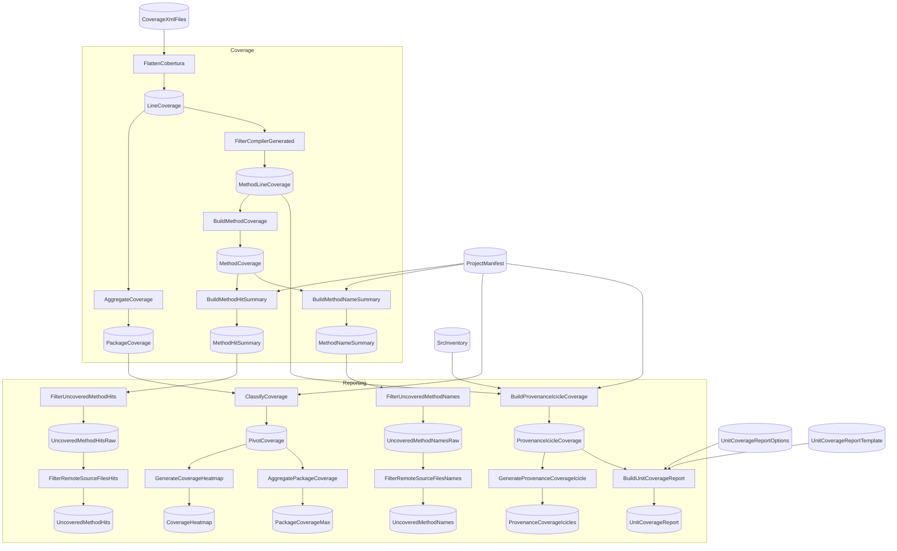

# FlowthruCoverage

<!-- flowthru:mermaid:start -->

```mermaid
flowchart TB

    %% External Data Inputs
    CoverageXmlFiles[("CoverageXmlFiles")]
    ProjectManifest[("ProjectManifest")]
    SrcInventory[("SrcInventory")]
    UnitCoverageReportOptions[("UnitCoverageReportOptions")]
    UnitCoverageReportTemplate[("UnitCoverageReportTemplate")]

    subgraph Coverage["Coverage"]
        FlattenCobertura["FlattenCobertura"]
        LineCoverage[("LineCoverage")]
        AggregateCoverage["AggregateCoverage"]
        PackageCoverage[("PackageCoverage")]
        FilterCompilerGenerated["FilterCompilerGenerated"]
        MethodLineCoverage[("MethodLineCoverage")]
        BuildMethodCoverage["BuildMethodCoverage"]
        MethodCoverage[("MethodCoverage")]
        BuildMethodHitSummary["BuildMethodHitSummary"]
        MethodHitSummary[("MethodHitSummary")]
        BuildMethodNameSummary["BuildMethodNameSummary"]
        MethodNameSummary[("MethodNameSummary")]
    end

    subgraph Reporting["Reporting"]
        ClassifyCoverage["ClassifyCoverage"]
        PivotCoverage[("PivotCoverage")]
        BuildProvenanceIcicleCoverage["BuildProvenanceIcicleCoverage"]
        ProvenanceIcicleCoverage[("ProvenanceIcicleCoverage")]
        GenerateCoverageHeatmap["GenerateCoverageHeatmap"]
        CoverageHeatmap[("CoverageHeatmap")]
        AggregatePackageCoverage["AggregatePackageCoverage"]
        PackageCoverageMax[("PackageCoverageMax")]
        GenerateProvenanceCoverageIcicle["GenerateProvenanceCoverageIcicle"]
        ProvenanceCoverageIcicles[("ProvenanceCoverageIcicles")]
        BuildUnitCoverageReport["BuildUnitCoverageReport"]
        UnitCoverageReport[("UnitCoverageReport")]
        FilterUncoveredMethodHits["FilterUncoveredMethodHits"]
        UncoveredMethodHitsRaw[("UncoveredMethodHitsRaw")]
        FilterUncoveredMethodNames["FilterUncoveredMethodNames"]
        UncoveredMethodNamesRaw[("UncoveredMethodNamesRaw")]
        FilterRemoteSourceFilesHits["FilterRemoteSourceFilesHits"]
        UncoveredMethodHits[("UncoveredMethodHits")]
        FilterRemoteSourceFilesNames["FilterRemoteSourceFilesNames"]
        UncoveredMethodNames[("UncoveredMethodNames")]
    end

    %% Edges
    CoverageXmlFiles --> FlattenCobertura
    FlattenCobertura --> LineCoverage
    LineCoverage --> AggregateCoverage
    AggregateCoverage --> PackageCoverage
    LineCoverage --> FilterCompilerGenerated
    FilterCompilerGenerated --> MethodLineCoverage
    PackageCoverage --> ClassifyCoverage
    ProjectManifest --> ClassifyCoverage
    ClassifyCoverage --> PivotCoverage
    MethodLineCoverage --> BuildMethodCoverage
    BuildMethodCoverage --> MethodCoverage
    MethodLineCoverage --> BuildProvenanceIcicleCoverage
    ProjectManifest --> BuildProvenanceIcicleCoverage
    SrcInventory --> BuildProvenanceIcicleCoverage
    BuildProvenanceIcicleCoverage --> ProvenanceIcicleCoverage
    PivotCoverage --> GenerateCoverageHeatmap
    GenerateCoverageHeatmap --> CoverageHeatmap
    PivotCoverage --> AggregatePackageCoverage
    AggregatePackageCoverage --> PackageCoverageMax
    MethodCoverage --> BuildMethodHitSummary
    ProjectManifest --> BuildMethodHitSummary
    BuildMethodHitSummary --> MethodHitSummary
    MethodCoverage --> BuildMethodNameSummary
    ProjectManifest --> BuildMethodNameSummary
    BuildMethodNameSummary --> MethodNameSummary
    ProvenanceIcicleCoverage --> GenerateProvenanceCoverageIcicle
    GenerateProvenanceCoverageIcicle --> ProvenanceCoverageIcicles
    ProvenanceIcicleCoverage --> BuildUnitCoverageReport
    UnitCoverageReportTemplate --> BuildUnitCoverageReport
    UnitCoverageReportOptions --> BuildUnitCoverageReport
    BuildUnitCoverageReport --> UnitCoverageReport
    MethodHitSummary --> FilterUncoveredMethodHits
    FilterUncoveredMethodHits --> UncoveredMethodHitsRaw
    MethodNameSummary --> FilterUncoveredMethodNames
    FilterUncoveredMethodNames --> UncoveredMethodNamesRaw
    UncoveredMethodHitsRaw --> FilterRemoteSourceFilesHits
    FilterRemoteSourceFilesHits --> UncoveredMethodHits
    UncoveredMethodNamesRaw --> FilterRemoteSourceFilesNames
    FilterRemoteSourceFilesNames --> UncoveredMethodNames

```
<!-- flowthru:mermaid:end -->
