# KedroSpaceflightsCustom

```mermaid
flowchart TB

    %% External Data Inputs
    CrossValidationParams[("CrossValidationParams")]
    KedroModelInputTable[("KedroModelInputTable")]
    ModelParams[("ModelParams")]
    RawCompanies[("RawCompanies")]
    RawReviews[("RawReviews")]
    RawShuttles[("RawShuttles")]

    subgraph DataDiagnostics["DataDiagnostics"]
        ExportCompaniesToDiagnosticCsv["ExportCompaniesToDiagnosticCsv"]
        CleanedCompaniesCsv[("CleanedCompaniesCsv")]
        ExportShuttlesToDiagnosticCsv["ExportShuttlesToDiagnosticCsv"]
        CleanedShuttlesCsv[("CleanedShuttlesCsv")]
        ValidateModelInputTableAgainstKedroSource["ValidateModelInputTableAgainstKedroSource"]
        ExportModelInputTableToDiagnosticCsv["ExportModelInputTableToDiagnosticCsv"]
        ModelInputTableCsv[("ModelInputTableCsv")]
        ExportModelInputTableToMinifiedJson["ExportModelInputTableToMinifiedJson"]
        ModelInputTableJsonMinified[("ModelInputTableJsonMinified")]
    end

    subgraph DataEvaluation["DataEvaluation"]
        PerformCrossValidatedOLSRegressionTest["PerformCrossValidatedOLSRegressionTest"]
        CrossValidationResults[("CrossValidationResults")]
        EvaluateOLSModel["EvaluateOLSModel"]
        ModelMetrics[("ModelMetrics")]
        ModelPredictions[("ModelPredictions")]
    end

    subgraph DataProcessing["DataProcessing"]
        PreprocessCompanies["PreprocessCompanies"]
        CleanedCompanies[("CleanedCompanies")]
        PreprocessShuttles["PreprocessShuttles"]
        CleanedShuttles[("CleanedShuttles")]
        PreprocessReviews["PreprocessReviews"]
        CleanedReviews[("CleanedReviews")]
        CreateModelInputTable["CreateModelInputTable"]
        ModelInputTable[("ModelInputTable")]
    end

    subgraph DataScience["DataScience"]
        CreateTestTrainSplitDatasets["CreateTestTrainSplitDatasets"]
        XTrain[("XTrain")]
        XTest[("XTest")]
        YTrain[("YTrain")]
        YTest[("YTest")]
        TrainOLSModel["TrainOLSModel"]
        Regressor[("Regressor")]
    end

    subgraph Reporting["Reporting"]
        GenerateConfusionMatrixChart["GenerateConfusionMatrixChart"]
        ConfusionMatrixChart[("ConfusionMatrixChart")]
        GeneratePassengerCapacityChart["GeneratePassengerCapacityChart"]
        ShuttlePassengerCapacityChart[("ShuttlePassengerCapacityChart")]
        ExportConfusionMatrixJson["ExportConfusionMatrixJson"]
        ConfusionMatrixPlot[("ConfusionMatrixPlot")]
        ExportPassengerCapacityJson["ExportPassengerCapacityJson"]
        ShuttlePassengerCapacityPlot[("ShuttlePassengerCapacityPlot")]
        GenerateCrossValidationChart["GenerateCrossValidationChart"]
        CrossValidationChart[("CrossValidationChart")]
        GenerateCrossValidationReport["GenerateCrossValidationReport"]
        CrossValidationReport[("CrossValidationReport")]
        ExportCrossValidationJson["ExportCrossValidationJson"]
        CrossValidationPlot[("CrossValidationPlot")]
        GeneratePredictionScatterChart["GeneratePredictionScatterChart"]
        PredictionScatterChart[("PredictionScatterChart")]
        ExportPredictionScatterJson["ExportPredictionScatterJson"]
        PredictionScatterPlot[("PredictionScatterPlot")]
    end

    %% Edges
    RawCompanies --> PreprocessCompanies
    PreprocessCompanies --> CleanedCompanies
    RawShuttles --> PreprocessShuttles
    PreprocessShuttles --> CleanedShuttles
    RawReviews --> PreprocessReviews
    PreprocessReviews --> CleanedReviews
    CleanedCompanies --> ExportCompaniesToDiagnosticCsv
    ExportCompaniesToDiagnosticCsv --> CleanedCompaniesCsv
    CleanedCompanies --> GenerateConfusionMatrixChart
    GenerateConfusionMatrixChart --> ConfusionMatrixChart
    CleanedShuttles --> ExportShuttlesToDiagnosticCsv
    ExportShuttlesToDiagnosticCsv --> CleanedShuttlesCsv
    CleanedShuttles --> GeneratePassengerCapacityChart
    GeneratePassengerCapacityChart --> ShuttlePassengerCapacityChart
    CleanedShuttles --> CreateModelInputTable
    CleanedCompanies --> CreateModelInputTable
    CleanedReviews --> CreateModelInputTable
    CreateModelInputTable --> ModelInputTable
    ConfusionMatrixChart --> ExportConfusionMatrixJson
    ExportConfusionMatrixJson --> ConfusionMatrixPlot
    ShuttlePassengerCapacityChart --> ExportPassengerCapacityJson
    ExportPassengerCapacityJson --> ShuttlePassengerCapacityPlot
    ModelInputTable --> CreateTestTrainSplitDatasets
    ModelParams --> CreateTestTrainSplitDatasets
    CreateTestTrainSplitDatasets --> XTrain
    CreateTestTrainSplitDatasets --> XTest
    CreateTestTrainSplitDatasets --> YTrain
    CreateTestTrainSplitDatasets --> YTest
    ModelInputTable --> ValidateModelInputTableAgainstKedroSource
    KedroModelInputTable --> ValidateModelInputTableAgainstKedroSource
    ModelInputTable --> ExportModelInputTableToDiagnosticCsv
    ExportModelInputTableToDiagnosticCsv --> ModelInputTableCsv
    ModelInputTable --> ExportModelInputTableToMinifiedJson
    ExportModelInputTableToMinifiedJson --> ModelInputTableJsonMinified
    ModelInputTable --> PerformCrossValidatedOLSRegressionTest
    CrossValidationParams --> PerformCrossValidatedOLSRegressionTest
    PerformCrossValidatedOLSRegressionTest --> CrossValidationResults
    XTrain --> TrainOLSModel
    YTrain --> TrainOLSModel
    TrainOLSModel --> Regressor
    CrossValidationResults --> GenerateCrossValidationChart
    GenerateCrossValidationChart --> CrossValidationChart
    CrossValidationResults --> GenerateCrossValidationReport
    GenerateCrossValidationReport --> CrossValidationReport
    Regressor --> EvaluateOLSModel
    XTest --> EvaluateOLSModel
    YTest --> EvaluateOLSModel
    EvaluateOLSModel --> ModelMetrics
    EvaluateOLSModel --> ModelPredictions
    CrossValidationChart --> ExportCrossValidationJson
    ExportCrossValidationJson --> CrossValidationPlot
    ModelMetrics --> GeneratePredictionScatterChart
    ModelPredictions --> GeneratePredictionScatterChart
    GeneratePredictionScatterChart --> PredictionScatterChart
    PredictionScatterChart --> ExportPredictionScatterJson
    ExportPredictionScatterJson --> PredictionScatterPlot

```

<!-- flowthru:mermaid:start -->

<!-- flowthru:mermaid:end -->

<!-- flowthru:filetree:start -->
```
KedroSpaceflightsCustom/
├── Program.cs  # entry point
├── Data/
│   ├── _01_Raw/
│   │   ├── Datasets/
│   │   │   ├── companies.csv
│   │   │   ├── kedro_model_input_table.csv
│   │   │   ├── NOTICE.md
│   │   │   ├── reviews.csv
│   │   │   └── shuttles.xlsx
│   │   └── Schemas/
│   │       ├── CompanyRawSchema.cs
│   │       ├── KedroModelInputSchema.cs
│   │       ├── ReviewRawSchema.cs
│   │       └── ShuttleRawSchema.cs
│   ├── ...
│   └── _06_Reporting/
│       ├── Datasets/
│       │   ├── confusion_matrix_plot.json
│       │   ├── cross_validation_plot.json
│       │   ├── cross_validation_report.md
│       │   ├── cross_validation_results.json
│       │   ├── prediction_scatter_plot.json
│       │   └── shuttle_passenger_capacity_plot.json
│       └── Schemas/
│           └── CrossValidationSchemas.cs
└── Flows/
    ├── DataDiagnostics/
    │   └── Steps/
    │       ├── PassthroughInputToOutputStep.cs
    │       └── ValidateAgainstKedroStep.cs
    ├── DataEvaluation/
    │   └── Steps/
    │       ├── CrossValidateModelStep.cs
    │       └── EvaluateModelStep.cs
    ├── DataProcessing/
    │   └── Steps/
    │       ├── CreateModelInputTableStep.cs
    │       ├── PreprocessCompaniesStep.cs
    │       ├── PreprocessReviewsStep.cs
    │       └── PreprocessShuttlesStep.cs
    ├── DataScience/
    │   └── Steps/
    │       ├── CreateTestTrainSplitStep.cs
    │       └── TrainModelStep.cs
    └── Reporting/
        └── Steps/
            ├── ComparePassengerCapacityStep.cs
            ├── CreateConfusionMatrixStep.cs
            ├── GenerateCrossValidationReportStep.cs
            ├── GeneratePredictionScatterStep.cs
            ├── PlotlyImageExportStep.cs
            ├── PlotlyJsonExportStep.cs
            └── VisualizeCrossValidationStep.cs
```
<!-- flowthru:filetree:end -->
