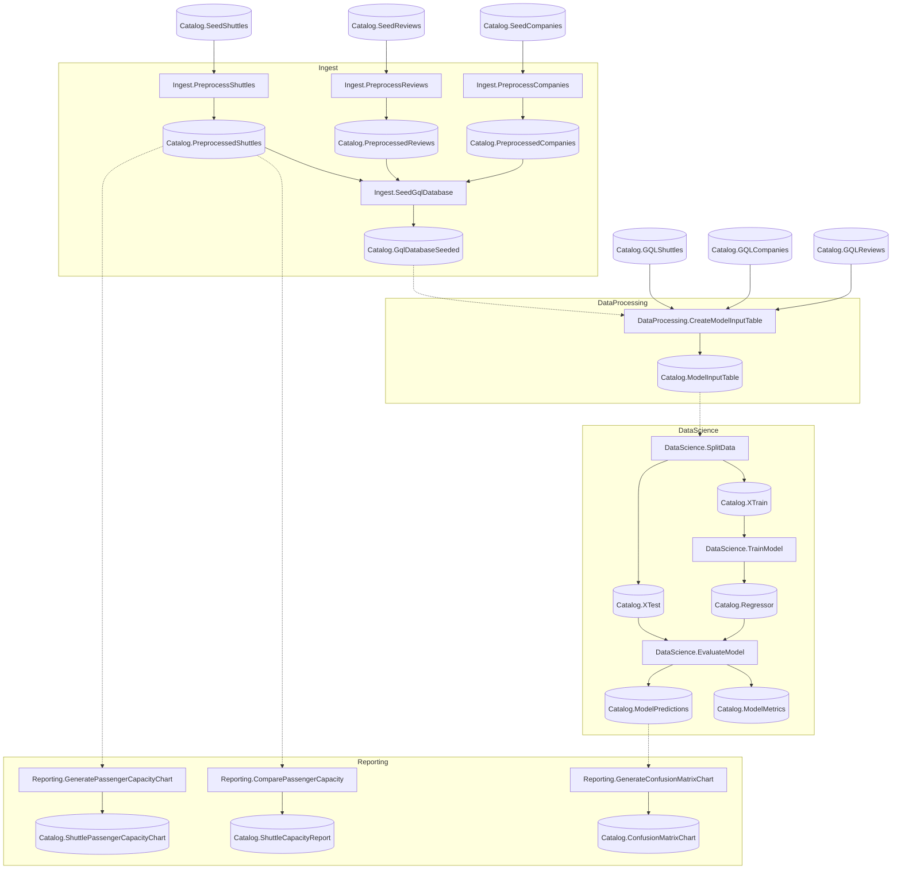

# KedroSpaceflights Starter

A Flowthru example project modeled off of the [Kedro Spaceflights Starter](https://github.com/kedro-org/kedro-starters/tree/main/spaceflights-pandas). 

This particular example demonstrates how to use GraphQL catalog items to ingest from a database. It's similar in style to Flowthru's EFCore examples.

## Getting Started

In order to execute this pipeline, move into this directory and run:

```bash
dotnet run
```

This will run both the Data Engineering and Data Science pipelines in sequence, generating the final [model outputs and visualizations.](./Data/_08_Reporting/Datasets)

Once you've confirmed your pipeline runs successfully, you can begin:

1. Adding new data, nodes, and pipelines to your project; and
2. Using the [Flowthru service](./Program.cs) to run your Flowthru pipelines from other .NET projects.

## Project Structure

### Flow Structure


