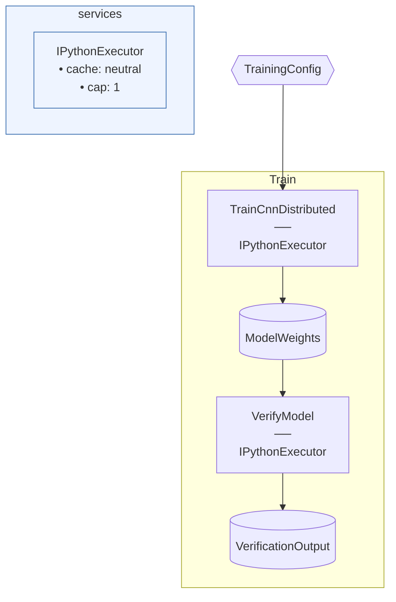

# MnistDistributed — distributed PyTorch training via TorchrunLauncher

A one-step Flowthru pipeline that trains a small CNN on synthetic
28×28 grayscale data using `TorchrunLauncher` (ADR-0014). The model
and dataset are deliberately tiny — a few KB of model weights, a few
hundred synthetic samples — because the example is for **exercising
the distributed launcher seam**, not for training quality.

## What it does

Two steps share one `TorchrunLauncher`-backed executor:

```
✓ TrainCnnDistributed (2651.60 ms)   -- step 1: 2 DDP epochs
→ VerifyModel executing…
[rank 0/2] entered verify_model
[rank 0/2] forward-pass norm = 0.4409
[rank 0] returning 54 bytes of verification dict
✓ VerifyModel (14.16 ms)             -- step 2: forward pass through same workers
Flow run finished in 2688.23 ms
```

`TorchrunLauncher { NProcPerNode = 2 }` resolves the venv's
`torchrun` binary, spawns two Python workers via
`torchrun --nproc_per_node=2 flowthru_worker.py`, and lets PyTorch's
gloo backend coordinate gradient synchronization across both ranks.
The same worker pool services both steps — `init_process_group` runs
once during training, the process group stays alive, and the
verification step reuses it without re-initialising. Only rank 0
returns results to the C# catalog; rank 1's stdout is redirected to
a per-rank log file (`/tmp/torchelastic_*`) to keep the Flowthru
protocol stream clean on the parent pipe.

Running with `NProcPerNode = 1` works identically — the rank-0 path
gracefully degrades to single-process execution for both steps.

## How the rank coordination works (slice 5)

The slice-5 worker (`flowthru_worker.py`) branches on `RANK` /
`WORLD_SIZE` env vars (set by torchrun) at startup:

- **Single-rank** (`WORLD_SIZE == 1`): existing protocol — read init
  from stdin, respond, loop on stdin for invokes, exit on shutdown.
- **Rank 0 in distributed**: read init + invoke from stdin as usual,
  but **also publish each message** to a sequenced broadcast file in
  `$TMPDIR/flowthru-bcast-<master-addr>-<master-port>-<run-id>/`.
  Return the result via stdout. Exit after one invoke (single-shot;
  torchrun expects to launch fresh per DDP cycle).
- **Non-rank-0**: redirect own stdout to `/dev/null` (no protocol
  corruption), poll the broadcast directory for the next sequenced
  file, dispatch the message locally, discard the response. Exit
  after one invoke.

All ranks call the user step function identically — DDP / NCCL / gloo
coordination is the user code's responsibility (via
`torch.distributed.init_process_group`, `DDP` wrapping, etc.). Rank
1 publishes nothing back to the host.

## Known limitations

- **Single-host only.** "Host" in the cluster sense — a physical
  machine. The broadcast session dir lives in `$TMPDIR`, which is
  local to each machine. Multi-host distributed training (where
  torchrun is launched per machine with a rendezvous endpoint
  coordinating across them) would need a shared filesystem for the
  broadcast dir; not implemented for slice 5. (Note: "host" here is
  the PyTorch/torchrun sense — Flowthru uses "node" in its DAG model
  for Items and Steps, so this README sticks to "host" / "machine"
  to avoid the collision.)

- **User code must guard `init_process_group`.** A multi-step
  distributed flow shares one process group across invokes (which is
  what makes the executor reusable). User steps should check
  `torch.distributed.is_initialized()` before calling
  `init_process_group` themselves — `verify_model` in this example
  does exactly that. HuggingFace `Trainer`, Accelerate, and Lightning
  all handle this guard internally, so trainer-based steps are fine
  without explicit handling.

## Running

```bash
cd examples/advanced/MnistDistributed
uv sync                       # materializes .venv with torch + pyarrow
dotnet run                    # runs with NProcPerNode = 2
```

Edit `Program.cs` to change `NProcPerNode` — the rank-0 single-rank
path and the rank-0/rank-N>0 distributed path both work via the same
worker entry point.

<!-- flowthru:mermaid:start -->

<!-- flowthru:mermaid:end -->

<!-- flowthru:filetree:start -->
```
MnistDistributed/
├── Program.cs  # entry point
├── Data/
│   ├── _05_ModelInput/
│   │   └── Schemas/
│   │       └── TrainingConfigSchema.cs
│   └── _06_Models/
│       └── Datasets/
│           ├── model.pkl
│           └── verification.pkl
└── Flows/
    └── Train/
        └── Steps/
            ├── __init__.py
            ├── train_ddp.py
            ├── verify_model.py
            └── __pycache__/
                ├── __init__.cpython-310.pyc
                ├── train_ddp.cpython-310.pyc
                └── verify_model.cpython-310.pyc
```
<!-- flowthru:filetree:end -->
