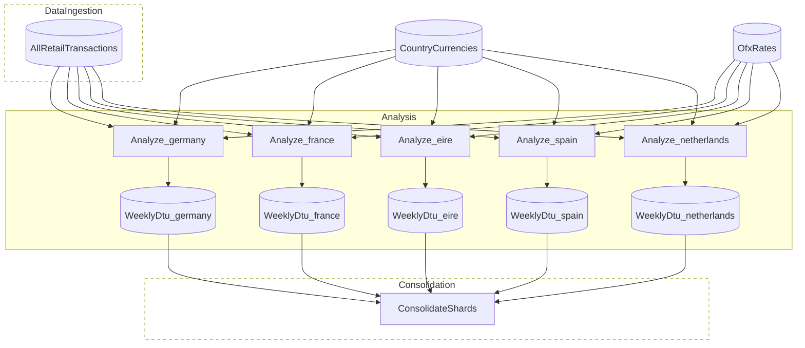
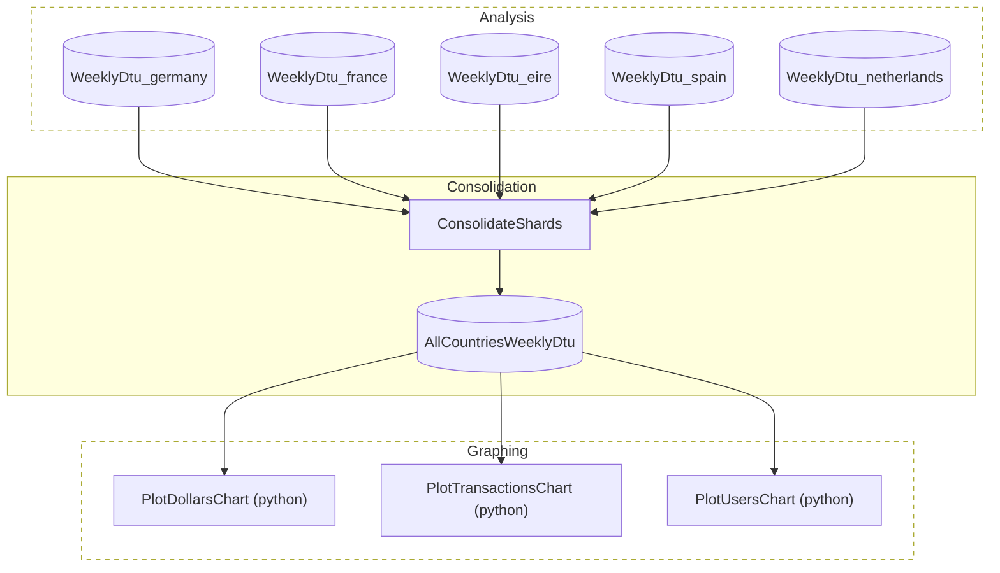
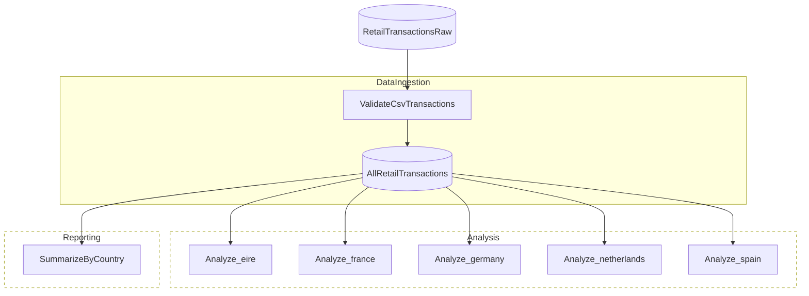
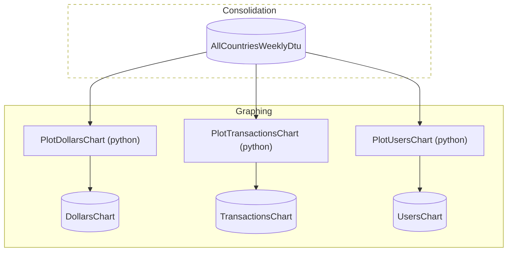
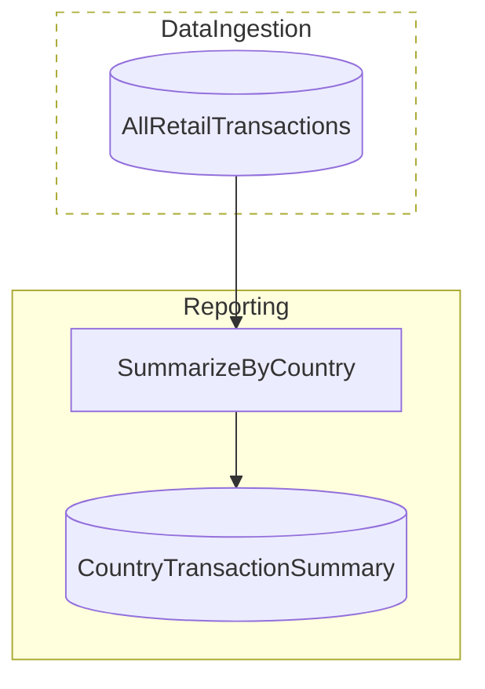

# RetailDataSplitFlow Advanced

> [!NOTE]
> How do I shard a Flow across N parallel branches at runtime?

This project demonstrates a **Flow factory** pattern — one Step template is instantiated once per country from a config-driven list, producing N parallel analysis branches that fan back in through a variadic consolidation Step. Pure vanilla Flowthru — no extensions, no reflection, no source generators; just closure capture, `foreach`-driven Step registration, and a variadic `AddStep` overload.

This project:

- Ingests a 43 MB retail-transactions CSV from GitHub (HTTP-cached for 24h), enriched with a country-currency mapping and FX rates, and reduces it to weekly per-country DTU (Daily-Transacting-Users) records.
- Reads a list of country names from [`appsettings.json`](./appsettings.json) under `Analysis:Countries`, then instantiates the analysis Step once per country — five parallel branches in the default config (Germany, France, Eire, Spain, Netherlands), each producing a country-specific Parquet output.
- Consolidates the parallel outputs through a single fan-in Step (`ConsolidateShards`) that takes the N input Catalog Items as one variadic parameter and flattens them with `SelectMany`.
- Renders the consolidated dataset into Plotly PNG charts (dollars, transactions, users) via three Python Steps in the `Graphing` Flow.

**This is not a template** — `dotnet new` does not scaffold it, and the country list, dataset URL, and currency mapping are domain-specific to the retail example. The Flow shape is original to this repo (not Kedro-derived). Assumes you've worked through [Spaceflights](../../starter/Spaceflights/) and [SpaceflightsPython](../../starter/SpaceflightsPython/).

## Getting Started

Requires Python 3.10+ and the [`uv`](https://docs.astral.sh/uv/) CLI. Bootstrap the Python environment, then run:

```bash
uv sync
nx run RetailDataSplitFlow
```

First run downloads the 43 MB transactions CSV from GitHub (subsequent runs within 24h use the HTTP cache). The chart outputs land under [`Data/_08_Reporting/Charts/`](./Data/_08_Reporting/Charts/) — `dollars_chart.png`, `transactions_chart.png`, `users_chart.png` — and the country-summary CSV at [`Data/_08_Reporting/Datasets/country_transaction_summary.csv`](./Data/_08_Reporting/Datasets/country_transaction_summary.csv).

## Concepts

> **Reminder:** the patterns below illustrate vanilla Flowthru's compositional limits, **not** a template to clone. The country list, dataset, and currency mapping are domain-specific to the retail example.

- **[Step factory with a closure-captured parameter](./Flows/Analysis/Steps/ComputeWeeklyDtuStep.cs):** `ComputeWeeklyDtuStep.Create(string country)` returns a parametrized `Func<...>` that closes over the country string and filters transactions in its WHERE clause. The Step type is one C# class; instances are differentiated only by what the factory closure-captured at registration time.
- **[`foreach`-driven Flow registration](./Flows/Analysis/AnalysisFlow.cs):** the Flow's `Create(...)` iterates the configured country list and calls `pipeline.AddStep(...)` once per country, assigning a distinct label (`Analyze_germany`, `Analyze_france`, ...) via `Slugify(country)`. The DAG sees five Steps; the code defines one Step template.
- **[Per-shard Catalog Items via instance properties](./Data/_03_Primary/):** `CountryShardCatalog` is instantiated once per country. Its `WeeklyDtu` property builds an Item whose name and Parquet path are computed from `Slugify(Country)`, so `CountryShardCatalog("Germany", ...)` produces `WeeklyDtu_germany.parquet`. Per-shard Items materialize from the same Catalog class, parameterized by the constructor.
- **[Variadic fan-in for consolidation](./Flows/Consolidation/):** `ConsolidationFlow` uses the variadic `AddStep` overload — its `inputs:` parameter is a single `IEnumerable<IItem<T>>` (the N per-shard Items packed into one list), not N separate Item arguments. The transform receives `IEnumerable<IEnumerable<T>>` (a sequence of batches) and flattens with `SelectMany`. One declaration handles N inputs; growing N requires no change to the Flow code.
- **[Config-driven shard list](./appsettings.json):** the country list lives in `appsettings.json` under `Analysis:Countries`. Adding a sixth country (say, `"Italy"`) is a two-file edit: append the name to the list, then add a matching row to [`country_currencies.json`](./Data/_01_Raw/Datasets/country_currencies.json) so the analysis Step can resolve its currency. No Flow code changes — `Program.cs` reads the list at startup, builds a `CountryShardCatalog` per country, and threads the list into both `AnalysisFlow.Create` and `ConsolidationFlow.Create`.
- **[Python Steps for visualization](./Flows/Graphing/Steps/plot_dtu_charts.py):** three sibling `@step` functions (`plot_dollars_chart`, `plot_transactions_chart`, `plot_users_chart`) render Plotly line charts from the consolidated DataFrame — the same Arrow-IPC marshalling pattern from `SpaceflightsPython`, applied to one consolidated input rather than per-Step.

## Structure

### Diagram

<!-- flowthru:mermaid:start -->
#### Analysis



#### Consolidation



#### DataIngestion



#### Graphing



#### Reporting


<!-- flowthru:mermaid:end -->

### Files

<!-- flowthru:filetree:start -->
```
RetailDataSplitFlow/
├── Program.cs  # entry point
├── Data/
│   ├── CoreCatalog.cs
│   ├── _01_Raw/
│   │   ├── CoreCatalog.Raw.cs
│   │   ├── Datasets/
│   │   │   ├── country_currencies.json
│   │   │   ├── LICENSE.md
│   │   │   └── ofx_rates.json
│   │   └── Schemas/
│   │       ├── CountryCurrencySchema.cs
│   │       ├── OfxRateResponseSchema.cs
│   │       └── RetailTransactionSchema.cs
│   ├── ...
│   └── _08_Reporting/
│       ├── CoreCatalog.Reporting.cs
│       ├── Charts/
│       │   ├── dollars_chart.png
│       │   ├── transactions_chart.png
│       │   └── users_chart.png
│       ├── Datasets/
│       │   └── country_transaction_summary.csv
│       └── Schemas/
│           └── CountryTransactionSummarySchema.cs
└── Flows/
    ├── Analysis/
    │   └── Steps/
    │       └── ComputeWeeklyDtuStep.cs
    ├── Consolidation/
    ├── DataIngestion/
    │   └── Steps/
    │       └── ValidateCsvStep.cs
    ├── Graphing/
    │   ├── __init__.py
    │   ├── __pycache__/
    │   │   ├── __init__.cpython-310.pyc
    │   │   └── __init__.cpython-313.pyc
    │   └── Steps/
    │       ├── __init__.py
    │       ├── plot_dtu_charts.py
    │       └── __pycache__/
    │           ├── __init__.cpython-310.pyc
    │           ├── __init__.cpython-313.pyc
    │           ├── plot_dtu_charts.cpython-310.pyc
    │           └── plot_dtu_charts.cpython-313.pyc
    └── Reporting/
        └── Steps/
            └── SummarizeByCountryStep.cs
```
<!-- flowthru:filetree:end -->
