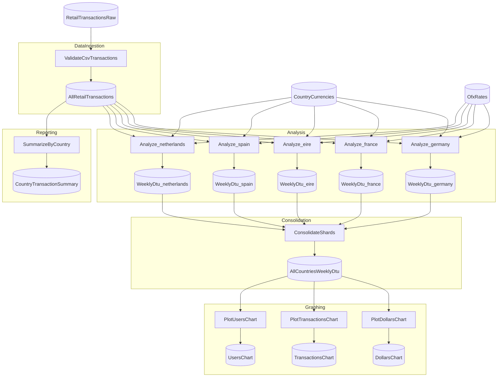

# RetailDataSplitFlow

<!-- flowthru:mermaid:start -->

<!-- flowthru:mermaid:end -->

<!-- flowthru:filetree:start -->
```
RetailDataSplitFlow/
├── Program.cs  # entry point
├── Data/
│   ├── CoreCatalog.cs
│   ├── _01_Raw/
│   │   ├── CoreCatalog.Raw.cs
│   │   ├── Datasets/
│   │   │   ├── country_currencies.json
│   │   │   ├── LICENSE.md
│   │   │   └── ofx_rates.json
│   │   └── Schemas/
│   │       ├── CountryCurrencySchema.cs
│   │       ├── OfxRateResponseSchema.cs
│   │       └── RetailTransactionSchema.cs
│   ├── ...
│   └── _08_Reporting/
│       ├── CoreCatalog.Reporting.cs
│       ├── Charts/
│       │   ├── dollars_chart.png
│       │   ├── transactions_chart.png
│       │   └── users_chart.png
│       ├── Datasets/
│       │   └── country_transaction_summary.csv
│       └── Schemas/
│           └── CountryTransactionSummarySchema.cs
└── Flows/
    ├── Analysis/
    │   └── Steps/
    │       └── ComputeWeeklyDtuStep.cs
    ├── Consolidation/
    ├── DataIngestion/
    │   └── Steps/
    │       └── ValidateCsvStep.cs
    ├── Graphing/
    │   ├── __init__.py
    │   ├── __pycache__/
    │   │   ├── __init__.cpython-310.pyc
    │   │   └── __init__.cpython-313.pyc
    │   └── Steps/
    │       ├── __init__.py
    │       ├── plot_dtu_charts.py
    │       └── __pycache__/
    │           ├── __init__.cpython-310.pyc
    │           ├── __init__.cpython-313.pyc
    │           ├── plot_dtu_charts.cpython-310.pyc
    │           └── plot_dtu_charts.cpython-313.pyc
    └── Reporting/
        └── Steps/
            └── SummarizeByCountryStep.cs
```
<!-- flowthru:filetree:end -->
