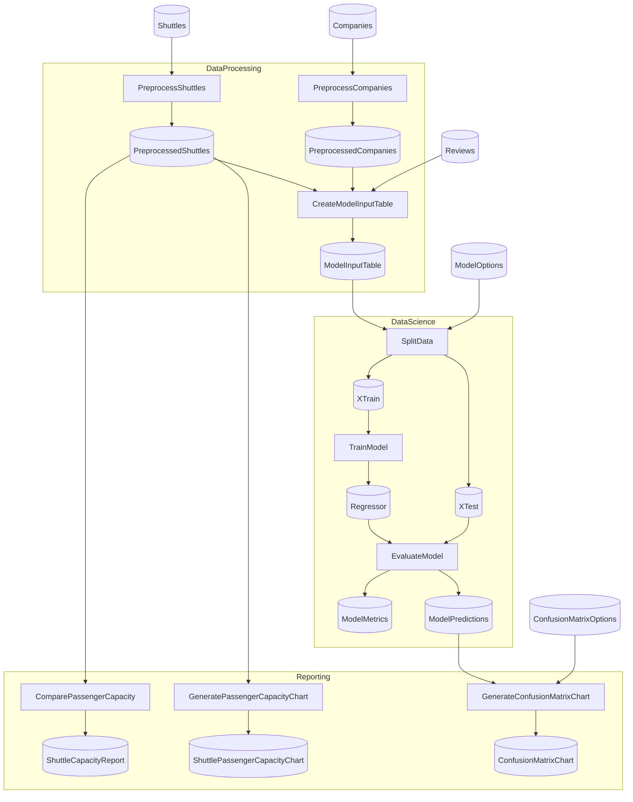

# SpaceflightsDistributed

<!-- flowthru:mermaid:start -->

<!-- flowthru:mermaid:end -->

<!-- flowthru:filetree:start -->
```
SpaceflightsDistributed/
├── SpaceflightsDistributed/
│   ├── Program.cs  # entry point
│   └── Data/
│       ├── _01_Raw/
│       │   └── Datasets/
│       │       ├── companies.csv
│       │       ├── NOTICE
│       │       ├── reviews.csv
│       │       └── shuttles.xlsx
│       ├── ...
│       └── _08_Reporting/
│           └── Datasets/
│               └── shuttle_capacity_report.json
├── SpaceflightsDistributed.DataProcessing/
│   ├── Data/
│   │   ├── DataProcessingCatalog.cs
│   │   ├── _01_Raw/
│   │   │   └── Schemas/
│   │   │       ├── CompanySchema.cs
│   │   │       ├── ReviewSchema.cs
│   │   │       └── ShuttleSchema.cs
│   │   ├── ...
│   │   └── _03_Primary/
│   │       └── Schemas/
│   │           └── ModelInputTableSchema.cs
│   └── Flows/
│       └── DataProcessing/
│           └── Steps/
│               ├── CreateModelInputTableStep.cs
│               ├── PreprocessCompaniesStep.cs
│               └── PreprocessShuttlesStep.cs
├── SpaceflightsDistributed.DataScience/
│   ├── Data/
│   │   ├── DataScienceCatalog.cs
│   │   ├── _05_ModelInput/
│   │   │   └── Schemas/
│   │   │       └── TestTrainSplit.cs
│   │   ├── ...
│   │   └── _07_ModelOutput/
│   │       └── Schemas/
│   │           ├── ModelMetrics.cs
│   │           └── ModelPredictions.cs
│   └── Flows/
│       └── DataScience/
│           └── Steps/
│               ├── EvaluateModelStep.cs
│               ├── SplitDataStep.cs
│               └── TrainModelStep.cs
└── SpaceflightsDistributed.Reporting/
    ├── Data/
    │   ├── ReportingCatalog.cs
    │   └── _08_Reporting/
    │       └── Schemas/
    │           └── ShuttleCapacityReport.cs
    └── Flows/
        └── Reporting/
            └── Steps/
                ├── ComparePassengerCapacityStep.cs
                ├── CreateConfusionMatrixStep.cs
                └── GeneratePassengerCapacityChartStep.cs
```
<!-- flowthru:filetree:end -->
