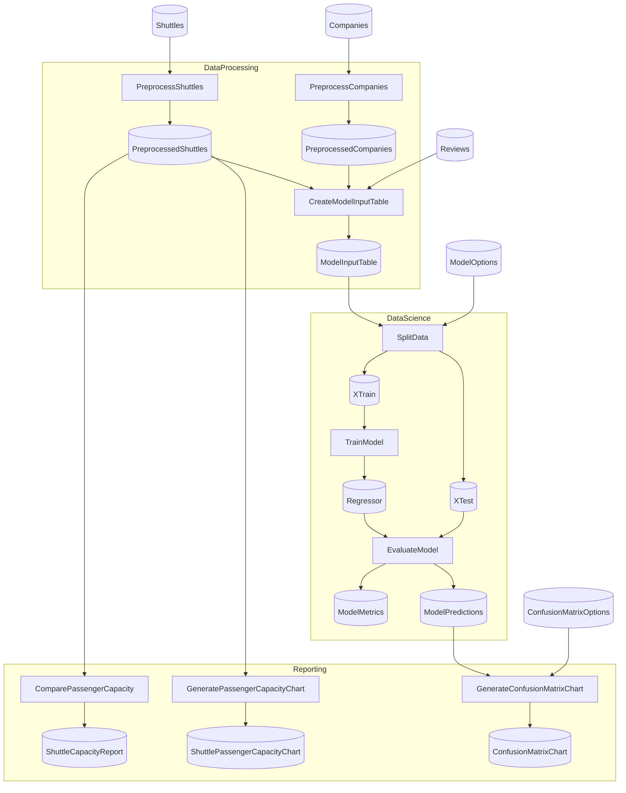

# SpaceflightsDistributed

<!-- flowthru:mermaid:start -->

```mermaid
flowchart TB

    %% External Data Inputs
    Companies[("Companies")]
    ConfusionMatrixOptions[("ConfusionMatrixOptions")]
    ModelOptions[("ModelOptions")]
    Reviews[("Reviews")]
    Shuttles[("Shuttles")]

    subgraph DataProcessing["DataProcessing"]
        PreprocessCompanies["PreprocessCompanies"]
        PreprocessedCompanies[("PreprocessedCompanies")]
        PreprocessShuttles["PreprocessShuttles"]
        PreprocessedShuttles[("PreprocessedShuttles")]
        CreateModelInputTable["CreateModelInputTable"]
        ModelInputTable[("ModelInputTable")]
    end

    subgraph DataScience["DataScience"]
        SplitData["SplitData"]
        XTrain[("XTrain")]
        XTest[("XTest")]
        TrainModel["TrainModel"]
        Regressor[("Regressor")]
        EvaluateModel["EvaluateModel"]
        ModelMetrics[("ModelMetrics")]
        ModelPredictions[("ModelPredictions")]
    end

    subgraph Reporting["Reporting"]
        ComparePassengerCapacity["ComparePassengerCapacity"]
        ShuttleCapacityReport[("ShuttleCapacityReport")]
        GeneratePassengerCapacityChart["GeneratePassengerCapacityChart"]
        ShuttlePassengerCapacityChart[("ShuttlePassengerCapacityChart")]
        GenerateConfusionMatrixChart["GenerateConfusionMatrixChart"]
        ConfusionMatrixChart[("ConfusionMatrixChart")]
    end

    %% Edges
    Companies --> PreprocessCompanies
    PreprocessCompanies --> PreprocessedCompanies
    Shuttles --> PreprocessShuttles
    PreprocessShuttles --> PreprocessedShuttles
    PreprocessedShuttles --> CreateModelInputTable
    PreprocessedCompanies --> CreateModelInputTable
    Reviews --> CreateModelInputTable
    CreateModelInputTable --> ModelInputTable
    PreprocessedShuttles --> ComparePassengerCapacity
    ComparePassengerCapacity --> ShuttleCapacityReport
    PreprocessedShuttles --> GeneratePassengerCapacityChart
    GeneratePassengerCapacityChart --> ShuttlePassengerCapacityChart
    ModelInputTable --> SplitData
    ModelOptions --> SplitData
    SplitData --> XTrain
    SplitData --> XTest
    XTrain --> TrainModel
    TrainModel --> Regressor
    Regressor --> EvaluateModel
    XTest --> EvaluateModel
    EvaluateModel --> ModelMetrics
    EvaluateModel --> ModelPredictions
    ModelPredictions --> GenerateConfusionMatrixChart
    ConfusionMatrixOptions --> GenerateConfusionMatrixChart
    GenerateConfusionMatrixChart --> ConfusionMatrixChart

```
<!-- flowthru:mermaid:end -->
