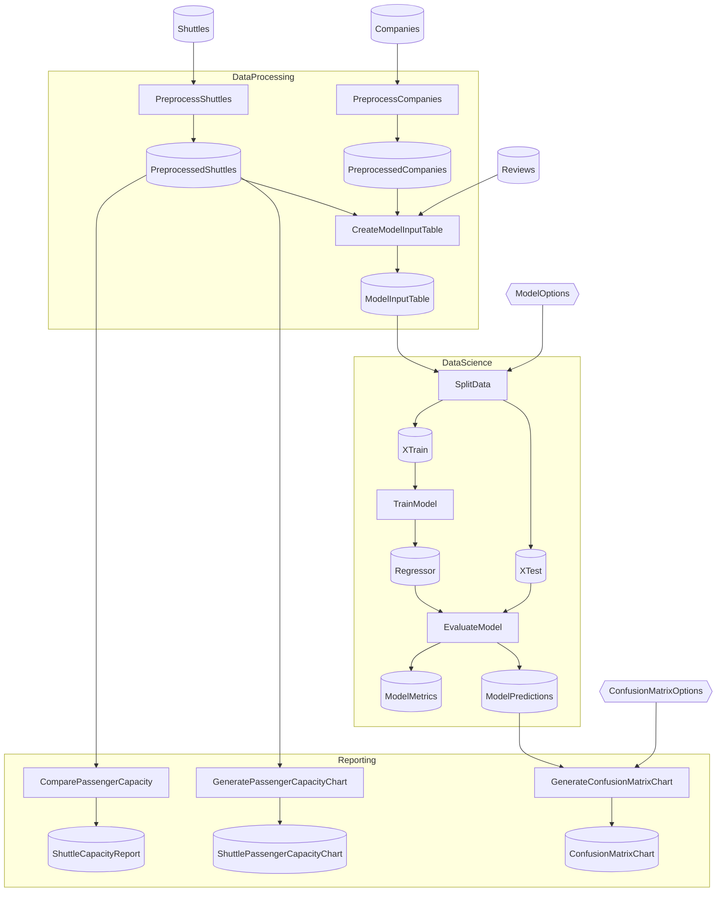

# SpaceflightsDistributed Advanced

> [!NOTE]
> How do I split Flow definitions across multiple library projects and compose them into one runnable?

This project demonstrates the **library/harness split** — Flow logic lives in three independent class library projects, each declaring its own Catalog class for the layers it owns, and a single executable harness project composes them at startup via DI. The shape mirrors how Flowthru would be embedded in a real production deployment (e.g., an ASP.NET service or a CLI tool with logic packaged for reuse).

This project:

- Centers on the harness executable in [`SpaceflightsDistributed/`](./SpaceflightsDistributed/) — its [`Program.cs`](./SpaceflightsDistributed/Program.cs) is the composition site. Read it first; the libraries make sense once you've seen how the harness consumes them.
- Spreads the three Flows across three class libraries (`SpaceflightsDistributed.DataProcessing/`, `.DataScience/`, `.Reporting/`), each owning the Steps, Schemas, and Catalog partials for its slice of the pipeline. The libraries reference `Flowthru.Core` only; the harness owns `Flowthru.Cli` and the configuration root.
- Expresses cross-library data dependencies by passing multiple Catalog instances into a Flow factory — `DataScienceFlow.Create(DataProcessingCatalog dp, DataScienceCatalog ds)` lets the DataScience library's Flow read Items from the DataProcessing library's Catalog without importing its Steps.
- Keeps each library's Catalog as a `partial class` split across `Data/<LibraryName>Catalog.cs` and per-layer `Catalog.<Category>.cs` partials — same partial-class convention as a single-project example, just scoped to one library. You **cannot** make `DataProcessingCatalog` and `DataScienceCatalog` partials of the same class; different assemblies, different types, by design.

**This is not a template** — `dotnet new` does not scaffold it, and the project naming convention (`<Solution>.<Library>` per library, with the executable taking the bare solution name) is illustrative rather than prescriptive. Assumes you've worked through [Spaceflights](../../starter/Spaceflights/). Modeled after [`kedro-org/kedro-starters`](https://github.com/kedro-org/kedro-starters)' Spaceflights tutorial.

## Getting Started

```bash
nx run SpaceflightsDistributed
```

The harness orchestrates all three Flows in dependency order. The capacity report lands at [`SpaceflightsDistributed/Data/_08_Reporting/Datasets/shuttle_capacity_report.json`](./SpaceflightsDistributed/Data/_08_Reporting/Datasets/shuttle_capacity_report.json) — outputs live under the harness's Data tree because the harness is the runtime owner of the working directory. The libraries' `Data/` folders hold schema and catalog *code* only, not dataset artifacts.

## Concepts

- **[The harness as composition site](./SpaceflightsDistributed/Program.cs):** the executable project's `Program.cs` is where the libraries become a Flow. It calls `RegisterCatalog<DataProcessingCatalog>(...)`, `RegisterCatalog<DataScienceCatalog>(...)`, and `RegisterCatalog<ReportingCatalog>(...)` once each — three concrete Catalog instances in one DI container — then registers each Flow with the Catalog *types* it consumes.
- **[Per-library Catalog class](./SpaceflightsDistributed.DataProcessing/Data/DataProcessingCatalog.cs):** each library owns one Catalog class that inherits from `CatalogAbstract`. The Catalog is split across partials (`DataProcessingCatalog.cs` + [`_01_Raw/Catalog.Raw.cs`](./SpaceflightsDistributed.DataProcessing/Data/_01_Raw/Schemas/) + `_02_Intermediate/Catalog.Intermediate.cs` + ...) the same way a single-project example would split it — the `partial` mechanism works inside one library, not across them.
- **[Cross-library Flow dependencies](./SpaceflightsDistributed.DataScience/Flows/DataScience/):** when a Flow needs Items from another library's Catalog, it accepts both Catalog types as factory parameters — `DataScienceFlow.Create(DataProcessingCatalog dp, DataScienceCatalog ds)`. Steps reference Items as `dp.ModelInputTable` or `ds.TrainSplit`. There's no shared interface; each library exports its Catalog as the contract.
- **[Class libraries without `Program.cs`](./SpaceflightsDistributed.Reporting/):** the three libraries are pure class library projects — no executable, no entry point, no `appsettings.json`. They reference `Flowthru.Core` and the relevant extensions; the harness is the only project that pulls in `Flowthru.Cli` and owns the configuration root.

## Structure

### Diagram

<!-- flowthru:mermaid:start -->

<!-- flowthru:mermaid:end -->

### Files

<!-- flowthru:filetree:start -->
```
SpaceflightsDistributed/
├── SpaceflightsDistributed/
│   ├── Program.cs  # entry point
│   └── Data/
│       ├── _01_Raw/
│       │   └── Datasets/
│       │       ├── companies.csv
│       │       ├── NOTICE
│       │       ├── reviews.csv
│       │       └── shuttles.xlsx
│       ├── ...
│       └── _08_Reporting/
│           └── Datasets/
│               └── shuttle_capacity_report.json
├── SpaceflightsDistributed.DataProcessing/
│   ├── Data/
│   │   ├── DataProcessingCatalog.cs
│   │   ├── _01_Raw/
│   │   │   └── Schemas/
│   │   │       ├── CompanySchema.cs
│   │   │       ├── ReviewSchema.cs
│   │   │       └── ShuttleSchema.cs
│   │   ├── ...
│   │   └── _03_Primary/
│   │       └── Schemas/
│   │           └── ModelInputTableSchema.cs
│   └── Flows/
│       └── DataProcessing/
│           └── Steps/
│               ├── CreateModelInputTableStep.cs
│               ├── PreprocessCompaniesStep.cs
│               └── PreprocessShuttlesStep.cs
├── SpaceflightsDistributed.DataScience/
│   ├── Data/
│   │   ├── DataScienceCatalog.cs
│   │   ├── _05_ModelInput/
│   │   │   └── Schemas/
│   │   │       └── TestTrainSplit.cs
│   │   ├── ...
│   │   └── _07_ModelOutput/
│   │       └── Schemas/
│   │           ├── ModelMetrics.cs
│   │           └── ModelPredictions.cs
│   └── Flows/
│       └── DataScience/
│           └── Steps/
│               ├── EvaluateModelStep.cs
│               ├── SplitDataStep.cs
│               └── TrainModelStep.cs
└── SpaceflightsDistributed.Reporting/
    ├── Data/
    │   ├── ReportingCatalog.cs
    │   └── _08_Reporting/
    │       └── Schemas/
    │           └── ShuttleCapacityReport.cs
    └── Flows/
        └── Reporting/
            └── Steps/
                ├── ComparePassengerCapacityStep.cs
                ├── CreateConfusionMatrixStep.cs
                └── GeneratePassengerCapacityChartStep.cs
```
<!-- flowthru:filetree:end -->
