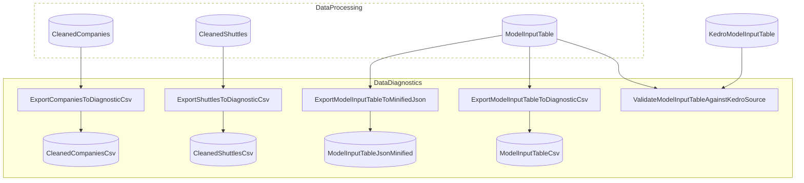
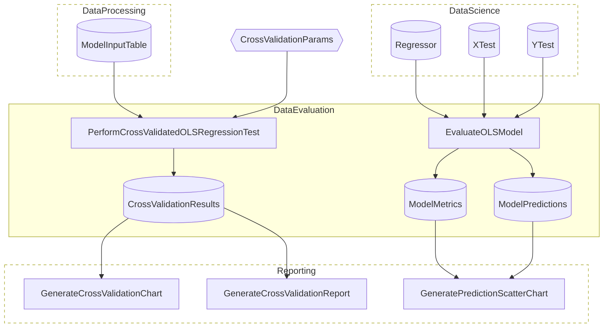
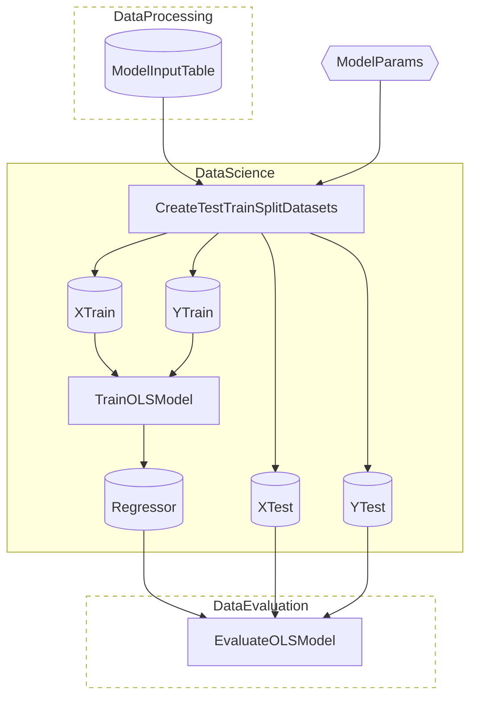
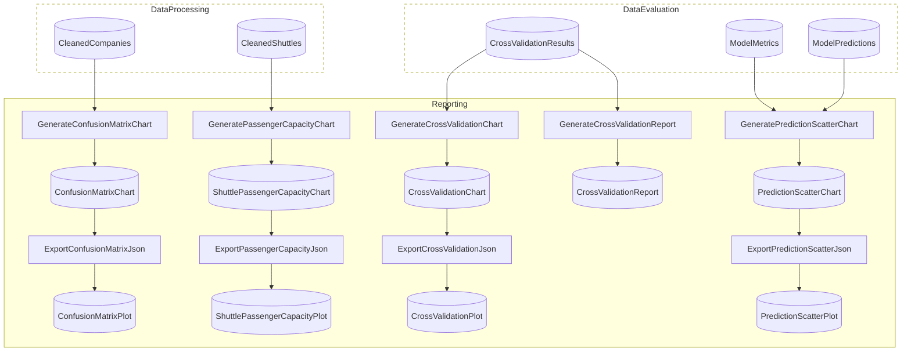

# SpaceflightsEnhanced Advanced

> [!NOTE]
> How do I prove my Flowthru pipeline reproduces a reference implementation's statistical outputs?

This project is a **validation harness** built to answer one question — does Flowthru's C# port of the Kedro Spaceflights pipeline produce statistically comparable results to the Python original, despite differences in random-seed implementations across the two languages? The answer this example assembles: row-level CSV equivalence against an exported Kedro reference, 20-fold cross-validated R² agreement against Kedro's published benchmark, and a deliberate use of closed-form OLS (Math.NET QR) that mirrors `sklearn.LinearRegression`'s solver rather than introducing a stochastic gradient path.

This project:

- Adds a `DataDiagnostics` Flow that compares Flowthru's `ModelInputTable` against a Kedro-exported CSV ([`kedro_model_input_table.csv`](./Data/_01_Raw/Datasets/kedro_model_input_table.csv)) — checking schema alignment, row count, and per-row numeric values within a 0.01 tolerance.
- Adds a `DataEvaluation` Flow that runs 20-fold cross-validated OLS regression on the processed model input, reports per-fold and aggregate R²/MAE/RMSE, and computes `DifferenceFromKedro = |meanR² − referenceR²|` against a hardcoded Kedro benchmark of ~0.387.
- Exports four diagnostic artifacts — cleaned companies/shuttles CSVs and the model input table as CSV + minified JSON — for manual spot-checking against Kedro's published outputs.
- Trains the production OLS regressor via Math.NET QR decomposition rather than an iterative gradient method, so the C#-side fit is closed-form and structurally apples-to-apples with `sklearn.LinearRegression`.

**This is not a template** — `dotnet new` does not scaffold it, and the validation thresholds (20-fold CV count, 0.387 reference R², 0.01 row-tolerance) are hard-coded for the Kedro Spaceflights dataset. Assumes you've worked through [Spaceflights](../../starter/Spaceflights/). Modeled after [`kedro-org/kedro-starters`](https://github.com/kedro-org/kedro-starters)' Spaceflights tutorial.

## Getting Started

```bash
nx run SpaceflightsEnhanced
```

Inspect the run by reading two places:

1. **The diagnostic exports** — cleaned companies/shuttles CSVs land under [`Data/_02_Intermediate/Datasets/`](./Data/_02_Intermediate/), and the model input table dump (CSV + minified JSON) lands under [`Data/_03_Primary/Datasets/`](./Data/_03_Primary/).
2. **The cross-validation report** at [`Data/_06_Reporting/Datasets/cross_validation_report.md`](./Data/_06_Reporting/Datasets/cross_validation_report.md) — human-readable summary with mean R² ± stddev, the `DifferenceFromKedro` value, and a stability assessment. The same numbers in machine-readable form live in [`cross_validation_results.json`](./Data/_06_Reporting/Datasets/cross_validation_results.json).

The validation is **observational** — no Step throws or returns non-zero on drift. The reader decides what counts as "close enough."

## Concepts

> **Reminder:** the patterns below illustrate validation methodology, **not** a template to clone. Tolerances and reference values (`0.01` row tolerance, `0.387` reference R², 20-fold CV count) are tuned to the Kedro Spaceflights dataset specifically.

- **[Row-level reference comparison](./Flows/DataDiagnostics/Steps/ValidateAgainstKedroStep.cs):** the validation Step joins Flowthru's `ModelInputTable` and the [`KedroModelInputTable`](./Data/_01_Raw/Catalog.Raw.cs) by key, checks schema alignment + row count, and walks numeric fields with a 0.01 absolute tolerance. Drift is logged as a mismatch tally — the reader inspects the count rather than relying on a programmatic verdict.
- **[Cross-validated R² agreement](./Flows/DataEvaluation/Steps/CrossValidateModelStep.cs):** ML.NET's `Regression.CrossValidate()` with `k = 20` produces a per-fold metrics array; the Step aggregates to mean R² and computes `DifferenceFromKedro = |meanR² − 0.387|`. The 20-fold count is high enough that R² distribution is informative beyond a single point estimate.
- **[Closed-form OLS via Math.NET QR](./Flows/DataScience/Steps/TrainModelStep.cs):** the production training Step uses QR decomposition for the OLS solve rather than an iterative gradient descent. The closed-form path is the apples-to-apples comparison point against `sklearn.LinearRegression`, which is also closed-form — removing one degree of freedom from the equivalence question.
- **[Reference data as a Catalog Item](./Data/_01_Raw/Catalog.Raw.cs):** `KedroModelInputTable` is declared as a typed CSV-backed Catalog Item via [`KedroModelInputSchema`](./Data/_01_Raw/Schemas/KedroModelInputSchema.cs), no different from any other input. The reference dataset participates in the DAG, gets the same pre-flight validation as production inputs, and is loaded once.
- **[Diagnostic export via a generic passthrough Step](./Flows/DataDiagnostics/Steps/PassthroughInputToOutputStep.cs):** a single reusable Step writes its input Item out as CSV or minified JSON, parameterized by the target file. Each diagnostic export Item declares its target path; the Step doesn't know or care what it's writing.
- **[Observational verdict, not throw-on-drift](./Flows/DataDiagnostics/Steps/ValidateAgainstKedroStep.cs):** the validation Step deliberately does not throw on mismatch. Flowthru's fail-fast guarantees apply to *structure and contracts*, not domain-specific equivalence thresholds — the reader sets the bar for what equivalence means and reads the logs against that bar.

## Structure

### Diagram

<!-- flowthru:mermaid:start -->
#### DataDiagnostics



#### DataEvaluation



#### DataProcessing

```mermaid
flowchart TB

    %% External Data Inputs
    RawCompanies[("RawCompanies")]
    RawReviews[("RawReviews")]
    RawShuttles[("RawShuttles")]

    subgraph DataProcessing["DataProcessing"]
        PreprocessCompanies["PreprocessCompanies"]
        CleanedCompanies[("CleanedCompanies")]
        PreprocessShuttles["PreprocessShuttles"]
        CleanedShuttles[("CleanedShuttles")]
        PreprocessReviews["PreprocessReviews"]
        CleanedReviews[("CleanedReviews")]
        CreateModelInputTable["CreateModelInputTable"]
        ModelInputTable[("ModelInputTable")]
    end

    subgraph DataDiagnostics_ds["DataDiagnostics"]
        ExportCompaniesToDiagnosticCsv["ExportCompaniesToDiagnosticCsv"]
        ExportModelInputTableToDiagnosticCsv["ExportModelInputTableToDiagnosticCsv"]
        ExportModelInputTableToMinifiedJson["ExportModelInputTableToMinifiedJson"]
        ExportShuttlesToDiagnosticCsv["ExportShuttlesToDiagnosticCsv"]
        ValidateModelInputTableAgainstKedroSource["ValidateModelInputTableAgainstKedroSource"]
    end

    subgraph DataEvaluation_ds["DataEvaluation"]
        PerformCrossValidatedOLSRegressionTest["PerformCrossValidatedOLSRegressionTest"]
    end

    subgraph DataScience_ds["DataScience"]
        CreateTestTrainSplitDatasets["CreateTestTrainSplitDatasets"]
    end

    subgraph Reporting_ds["Reporting"]
        GenerateConfusionMatrixChart["GenerateConfusionMatrixChart"]
        GeneratePassengerCapacityChart["GeneratePassengerCapacityChart"]
    end

    %% Edges
    RawCompanies --> PreprocessCompanies
    PreprocessCompanies --> CleanedCompanies
    RawShuttles --> PreprocessShuttles
    PreprocessShuttles --> CleanedShuttles
    RawReviews --> PreprocessReviews
    PreprocessReviews --> CleanedReviews
    CleanedShuttles --> CreateModelInputTable
    CleanedCompanies --> CreateModelInputTable
    CleanedReviews --> CreateModelInputTable
    CreateModelInputTable --> ModelInputTable
    CleanedCompanies --> ExportCompaniesToDiagnosticCsv
    ModelInputTable --> ExportModelInputTableToDiagnosticCsv
    ModelInputTable --> ExportModelInputTableToMinifiedJson
    CleanedShuttles --> ExportShuttlesToDiagnosticCsv
    ModelInputTable --> ValidateModelInputTableAgainstKedroSource
    ModelInputTable --> PerformCrossValidatedOLSRegressionTest
    ModelInputTable --> CreateTestTrainSplitDatasets
    CleanedCompanies --> GenerateConfusionMatrixChart
    CleanedShuttles --> GeneratePassengerCapacityChart

    classDef collapsed stroke-dasharray:5 5,fill:transparent
    class DataDiagnostics_ds,DataEvaluation_ds,DataScience_ds,Reporting_ds collapsed
```



#### DataScience



#### Reporting


<!-- flowthru:mermaid:end -->

### Files

<!-- flowthru:filetree:start -->
```
SpaceflightsEnhanced/
├── Program.cs  # entry point
├── Data/
│   ├── _01_Raw/
│   │   ├── Datasets/
│   │   │   ├── companies.csv
│   │   │   ├── kedro_model_input_table.csv
│   │   │   ├── NOTICE.md
│   │   │   ├── reviews.csv
│   │   │   └── shuttles.xlsx
│   │   └── Schemas/
│   │       ├── CompanyRawSchema.cs
│   │       ├── KedroModelInputSchema.cs
│   │       ├── ReviewRawSchema.cs
│   │       └── ShuttleRawSchema.cs
│   ├── ...
│   └── _06_Reporting/
│       ├── Datasets/
│       │   ├── confusion_matrix_plot.json
│       │   ├── cross_validation_plot.json
│       │   ├── cross_validation_report.md
│       │   ├── cross_validation_results.json
│       │   ├── prediction_scatter_plot.json
│       │   └── shuttle_passenger_capacity_plot.json
│       └── Schemas/
│           └── CrossValidationSchemas.cs
└── Flows/
    ├── DataDiagnostics/
    │   └── Steps/
    │       ├── PassthroughInputToOutputStep.cs
    │       └── ValidateAgainstKedroStep.cs
    ├── DataEvaluation/
    │   └── Steps/
    │       ├── CrossValidateModelStep.cs
    │       └── EvaluateModelStep.cs
    ├── DataProcessing/
    │   └── Steps/
    │       ├── CreateModelInputTableStep.cs
    │       ├── PreprocessCompaniesStep.cs
    │       ├── PreprocessReviewsStep.cs
    │       └── PreprocessShuttlesStep.cs
    ├── DataScience/
    │   └── Steps/
    │       ├── CreateTestTrainSplitStep.cs
    │       └── TrainModelStep.cs
    └── Reporting/
        └── Steps/
            ├── ComparePassengerCapacityStep.cs
            ├── CreateConfusionMatrixStep.cs
            ├── GenerateCrossValidationReportStep.cs
            ├── GeneratePredictionScatterStep.cs
            ├── PlotlyJsonExportStep.cs
            └── VisualizeCrossValidationStep.cs
```
<!-- flowthru:filetree:end -->
