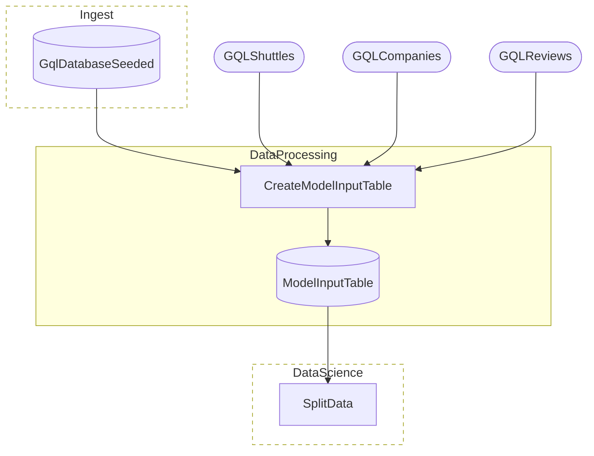
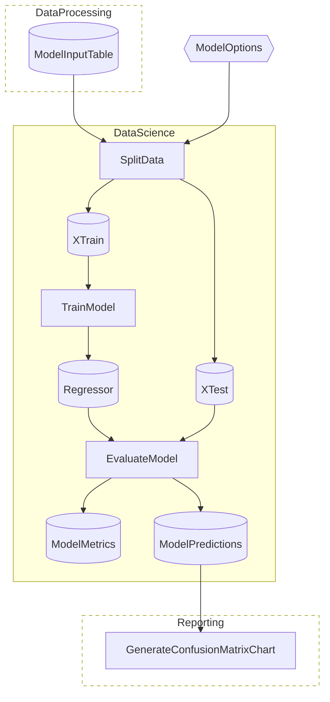
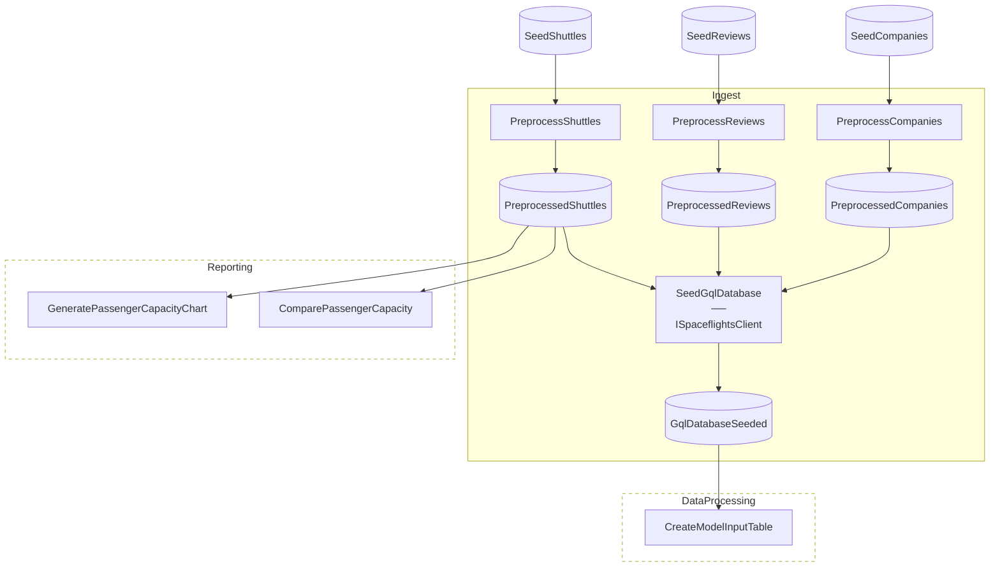
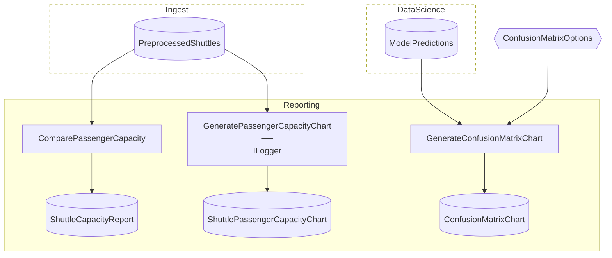

# SpaceflightsGQL Advanced

> [!NOTE]
> How do I back my Catalog Items with a self-hosted GraphQL server?

This project demonstrates a Flowthru pipeline that owns a self-hosted GraphQL server in-process — seeding it with mutations from CSV/Excel inputs, then reading from it through deferred GraphQL query Catalog Items via the `Flowthru.Extensions.GQL` extension.

This project:

- Mirrors vanilla Spaceflights's later Flows (DataProcessing → DataScience → Reporting), plus a new `Ingest` Flow that seeds the GraphQL server before the rest of the pipeline reads from it.
- Stands up a [HotChocolate-based GraphQL server in-process](./Infra/GqlServer/) via ASP.NET Core's `TestServer` — no external orchestration, no port binding, no race conditions; the pipeline owns the server's lifecycle.
- Declares GraphQL-backed Catalog Items via `.GqlDeferred<TResult, T>()` — analogous to EFCore's `.EFCoreQuery<>()`, but the deferred handle wraps a StrawberryShake-generated typed operation rather than a `DbSet`.
- Reads its queries from hand-authored [`Operations.graphql`](./Infra/GqlClient/Operations.graphql); StrawberryShake's MSBuild code generator produces typed C# operation classes at build time, consumed directly by the Catalog Items.

**This is not a template** — `dotnet new` does not scaffold it, and the in-process `TestServer` design is a demo convenience rather than production architecture. Assumes you've worked through [Spaceflights](../../starter/Spaceflights/) and [SpaceflightsEFCore](../../starter/SpaceflightsEFCore/). Modeled after [`kedro-org/kedro-starters`](https://github.com/kedro-org/kedro-starters)' Spaceflights tutorial.

## Getting Started

```bash
nx run SpaceflightsGQL
```

The build invokes StrawberryShake's code generator over [`schema.graphql`](./Infra/GqlClient/schema.graphql) and [`Operations.graphql`](./Infra/GqlClient/Operations.graphql) before the harness starts. The capacity report lands at [`Data/_08_Reporting/Datasets/shuttle_capacity_report.json`](./Data/_08_Reporting/Datasets/shuttle_capacity_report.json).

## Concepts

- **[In-process GraphQL server via `TestServer`](./Infra/GqlServer/SpaceflightsGqlServer.cs):** the HotChocolate server is hosted in the same process as the pipeline through ASP.NET Core's `TestServer`. The StrawberryShake client injects `TestServer.CreateHandler()` as its `HttpMessageHandler`, so queries never hit the network — they round-trip through the in-process server entirely. Production deployments would swap `TestServer` for a real Kestrel endpoint and point the client at a deployed URL.
- **[`.GqlDeferred<TResult, T>()` Catalog Item builder](./Data/_01_Raw/Catalog.Raw.cs):** declares a Catalog Item whose value is a `GqlQuery<TResult, T>` handle. The query doesn't execute until a Step iterates the result — parallel to EFCore's deferred-iteration model. The builder takes the StrawberryShake-generated `ExecuteAsync` invocation and a `selectData` projection that extracts the typed collection from the response wrapper.
- **[Hand-authored `.graphql` + StrawberryShake codegen](./Infra/GqlClient/Operations.graphql):** queries live as plain GraphQL strings in `Operations.graphql`; the MSBuild integration generates the typed C# operation classes (`IGetCompanies`, `IGetShuttles`, `IGetReviews`) and result shapes during compilation. Updating a query is a `.graphql` edit + rebuild — no C# wiring change required.
- **[Ingest Flow that seeds via mutations](./Flows/Ingest/Steps/SeedGqlDatabaseStep.cs):** unlike file- or DB-backed Catalog Items where the upstream data exists *before* the run, the in-process GraphQL server starts empty — so the pipeline must write before it reads. The `Ingest` Flow reads raw CSV/Excel inputs into typed records, then fires `AddCompany`/`AddShuttle`/`AddReview` mutations against the in-process server to populate its in-memory repository.
- **[Bool gate as a Catalog Item](./Flows/Ingest/Steps/SeedGqlDatabaseStep.cs):** the `SeedGqlDatabase` Step outputs a `GqlDatabaseSeeded` Item — a typed `bool` whose only job is to force a DAG dependency from `Ingest` to `DataProcessing`. The framework can't infer this ordering on its own: the GQL query handles don't declare the server as a Flowthru-visible input, so the *side effect* of the seed mutations is invisible to DAG construction. Threading an explicit Item makes the dependency real, and `CreateModelInputTable` declares `GqlDatabaseSeeded` alongside the three GQL query handles to force the wait.

## Structure

### Diagram

<!-- flowthru:mermaid:start -->
#### DataProcessing



#### DataScience



#### Ingest



#### Reporting


<!-- flowthru:mermaid:end -->

### Files

<!-- flowthru:filetree:start -->
```
SpaceflightsGQL/
├── Program.cs  # entry point
├── Data/
│   ├── _01_Raw/
│   │   ├── Datasets/
│   │   │   ├── companies.csv
│   │   │   ├── NOTICE
│   │   │   ├── reviews.csv
│   │   │   └── shuttles.xlsx
│   │   └── Schemas/
│   │       ├── CompanySchema.cs
│   │       ├── ReviewSchema.cs
│   │       └── ShuttleSchema.cs
│   ├── ...
│   └── _08_Reporting/
│       ├── Datasets/
│       │   └── shuttle_capacity_report.json
│       └── Schemas/
│           └── ShuttleCapacityReport.cs
├── Flows/
│   ├── DataProcessing/
│   │   └── Steps/
│   │       └── CreateModelInputTableStep.cs
│   ├── DataScience/
│   │   └── Steps/
│   │       ├── EvaluateModelStep.cs
│   │       ├── SplitDataStep.cs
│   │       └── TrainModelStep.cs
│   ├── Ingest/
│   │   └── Steps/
│   │       ├── PreprocessCompaniesStep.cs
│   │       ├── PreprocessReviewsStep.cs
│   │       ├── PreprocessShuttlesStep.cs
│   │       └── SeedGqlDatabaseStep.cs
│   └── Reporting/
│       └── Steps/
│           ├── ComparePassengerCapacityStep.cs
│           ├── CreateConfusionMatrixStep.cs
│           └── GeneratePassengerCapacityChartStep.cs
└── Infra/
    ├── GqlClient/
    │   ├── Operations.graphql
    │   └── schema.graphql
    └── GqlServer/
        ├── SpaceflightsGqlServer.cs
        ├── SpaceflightsRepository.cs
        └── Types.cs
```
<!-- flowthru:filetree:end -->
