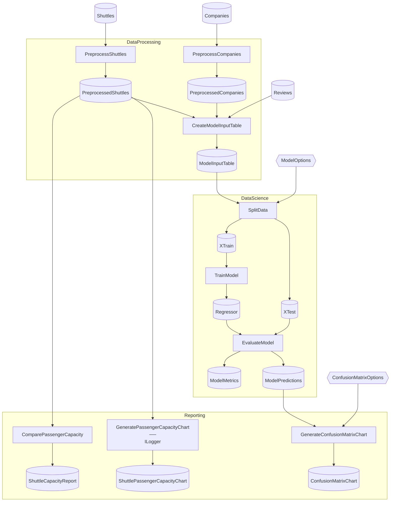

# SpaceflightsHybridCatalog Advanced

> [!NOTE]
> How do I swap data backends at startup without rewriting my Flows?

This project demonstrates abstracting the Catalog so a single set of Flows can run against either file-backed (Parquet/JSON) or EFCore-backed (SQLite) storage, with the choice resolved by `ASPNETCORE_ENVIRONMENT` at DI registration time.

This project:

- Declares an abstract [`Catalog`](./Data/Catalog.cs) base with eight `abstract` Items; [`DevelopmentCatalog`](./Data/DevelopmentCatalog.cs) overrides them as file-backed (Parquet/JSON/Memory), [`ProductionCatalog`](./Data/ProductionCatalog.cs) overrides them as EFCore-backed.
- Keeps Items that don't differ between environments concrete on the base — raw CSV/Excel inputs in [`_01_Raw/Catalog.Raw.cs`](./Data/_01_Raw/Catalog.Raw.cs) and the JSON capacity report plus in-memory chart Items in [`_08_Reporting/Catalog.Reporting.cs`](./Data/_08_Reporting/Catalog.Reporting.cs).
- Registers the abstract base via a DI factory that constructs the right concrete subclass based on `ASPNETCORE_ENVIRONMENT`. The choice is baked at startup; the same DI container resolves one Catalog for the run.
- Keeps all three Flows and their Steps byte-identical to vanilla Spaceflights — they bind only to the abstract `Catalog`, never to either concrete subclass.

This is a reference example, not a template — `dotnet new` does not scaffold it. Assumes you've worked through [Spaceflights](../../starter/Spaceflights/) and [SpaceflightsEFCore](../../starter/SpaceflightsEFCore/). Modeled after [`kedro-org/kedro-starters`](https://github.com/kedro-org/kedro-starters)' Spaceflights tutorial.

## Getting Started

```bash
nx run SpaceflightsHybridCatalog                                      # Development — file-backed (default)
ASPNETCORE_ENVIRONMENT=Production nx run SpaceflightsHybridCatalog    # Production — EFCore-backed
```

Per ASP.NET Core convention, an unset `ASPNETCORE_ENVIRONMENT` is treated as `Development`, so the first form lands on the file-backed branch.

In Production mode, first run creates an empty SQLite database at [`Data/spaceflights.db`](./Data/spaceflights.db) via `EnsureCreated()`. In either mode, the capacity report lands at [`Data/_08_Reporting/Datasets/shuttle_capacity_report.json`](./Data/_08_Reporting/Datasets/shuttle_capacity_report.json).

## Concepts

- **[Abstract Catalog base](./Data/Catalog.cs):** declares the eight Items that vary between dev and prod as `abstract` properties, plus two `ConfigurationItem<T>` properties for bound options. Flows declare a dependency on `Catalog` (the abstract type) and stay backend-agnostic.
- **[Shared concrete Items on the base](./Data/_01_Raw/Catalog.Raw.cs):** Items that *don't* differ between environments live as concrete declarations on partial files attached to the abstract base. Raw CSV/Excel inputs and the final JSON capacity report are always file-backed regardless of mode.
- **[Development overrides](./Data/DevelopmentCatalog.cs):** the file-backed subclass — overrides each abstract Item with `.Parquet()`, `.Json()`, or `.Memory()` builders. The intermediate and modeling layers materialize to disk as Parquet for fast local iteration.
- **[Production overrides](./Data/ProductionCatalog.cs):** the EFCore-backed subclass — overrides the same Items with `.EFCoreQuery()`, `.EFCoreTable()`, and `.EFCoreEntity()` over the shared [`SpaceflightsDbContext`](./Data/SpaceflightsDbContext.cs).
- **[DI factory swap](./Program.cs):** one `RegisterCatalog<Catalog>(sp => ...)` call decides which concrete subclass to construct, gated on `ASPNETCORE_ENVIRONMENT`. The abstract type is what gets registered; the concrete type is hidden from downstream code.
- **[Split serialization for the same Schema field](./Data/_01_Raw/Schemas/ShuttleSchema.cs):** `CheckStatus` is a single enum with two on-disk representations — `[SerializedEnum("t"/"f")]` rounds it through CSV cells, and the [`DbContext`'s `HasConversion<string>()`](./Data/SpaceflightsDbContext.cs) stores it as the enum member name in SQLite. The Schema is the single source of truth for the in-memory type; only the format-side attributes differ between backends, so domain code (Steps, downstream Schemas) stays format-agnostic.
- **[Environment-keyed appsettings](./appsettings.Development.json):** standard ASP.NET Core `appsettings.<Environment>.json` conventions apply — [development settings](./appsettings.Development.json) lower the log level for iteration, [production settings](./appsettings.Production.json) silence noisy EFCore warnings. The Catalog factory and the host configuration both key off the same `ASPNETCORE_ENVIRONMENT` variable.

## Structure

### Diagram

<!-- flowthru:mermaid:start -->

<!-- flowthru:mermaid:end -->

### Files

<!-- flowthru:filetree:start -->
```
SpaceflightsHybridCatalog/
├── Program.cs  # entry point
├── Data/
│   ├── DevelopmentCatalog.cs
│   ├── ProductionCatalog.cs
│   ├── spaceflights.db
│   ├── SpaceflightsDbContext.cs
│   ├── _01_Raw/
│   │   ├── Datasets/
│   │   │   ├── companies.csv
│   │   │   ├── NOTICE
│   │   │   ├── reviews.csv
│   │   │   └── shuttles.xlsx
│   │   └── Schemas/
│   │       ├── CompanySchema.cs
│   │       ├── ReviewSchema.cs
│   │       └── ShuttleSchema.cs
│   ├── ...
│   └── _08_Reporting/
│       ├── Datasets/
│       │   └── shuttle_capacity_report.json
│       └── Schemas/
│           └── ShuttleCapacityReport.cs
└── Flows/
    ├── DataProcessing/
    │   └── Steps/
    │       ├── CreateModelInputTableStep.cs
    │       ├── PreprocessCompaniesStep.cs
    │       └── PreprocessShuttlesStep.cs
    ├── DataScience/
    │   └── Steps/
    │       ├── EvaluateModelStep.cs
    │       ├── SplitDataStep.cs
    │       └── TrainModelStep.cs
    └── Reporting/
        └── Steps/
            ├── ComparePassengerCapacityStep.cs
            ├── CreateConfusionMatrixStep.cs
            └── GeneratePassengerCapacityChartStep.cs
```
<!-- flowthru:filetree:end -->
