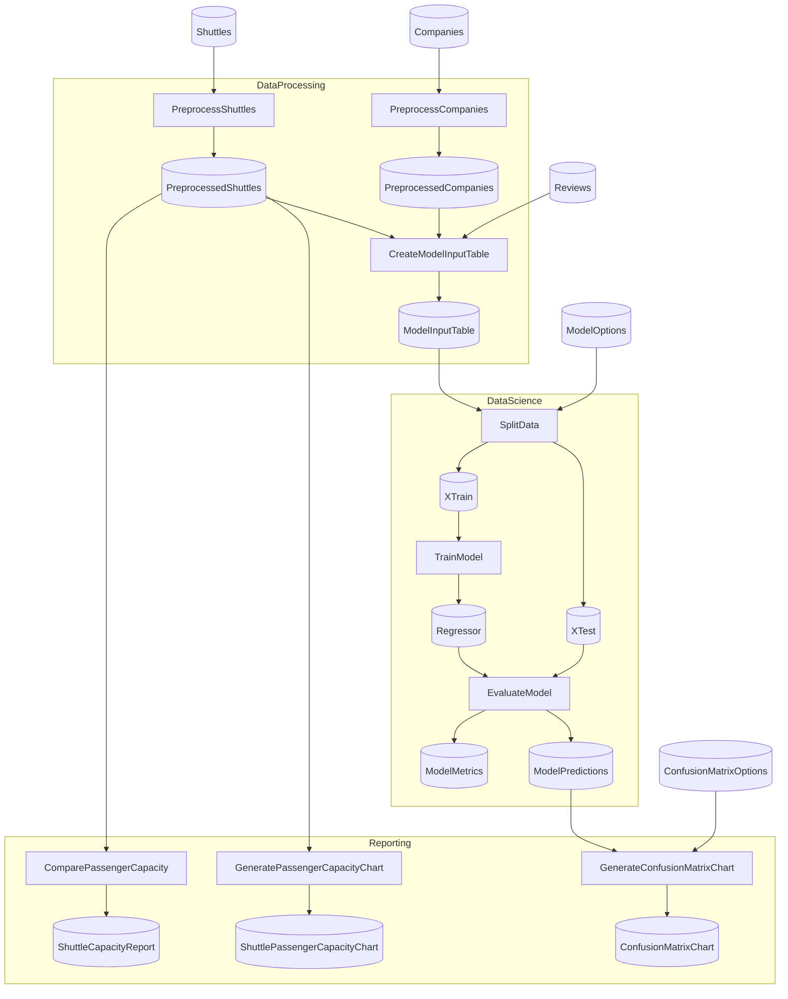

# SpaceflightsNewTypes Advanced

> [!NOTE]
> How do I use NewTypes in Schemas to prevent ID mix-ups at compile time?

This project demonstrates the FP **NewType pattern** applied to Flowthru Schemas — wrapping primitive IDs (`CompanyId`, `ShuttleId`) in distinct types via the `[FlowthruColumn]` source generator so the C# compiler refuses to mix them up in join keys. The pipeline behaves identically to vanilla Spaceflights; the only difference is that a class of silent join bugs is now a build error.

This project:

- Mirrors vanilla Spaceflights's Flow structure exactly — same three Flows, Steps, Schemas, and outputs.
- NewTypes the join-key fields on the raw and intermediate Schemas — `CompanyId` and `ShuttleId` each become single-field record types generated by the `[FlowthruColumn(typeof(string))]` source generator. Both wrap `string`, but the compiler treats them as incompatible types: a `CompanyId` cannot be assigned to a `ShuttleId` even though their underlying representations are identical.
- Catches an entire class of silent-corruption bugs at compile time. Swapping `c.Id` (`CompanyId`) for `s.Id` (`ShuttleId`) in `CreateModelInputTableStep`'s LINQ joins fails to compile; the same mistake against raw `int` IDs would silently produce an empty or wrong-shape table at runtime.
- Has one known limitation: the Parquet serializer doesn't yet unwrap `IScalar` NewTypes, so intermediate Catalog Items are memory-backed instead of file-backed. CSV, Excel, and JSON serialization work transparently — the generator auto-unwraps NewTypes to their underlying primitive on the wire.

**This is not a template** — `dotnet new` does not scaffold it, and the NewType-everything-that-can-be-newtyped style is a deliberate exploration of the pattern's compile-time guarantees, not a recommendation that every primitive field in your Schemas needs a wrapper. Assumes you've worked through [Spaceflights](../../starter/Spaceflights/). Modeled after [`kedro-org/kedro-starters`](https://github.com/kedro-org/kedro-starters)' Spaceflights tutorial.

## Getting Started

```bash
nx run SpaceflightsNewTypes
```

Same outputs as vanilla Spaceflights — the capacity report lands at [`Data/_08_Reporting/Datasets/shuttle_capacity_report.json`](./Data/_08_Reporting/Datasets/shuttle_capacity_report.json).

## Concepts

> **Reminder:** the pattern below illustrates how far Flowthru's type system can be pushed, **not** a template to clone. NewType every ID-shaped field, but think hard before NewTyping arbitrary primitives — the wrapping is strict by design, and the cost shows up at every conversion site.

- **[NewType generation via `[FlowthruColumn]`](./Data/_01_Raw/Schemas/CompanySchema.cs):** the Schema declares `[FlowthruColumn(typeof(string))] public required CompanyId Id { get; init; }`; the source generator produces a `CompanyId` record type with a `.Value` property of the underlying primitive. No hand-written NewType file is needed — declaring the property generates the type.
- **[Distinct types for distinct IDs](./Data/_01_Raw/Schemas/ShuttleSchema.cs):** `ShuttleSchema` declares both `Id` (a `ShuttleId`) and `CompanyId` (a `CompanyId`). Both wrap `string` but are not assignment-compatible — the compiler treats them as fully separate types, even though their underlying representations are identical.
- **[Compile-time join safety](./Flows/DataProcessing/Steps/CreateModelInputTableStep.cs):** the joins in `CreateModelInputTableStep` unify only when matched key types resolve — `r.ShuttleId == s.Id` works because both are `ShuttleId`; swapping `s.Id` for `c.Id` would fail to compile because `Enumerable.Join`'s type parameters can't unify a `ShuttleId` with a `CompanyId`.
- **[Transparent wire-format serialization](./Data/_01_Raw/):** CSV cells, Excel cells, and JSON fields containing a `CompanyId` value just look like their underlying string — `"42"`, not `"{Value:42}"`. The `[FlowthruColumn]` generator emits the conversion alongside the NewType, so the file-format adapters never see the wrapper.
- **[Parquet limitation, memory-backed workaround](./Data/_02_Intermediate/):** the Parquet serializer's CLR-to-DataField mapping doesn't yet unwrap `IScalar` NewTypes, so a `ShuttleId` column would silently drop when serialized to Parquet. Intermediate Catalog Items use in-memory backing as a workaround until the Parquet adapter is fixed — a known gap tracked separately.

## Structure

### Diagram

<!-- flowthru:mermaid:start -->

<!-- flowthru:mermaid:end -->

### Files

<!-- flowthru:filetree:start -->
```
SpaceflightsNewTypes/
├── Program.cs  # entry point
├── Data/
│   ├── _01_Raw/
│   │   ├── Datasets/
│   │   │   ├── companies.csv
│   │   │   ├── NOTICE
│   │   │   ├── reviews.csv
│   │   │   └── shuttles.xlsx
│   │   └── Schemas/
│   │       ├── CompanySchema.cs
│   │       ├── ReviewSchema.cs
│   │       └── ShuttleSchema.cs
│   ├── ...
│   └── _08_Reporting/
│       ├── Datasets/
│       │   └── shuttle_capacity_report.json
│       └── Schemas/
│           └── ShuttleCapacityReport.cs
└── Flows/
    ├── DataProcessing/
    │   └── Steps/
    │       ├── CreateModelInputTableStep.cs
    │       ├── PreprocessCompaniesStep.cs
    │       └── PreprocessShuttlesStep.cs
    ├── DataScience/
    │   └── Steps/
    │       ├── EvaluateModelStep.cs
    │       ├── SplitDataStep.cs
    │       └── TrainModelStep.cs
    └── Reporting/
        └── Steps/
            ├── ComparePassengerCapacityStep.cs
            ├── CreateConfusionMatrixStep.cs
            ├── GeneratePassengerCapacityChartStep.cs
            └── PlotlyImageExportStep.cs
```
<!-- flowthru:filetree:end -->
