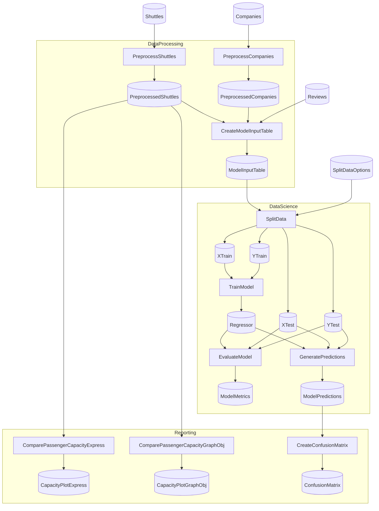

# Spaceflights: Python & EFCore Cooperation Demo

This pipeline is an iteration of the Spaceflights pipeline used throughout the Flowthru examples set. This specific pipeline targets testing interoperability between the `Flowthru.Extensions.EFCore` and `Flowthru.Extensions.Python` packages, to demonstrate the separability of:

1. Python and C# nodes coexisting in the same project; with
2. Python taking advantage of advanced implementations of `IStorageAdapter`, such as the implementation used for EFCore.

<!-- flowthru:mermaid:start -->

<!-- flowthru:mermaid:end -->
