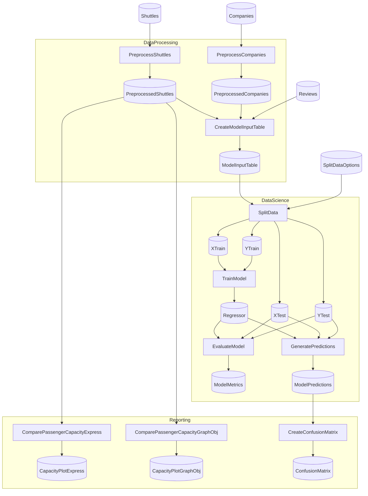

# Spaceflights: Python & EFCore Cooperation Demo

This pipeline is an iteration of the Spaceflights pipeline used throughout the Flowthru examples set. This specific pipeline targets testing interoperability between the `Flowthru.Extensions.EFCore` and `Flowthru.Extensions.Python` packages, to demonstrate the separability of:

1. Python and C# nodes coexisting in the same project; with
2. Python taking advantage of advanced implementations of `IStorageAdapter`, such as the implementation used for EFCore.

<!-- flowthru:mermaid:start -->

<!-- flowthru:mermaid:end -->

<!-- flowthru:filetree:start -->
```
SpaceflightsPythonEFCore/
├── Program.cs  # entry point
├── Data/
│   ├── spaceflights.db
│   ├── SpaceflightsDbContext.cs
│   ├── _01_Raw/
│   │   ├── Datasets/
│   │   │   ├── companies.csv
│   │   │   ├── NOTICE
│   │   │   ├── reviews.csv
│   │   │   └── shuttles.xlsx
│   │   └── Schemas/
│   │       ├── CompanySchema.cs
│   │       ├── ReviewSchema.cs
│   │       └── ShuttleSchema.cs
│   ├── ...
│   └── _08_Reporting/
│       ├── Datasets/
│       │   ├── shuttle_passenger_capacity_plot_exp.json
│       │   └── shuttle_passenger_capacity_plot_go.json
│       └── Images/
│           └── confusion_matrix.png
└── Flows/
    ├── DataProcessing/
    │   └── Steps/
    │       ├── __init__.py
    │       ├── CreateModelInputTableStep.cs
    │       ├── PreprocessCompaniesStep.cs
    │       └── PreprocessShuttlesStep.cs
    ├── DataScience/
    │   ├── Schemas/
    │   │   └── SplitDataOptions.cs
    │   └── Steps/
    │       ├── evaluate_model.py
    │       ├── generate_predictions.py
    │       ├── split_data.py
    │       ├── train_model.py
    │       └── __pycache__/
    │           ├── evaluate_model.cpython-310.pyc
    │           ├── generate_predictions.cpython-310.pyc
    │           ├── split_data.cpython-310.pyc
    │           └── train_model.cpython-310.pyc
    └── Reporting/
        └── Steps/
            ├── __init__.py
            ├── compare_passenger_capacity.py
            ├── create_confusion_matrix.py
            └── __pycache__/
                ├── __init__.cpython-310.pyc
                ├── compare_passenger_capacity.cpython-310.pyc
                └── create_confusion_matrix.cpython-310.pyc
```
<!-- flowthru:filetree:end -->
