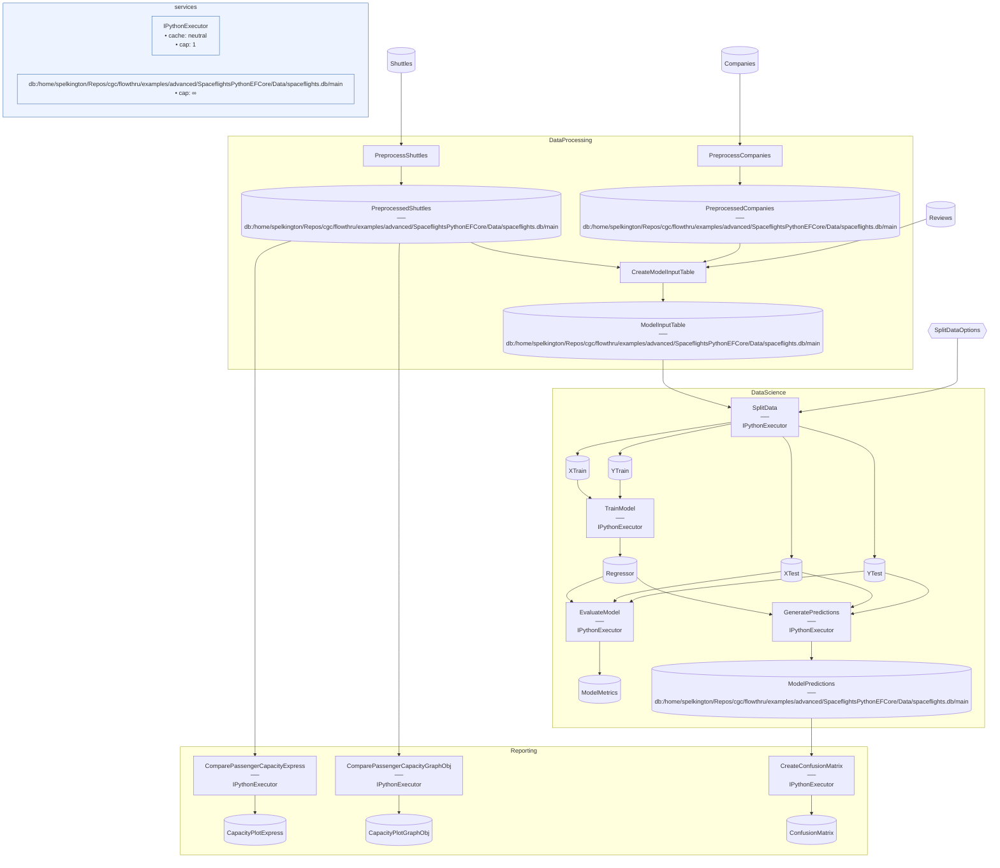

# SpaceflightsPythonEFCore Advanced

> [!NOTE]
> How do I use Python Steps with EFCore-backed Catalog Items?

This project demonstrates Python Steps reading from and writing to SQLite-backed Catalog Items via Arrow IPC marshalling, with clean language separation at Flow boundaries — C# handles ingestion and joins, Python handles modeling and reporting.

This project:

- Runs a C# `DataProcessing` Flow that ingests raw CSV/Excel inputs and writes the preprocessed companies, shuttles, reviews, and joined `ModelInputTable` into SQLite via [`SpaceflightsDbContext`](./Data/SpaceflightsDbContext.cs).
- Runs a Python `DataScience` Flow that reads `ModelInputTable` as a pandas DataFrame (Arrow IPC, transparent), trains a regression model, and writes `ModelPredictions` back into SQLite.
- Runs a Python `Reporting` Flow that reads both C#-written tables (`PreprocessedShuttles`) and Python-written tables (`ModelPredictions`) to produce Plotly JSON capacity charts and a PNG confusion matrix.
- Tunes the Python/EFCore seam with `.WithQuery(q => q.OrderBy(...))` for deterministic row order before Python reads, and `.WithSave(BulkSavePredictions)` on `ModelPredictions` to issue raw SQL `INSERT`s instead of routing through EFCore's change tracker.

This is a reference example, not a template — `dotnet new` does not scaffold it. Assumes you've worked through [SpaceflightsEFCore](../../starter/SpaceflightsEFCore/) and [SpaceflightsPython](../../starter/SpaceflightsPython/). Modeled after [`kedro-org/kedro-starters`](https://github.com/kedro-org/kedro-starters)' Spaceflights tutorial.

## Getting Started

Requires Python 3.10+ and the [`uv`](https://docs.astral.sh/uv/) CLI (install via [`uv`'s installer](https://docs.astral.sh/uv/getting-started/installation/) if you don't already have it). Bootstrap the Python environment, then run:

```bash
uv sync
nx run SpaceflightsPythonEFCore
```

First run creates an empty SQLite database at [`Data/spaceflights.db`](./Data/spaceflights.db); subsequent runs reuse the same file (delete it to start clean). The confusion matrix PNG lands at [`Data/_08_Reporting/Images/confusion_matrix.png`](./Data/_08_Reporting/Images/confusion_matrix.png); the Plotly figure JSONs land in [`Data/_08_Reporting/Datasets/`](./Data/_08_Reporting/Datasets/).

## Concepts

- **[Arrow IPC across the EFCore boundary](./Flows/DataScience/Steps/split_data.py):** when a Python `@step` declares an EFCore-backed Catalog Item as an input, the framework materializes the `DbSet` and marshals it to a pandas DataFrame via Apache Arrow IPC. The Python code sees only `pd.DataFrame` — no awareness of EFCore, no `IQueryable`, no entity types. The reverse path applies on writes: a DataFrame return value is converted back to a list of entities for the Item's `saveFunc`.
- **[Deterministic ordering before Python](./Data/_03_Primary/Catalog.Primary.cs):** LINQ-to-SQL doesn't guarantee row order without an explicit `ORDER BY`, and a Python Step that's order-sensitive (e.g., a train/test split with a fixed seed) needs determinism. Without it, your metrics drift between runs on the same data — the seed reproducibly partitions a *different* permutation each time. `ModelInputTable` uses `.WithQuery(q => q.OrderBy(r => r.ShuttleId))` to pin the order at materialization time.
- **[Custom `.WithSave` for bulk inserts](./Data/_07_ModelOutput/Catalog.ModelOutput.cs):** `ModelPredictions` overrides the default EFCore write path with `.WithSave(BulkSavePredictions)` — a lambda that issues raw SQL `INSERT` statements, bypassing the EFCore change tracker. Useful when the Python Step produces a large DataFrame and the per-row overhead of EFCore tracking would dominate.
- **[Joint DI for both extensions](./Program.cs):** `AddDbContextFactory<SpaceflightsDbContext>()` and `flowthru.UsePython(...)` register side-by-side in `Program.cs`. Flows split by language at their boundaries — `DataProcessing` is pure C#, `DataScience` and `Reporting` are pure Python — and share data through the EFCore-backed Catalog rather than mixing languages within a single Flow.

## Structure

### Diagram

<!-- flowthru:mermaid:start -->

<!-- flowthru:mermaid:end -->

### Files

<!-- flowthru:filetree:start -->
```
SpaceflightsPythonEFCore/
├── Program.cs  # entry point
├── Data/
│   ├── spaceflights.db
│   ├── SpaceflightsDbContext.cs
│   ├── _01_Raw/
│   │   ├── Datasets/
│   │   │   ├── companies.csv
│   │   │   ├── NOTICE
│   │   │   ├── reviews.csv
│   │   │   └── shuttles.xlsx
│   │   └── Schemas/
│   │       ├── CompanySchema.cs
│   │       ├── ReviewSchema.cs
│   │       └── ShuttleSchema.cs
│   ├── ...
│   └── _08_Reporting/
│       ├── Datasets/
│       │   ├── shuttle_passenger_capacity_plot_exp.json
│       │   └── shuttle_passenger_capacity_plot_go.json
│       └── Images/
│           └── confusion_matrix.png
└── Flows/
    ├── DataProcessing/
    │   └── Steps/
    │       ├── __init__.py
    │       ├── CreateModelInputTableStep.cs
    │       ├── PreprocessCompaniesStep.cs
    │       └── PreprocessShuttlesStep.cs
    ├── DataScience/
    │   ├── Schemas/
    │   │   └── SplitDataOptions.cs
    │   └── Steps/
    │       ├── evaluate_model.py
    │       ├── generate_predictions.py
    │       ├── split_data.py
    │       ├── train_model.py
    │       └── __pycache__/
    │           ├── evaluate_model.cpython-310.pyc
    │           ├── generate_predictions.cpython-310.pyc
    │           ├── split_data.cpython-310.pyc
    │           └── train_model.cpython-310.pyc
    └── Reporting/
        └── Steps/
            ├── __init__.py
            ├── compare_passenger_capacity.py
            ├── create_confusion_matrix.py
            └── __pycache__/
                ├── __init__.cpython-310.pyc
                ├── compare_passenger_capacity.cpython-310.pyc
                └── create_confusion_matrix.cpython-310.pyc
```
<!-- flowthru:filetree:end -->
