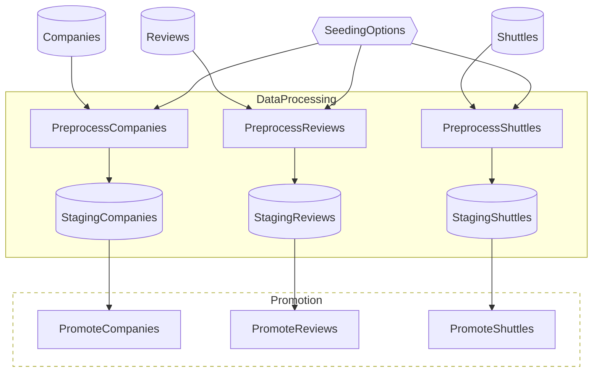
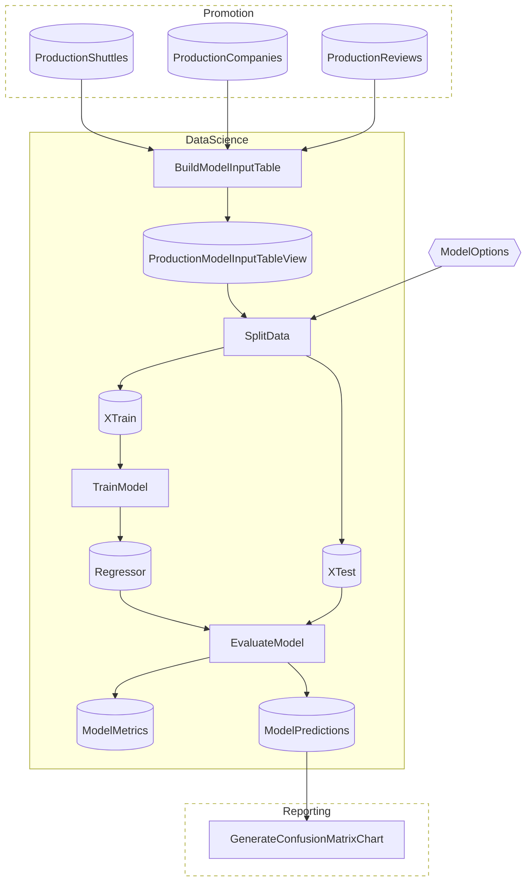
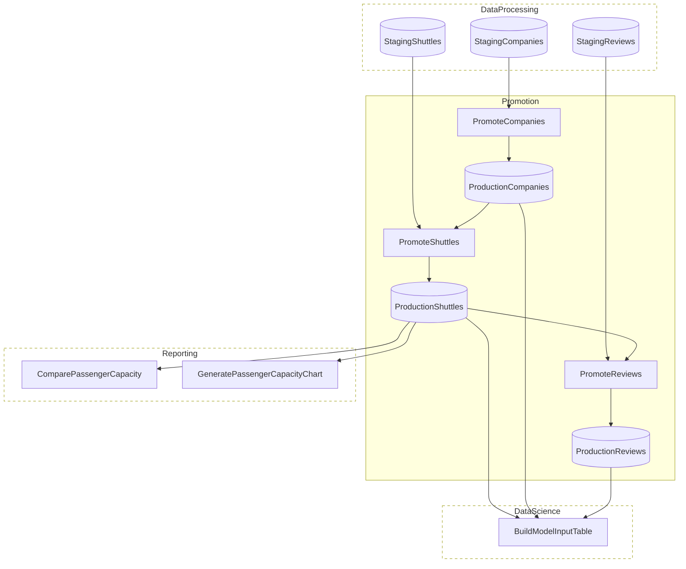
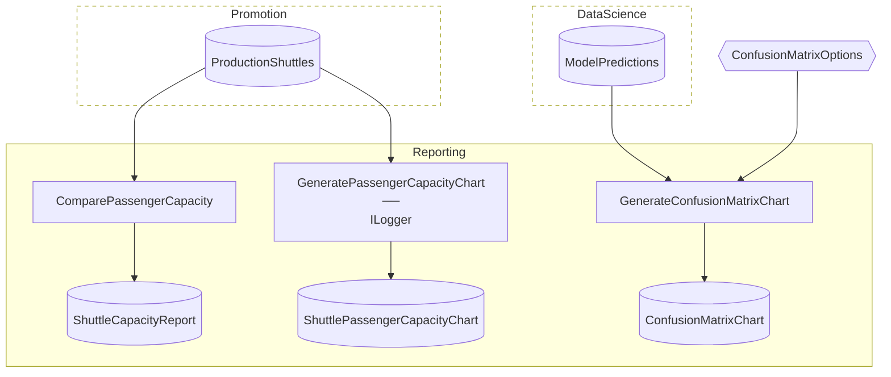

# SpaceflightsStagingSchema Advanced

> [!NOTE]
> How do I promote data from an ephemeral staging schema into a durable production schema?

This project demonstrates a staging→production promotion pattern over PostgreSQL — raw data lands in an ephemeral `staging` schema that's dropped at Flow completion, and FK-conformant subsets are promoted into a durable `public` schema before any modeling or reporting work runs.

This project:

- Brings up PostgreSQL 17 on demand via Testcontainers, then runs four Flows (DataProcessing → Promotion → DataScience → Reporting) against it.
- Splits the catalog across two `DbContext`s — [`StagingDbContext`](./Data/StagingDbContext.cs) (schema: `staging`) and [`ProductionDbContext`](./Data/ProductionDbContext.cs) (schema: `public`) — sharing one physical database.
- Wraps the run in a `FlowResource<DbScope>` lifecycle: the `staging` schema is created at startup, dropped on success, and preserved on failure for debugging.
- Filters FK-respecting subsets in dedicated [Promotion Steps](./Flows/Promotion/Steps/) that move data from `staging.*` to `public.*` before downstream Flows ever read the production tables.
- Uses Npgsql binary COPY (`BulkSave.Insert`) on every production write and pushes joins/aggregations into SQL via `DbQuery.Project`.

This is a reference example, not a template — `dotnet new` does not scaffold it. Assumes you've worked through [Spaceflights](../../starter/Spaceflights/) and [SpaceflightsEFCore](../../starter/SpaceflightsEFCore/). Modeled after [`kedro-org/kedro-starters`](https://github.com/kedro-org/kedro-starters)' Spaceflights tutorial.

## Getting Started

Requires Docker on the host — Testcontainers spins up PostgreSQL 17 on entry and tears it down on exit.

```bash
nx run SpaceflightsStagingSchema                                  # run all Flows
nx run SpaceflightsStagingSchema -- --flows DataProcessing        # run a specific Flow
nx run SpaceflightsStagingSchema -- --dry-run                     # validate without executing Steps
```

The capacity report lands at [`Data/_08_Reporting/Datasets/shuttle_capacity_report.json`](./Data/_08_Reporting/Datasets/shuttle_capacity_report.json). End-to-end run on the real-data input set finishes in ~6 seconds; see the synthetic-seeding bullet under Concepts for scaling to bulk-throughput tests.

## Concepts

- **[`FlowResource<DbScope>` lifecycle](./Data/StagingCatalog.cs):** the `staging` schema is declared via `EphemeralSchema(...)` as a `FlowResource` on the StagingCatalog. The framework calls `Acquire()` before the Flow body runs (create the schema + tables) and `Release()` on exit (drop the schema). `PreserveOnFailure = true` keeps `staging` intact when something throws, so you can inspect the partial state.
- **[Two `DbContext`s, one database](./Data/ProductionDbContext.cs):** both contexts point at the same Postgres instance but declare different default schemas via `HasDefaultSchema`. Single connection, two namespaces — promotion Steps read `staging.*` and write `public.*` against the same physical DB.
- **[FK-conformant promotion Steps](./Flows/Promotion/Steps/PromoteShuttlesStep.cs):** the `Promotion` Flow's three Steps (`PromoteCompanies`, `PromoteShuttles`, `PromoteReviews`) filter their staging inputs to FK-respecting subsets before writing to production. If staging holds a shuttle whose `CompanyId` doesn't exist in `production.Companies`, `PromoteShuttles` drops it before the database's FK constraint would reject the insert. `staging` is the unconstrained scratchpad; `public` is the FK-clean system of record, enforced both by the C# filter and by the database constraints declared in [`ProductionDbContext.OnModelCreating`](./Data/ProductionDbContext.cs).
- **[`BulkSave.Insert` on production writes](./Data/_02_Intermediate/Catalog.Intermediate.Production.cs):** every production-side Catalog Item uses `BulkSave.Insert` as its `saveFunc` — Npgsql binary `COPY`, orders of magnitude faster than the change-tracker default. Also used in [`Catalog.ModelInput.cs`](./Data/_05_ModelInput/Catalog.ModelInput.cs) and [`Catalog.ModelOutput.cs`](./Data/_07_ModelOutput/Catalog.ModelOutput.cs).
- **[`DbQuery.Project` for server-side composition](./Flows/DataScience/Steps/BuildModelInputTableStep.cs):** Steps return a deferred `DbQuery<T>` instead of materializing rows in C#. `BuildModelInputTableStep` composes a SQL JOIN over the three FK-clean production tables; the SQL fires only when `SplitData` iterates. [`ComparePassengerCapacityStep`](./Flows/Reporting/Steps/ComparePassengerCapacityStep.cs) does the same for a `GROUP BY` aggregation — no rows materialize in C# regardless of table size.
- **[Synthetic seeding for bulk-throughput tests](./Flows/DataProcessing/SeedingOptions.cs):** the DataProcessing Flow accepts a `SeedingOptions` config that synthesizes additional rows alongside the real Spaceflights CSVs, deterministically and FK-respecting. Defaults in [`appsettings.json`](./appsettings.json) under `Flowthru:Flows:DataProcessing:Seeding` are zero; override at the same path in `appsettings.Local.json`, setting `SyntheticCompanies`, `SyntheticShuttles`, and `SyntheticReviews` to scale up (e.g., 100k / 500k / 500k). The real Spaceflights inputs alone run in ~6 seconds — too small to meaningfully exercise the bulk path.

## Structure

### Diagram

<!-- flowthru:mermaid:start -->
#### DataProcessing



#### DataScience



#### Promotion



#### Reporting


<!-- flowthru:mermaid:end -->

### Files

<!-- flowthru:filetree:start -->
```
SpaceflightsStagingSchema/
├── Program.cs  # entry point
├── Data/
│   ├── production.db
│   ├── ProductionCatalog.cs
│   ├── ProductionDbContext.cs
│   ├── RawCatalog.cs
│   ├── StagingCatalog.cs
│   ├── StagingDbContext.cs
│   ├── _01_Raw/
│   │   ├── Datasets/
│   │   │   ├── companies.csv
│   │   │   ├── NOTICE
│   │   │   ├── reviews.csv
│   │   │   └── shuttles.xlsx
│   │   └── Schemas/
│   │       ├── CompanySchema.cs
│   │       ├── ReviewSchema.cs
│   │       └── ShuttleSchema.cs
│   ├── ...
│   └── _08_Reporting/
│       ├── Datasets/
│       │   └── shuttle_capacity_report.json
│       └── Schemas/
│           └── ShuttleCapacityReport.cs
└── Flows/
    ├── DataProcessing/
    │   ├── SeedingOptions.cs
    │   ├── SyntheticDataSeeder.cs
    │   └── Steps/
    │       ├── PreprocessCompaniesStep.cs
    │       ├── PreprocessReviewsStep.cs
    │       └── PreprocessShuttlesStep.cs
    ├── DataScience/
    │   └── Steps/
    │       ├── BuildModelInputTableStep.cs
    │       ├── EvaluateModelStep.cs
    │       ├── SplitDataStep.cs
    │       └── TrainModelStep.cs
    ├── Promotion/
    │   └── Steps/
    │       ├── PromoteCompaniesStep.cs
    │       ├── PromoteReviewsStep.cs
    │       └── PromoteShuttlesStep.cs
    └── Reporting/
        └── Steps/
            ├── ComparePassengerCapacityStep.cs
            ├── CreateConfusionMatrixStep.cs
            └── GeneratePassengerCapacityChartStep.cs
```
<!-- flowthru:filetree:end -->
