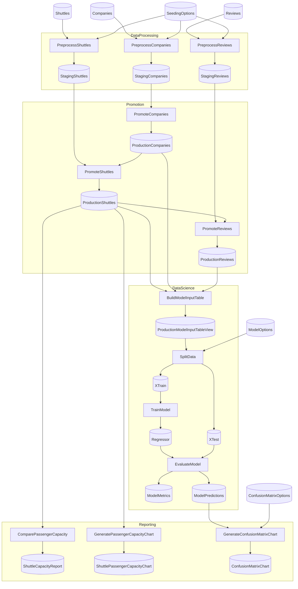

# Spaceflights Staging Schema (PostgreSQL)

Production-grade reference for the **staging→production promotion pattern** in Flowthru. An ephemeral PostgreSQL schema is provisioned for staging, raw data flows through it, and FK-conformant rows are promoted into a durable production schema. The whole run executes against a dedicated PostgreSQL instance brought up via Testcontainers.

## Topology

```
[Raw CSV/Excel]  →  DataProcessing  →  staging.{Companies,Shuttles,Reviews}  ←  unconstrained
                                                       │
                                                       ▼
                                  Promotion  ─ FK-conformance filter ─►  public.{Companies,Shuttles,Reviews}
                                                                                      │
                                                                                      ▼
                                                                              DataScience  →  public.{Train,Test,Models,Metrics,Predictions}
                                                                                      │
                                                                                      ▼
                                                                              Reporting  →  JSON report + chart objects
```

`staging` is dropped on flow completion (or preserved on failure for debugging). `public` persists for the lifetime of the Testcontainers session.

## What this demonstrates

- **`FlowResource<DbScope>` lifecycle.** [`StagingCatalog`](Data/StagingCatalog.cs) declares a `FlowResource` via `EFCoreResources.EphemeralSchema(...)`. The framework drops + recreates the `staging` schema before the flow runs and drops it again on exit, in LIFO order, regardless of success or failure.
- **PostgreSQL multi-schema architecture.** Two `DbContext`s (`StagingDbContext`, `ProductionDbContext`) point at the same database but declare different default schemas via `HasDefaultSchema`. Single connection, two namespaces.
- **`BulkSave.Insert` on every production write site.** [Companies/Shuttles/Reviews](Data/_02_Intermediate/Catalog.Intermediate.Production.cs), [TrainSplit/TestSplit](Data/_05_ModelInput/Catalog.ModelInput.cs), and [ModelPredictions](Data/_07_ModelOutput/Catalog.ModelOutput.cs) use `BulkSave.Insert` as their `saveFunc` — Npgsql binary `COPY`, orders of magnitude faster than the change-tracker default.
- **Server-side aggregation via `DbQuery.Project`.** [`ComparePassengerCapacityStep`](Flows/Reporting/Steps/ComparePassengerCapacityStep.cs) projects a SQL `GROUP BY` directly onto PostgreSQL — no rows materialize in C# regardless of how many shuttles are in the table.
- **Deferred query view for the model input table.** [`BuildModelInputTableStep`](Flows/DataScience/Steps/BuildModelInputTableStep.cs) composes a `DbQuery.Project<>` join over the three FK-constrained production tables. The SQL fires only when `SplitData` iterates.
- **FK enforcement at the database layer.** Promotion isn't pure identity — the [`PromoteShuttlesStep`](Flows/Promotion/Steps/PromoteShuttlesStep.cs) and [`PromoteReviewsStep`](Flows/Promotion/Steps/PromoteReviewsStep.cs) bodies filter to FK-respecting subsets so the database accepts the inserts. Staging is the unconstrained scratchpad; production is the FK-clean system of record.

## Running

Requires Docker on the host. The example brings up PostgreSQL 17 via Testcontainers on `Main` entry and disposes it on exit.

```bash
# Run all flows
dotnet run

# Run a specific flow
dotnet run -- --flows DataProcessing

# Dry-run with full lifecycle (acquires + releases the schema, runs all
# pre-flight checks, but skips step execution)
dotnet run -- --dry-run --acquire-on-dry-run
```

## Scaling for bulk-throughput tests

Real-data inputs (Spaceflights CSVs) run end-to-end in ~6 seconds — too small to meaningfully exercise the bulk path. The DataProcessing flow accepts a [`SeedingOptions`](Flows/DataProcessing/SeedingOptions.cs) config that synthesizes additional rows alongside the real ones, deterministically and FK-respecting.

Defaults in [`appsettings.json`](appsettings.json) are zero (no synthesis). Override locally via `appsettings.Local.json`:

```json
{
  "Flowthru": {
    "Flows": {
      "DataProcessing": {
        "Seeding": {
          "SyntheticCompanies": 100000,
          "SyntheticShuttles": 500000,
          "SyntheticReviews": 1000000,
          "RandomSeed": 42
        }
      }
    }
  }
}
```

**Statistical fidelity is not a goal.** Synthetic rows are uncorrelated with the real Spaceflights data — RNG-generated company names, ratings, prices, etc. The point is throughput, not predictive validity. The DataScience model trained on the augmented data will be approximately useless; that's expected.

**FK shape is preserved.** Synthetic shuttles reference `syn-co-{i mod SyntheticCompanies}`; synthetic reviews reference `syn-sh-{i mod SyntheticShuttles}`. As long as you scale companies and shuttles up enough to support the children, the FK conformance filter at promotion retains them.

### Measured timings (1.6M rows synthetic)

Reference numbers from a local run with `100k companies / 500k shuttles / 1M reviews` on a CachyOS dev box, single-process PostgreSQL container:

```
Total duration: 41.7s

Promotion.PromoteReviews          14.29s   ← C# HashSet filter (500k IDs) + bulk insert (1M rows)
Promotion.PromoteShuttles          8.94s   ← HashSet filter (100k IDs) + bulk insert (500k rows)
DataScience.SplitData              7.89s   ← materialize 1.5M-row join + shuffle for train/test
DataScience.TrainModel             2.59s   ← Math.NET QR on the materialized features
DataProcessing.PreprocessShuttles  2.65s   ← parse real + emit 500k synthetic + bulk write
DataProcessing.PreprocessReviews   2.18s   ← same shape, 1M synthetic
Promotion.PromoteCompanies         1.22s   ← bulk insert 100k+ rows
DataScience.EvaluateModel          0.83s
Reporting.GeneratePassengerCapacityChart   0.51s
DataProcessing.PreprocessCompanies         0.37s
Reporting.GenerateConfusionMatrixChart     0.16s
Reporting.ComparePassengerCapacity         0.07s   ← server-side GROUP BY: ~10 rows over the wire
DataScience.BuildModelInputTable           0.00s   ← deferred query, fires when SplitData iterates
```

The promote steps dominate at this scale — that's the C# HashSet filter + bulk insert pattern showing its cost. Crossing into multi-million-row territory is where the still-on-you items in the next section start to matter.

## Optimization paths

This example exercises three optimization paths the framework already provides. The fourth — full server-side fused INSERT-FROM-SELECT for cross-schema promotion — is documented as a future direction.

| Site | Path used | Mechanism |
|---|---|---|
| Staging writes (preprocess steps → `staging.X`) | `BulkSave.Insert` | Npgsql binary `COPY` |
| Promotion writes (`production.X`) | C# HashSet FK filter + `BulkSave.Insert` | In-process filter, then bulk insert |
| DataScience writes (splits, predictions) | `BulkSave.Insert` | Npgsql binary `COPY` |
| Reporting aggregation | `DbQuery.Project` SQL `GROUP BY` | Server-side reduction |
| Model input table | `DbQuery.Project` deferred join | Server-side `JOIN`, lazily fired |

### What's still on the user (and on the framework)

The framework's fused `INSERT-FROM-SELECT` save dispatch (`DbQueryStorageAdapter.FusedSaveAsync`) is designed for same-`DbContext` source-and-destination. Cross-context promotion — even when the two contexts share a connection and database — falls to the materialized save path because the source's `BuildQuery` is resolved against the destination's context and would query the wrong schema.

To unlock the fully fused path, the example would need:

1. **A single `DbContext`** mapping both schemas via shared-type entity types (`modelBuilder.SharedTypeEntity<T>("StagingCompanies", b => b.ToTable("Companies", "staging"))` etc.).
2. **A new factory shape** in `Flowthru.Extensions.EFCore` that lets catalog items reference shared-type entity names rather than the default `Set<T>()`.

Both are bounded changes worth tracking as a follow-up. With them in place, promote steps could be `rows => rows` again, and the database would do the join + insert in one server-side operation, with zero C# materialization. The current `BulkSave.Insert` path is a strong second-best — fast in absolute terms, and the right move for two-DbContext architectures.

Other gaps that emerge at multi-GB scale:

- **No transactional boundary across multi-step promotion.** If `PromoteShuttles` succeeds but `PromoteReviews` fails, production is half-promoted. Mitigations: `BulkSave.InsertOrUpdateOrDelete` for idempotent restart, or schema-rename atomicity (`ALTER SCHEMA tmp RENAME TO public`).
- **No checkpoint primitive.** Idempotent acquire wipes staging; production isn't wiped. Re-runs need explicit handling on the user side.
- **`InspectShallow` / `InspectDeep` at scale.** Pre-flight inspection sampling behavior is undefined for multi-billion-row tables.

## Project layout

```
SpaceflightsStagingSchema/
├── Program.cs                          # TestContainers PG bring-up + service registration
├── appsettings.json                    # Pipeline configuration
├── Data/
│   ├── StagingDbContext.cs             # HasDefaultSchema("staging")
│   ├── ProductionDbContext.cs          # HasDefaultSchema("public") + FK constraints
│   ├── RawCatalog.cs                   # CSV/Excel inputs (no resource)
│   ├── StagingCatalog.cs               # FlowResource<DbScope> via EphemeralSchema
│   ├── ProductionCatalog.cs            # Persistent; EnsureCreated in ctor
│   ├── FlowConfig.cs                   # appsettings binding
│   └── _01_Raw/ … _08_Reporting/       # Layered schemas + per-layer catalog partials
└── Flows/
    ├── DataProcessing/                 # Raw → Staging
    ├── Promotion/                      # Staging → Production (FK-conformant)
    ├── DataScience/                    # Production → Production
    └── Reporting/                      # Production → Production
```

## Comparison with `examples/starter/SpaceflightsEFCore`

| Aspect | `SpaceflightsEFCore` (starter) | `SpaceflightsStagingSchema` (advanced) |
|---|---|---|
| Backing store | SQLite, single file | PostgreSQL via Testcontainers |
| Schemas | None | `staging` + `public` |
| Resource lifecycle | None | `FlowResource<DbScope>` via `EphemeralSchema` |
| Save path | Default change tracker | `BulkSave.Insert` (Npgsql COPY) |
| Aggregations | C# `GroupBy` | `DbQuery.Project` SQL `GROUP BY` |
| FK enforcement | Implicit via inner join in C# | Explicit FK constraints in PG, conformance filter at promotion |
| Audience | Learning EFCore + Flowthru | Production-grade reference |

<!-- flowthru:mermaid:start -->

<!-- flowthru:mermaid:end -->

<!-- flowthru:filetree:start -->
```
SpaceflightsStagingSchema/
├── Program.cs  # entry point
├── Data/
│   ├── production.db
│   ├── ProductionCatalog.cs
│   ├── ProductionDbContext.cs
│   ├── RawCatalog.cs
│   ├── StagingCatalog.cs
│   ├── StagingDbContext.cs
│   ├── _01_Raw/
│   │   ├── Datasets/
│   │   │   ├── companies.csv
│   │   │   ├── NOTICE
│   │   │   ├── reviews.csv
│   │   │   └── shuttles.xlsx
│   │   └── Schemas/
│   │       ├── CompanySchema.cs
│   │       ├── ReviewSchema.cs
│   │       └── ShuttleSchema.cs
│   ├── ...
│   └── _08_Reporting/
│       ├── Datasets/
│       │   └── shuttle_capacity_report.json
│       └── Schemas/
│           └── ShuttleCapacityReport.cs
└── Flows/
    ├── DataProcessing/
    │   ├── SeedingOptions.cs
    │   ├── SyntheticDataSeeder.cs
    │   └── Steps/
    │       ├── PreprocessCompaniesStep.cs
    │       ├── PreprocessReviewsStep.cs
    │       └── PreprocessShuttlesStep.cs
    ├── DataScience/
    │   └── Steps/
    │       ├── BuildModelInputTableStep.cs
    │       ├── EvaluateModelStep.cs
    │       ├── SplitDataStep.cs
    │       └── TrainModelStep.cs
    ├── Promotion/
    │   └── Steps/
    │       ├── PromoteCompaniesStep.cs
    │       ├── PromoteReviewsStep.cs
    │       └── PromoteShuttlesStep.cs
    └── Reporting/
        └── Steps/
            ├── ComparePassengerCapacityStep.cs
            ├── CreateConfusionMatrixStep.cs
            └── GeneratePassengerCapacityChartStep.cs
```
<!-- flowthru:filetree:end -->
