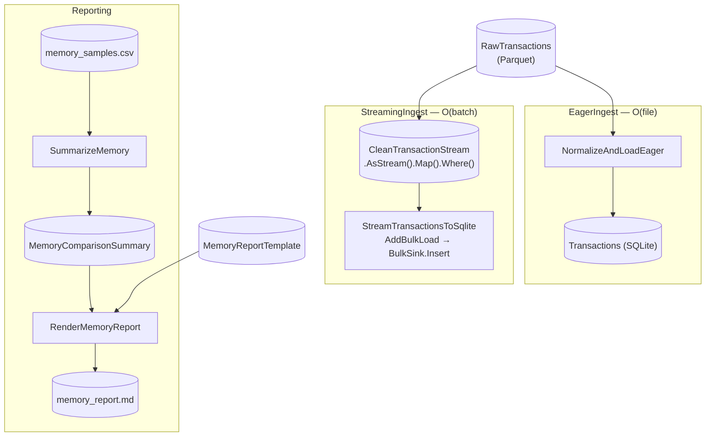

# StreamingBulkLoad Advanced

> [!NOTE]
> How do I bulk-load a large Parquet dataset into a database on a memory-constrained host without buffering the whole file?

This project demonstrates streaming a multi-row-group Parquet dataset into SQLite one row group at a time — O(batch) peak memory — and measures the win against the eager O(file) path over the very same data.

This project:

- Generates a synthetic multi-row-group Parquet dataset (row count is a knob) and reads it back two ways into the **same** SQLite schema — an **eager** Flow (materialise the whole file, then bulk-write) and a **streaming** Flow (`.AsStream().Map(...).Where(...)` into an `AddBulkLoad` sink).
- Instruments itself: a background working-set sampler wraps each ingest variant and records peak memory to a Raw CSV, which a pure-Flowthru **Reporting** Flow reads back to render `memory_report.md` — the example proves its own thesis.
- Frames the production shape: the constrained-host story where the eager path OOMs and the streaming path survives, and where the Parquet would arrive forward-only from S3.

**This is not a template** — `dotnet new` does not scaffold it, and the harness in `Program.cs` is bespoke self-measurement rather than the standard CLI host. It is the runnable, teachable form of the downstream case that motivated the streaming milestone ([#111](https://github.com/chaoticgoodcomputing/flowthru/issues/111)). Assumes you've worked through [SpaceflightsEFCore](../../starter/SpaceflightsEFCore/) and [FlowthruCoverage](../FlowthruCoverage/).

## Getting Started

Runs with no external database — SQLite via `EFCore.BulkExtensions`, and the dataset is generated on first run. From this directory:

```bash
nx run StreamingBulkLoad:run       # or: dotnet run
```

Crank the dataset up (wider memory gap, longer runtime), then run:

```bash
STREAMINGBULKLOAD_ROWS=2000000 ./scripts/generate-dataset.sh   # or: nx run StreamingBulkLoad:generate
dotnet run
```

Success looks like the verdict printed to the console and written to [`Data/_04_Reporting/Datasets/memory_report.md`](./Data/_04_Reporting/Datasets/memory_report.md) — at the 200,000-row default, streaming holds peak managed memory to ~15% of eager while both load the same 196,000 rows into [`Data/_02_Intermediate/transactions.db`](./Data/_02_Intermediate/).

To watch the constrained-host story directly, cap the process and run the eager path alone under a ceiling it cannot fit — it OOMs, while streaming survives the same cap:

```bash
# Eager peak scales with the file; streaming peak stays flat. Crank rows high,
# then cap the process memory (mirrors tests/extensions/CONTRIBUTING.md).
podman run --rm --memory=256m -v "$PWD/../../..":/work -w /work/examples/advanced/StreamingBulkLoad \
  mcr.microsoft.com/dotnet/sdk:10.0 \
  bash -c 'STREAMINGBULKLOAD_ROWS=5000000 dotnet run'
```

## Concepts

> **Reminder:** the patterns below show how the streaming primitives compose on a real workload, **not** a template to clone. The harness, schema, and measurement wiring are specific to this demonstration.

- **[Streaming ingest with `.AsStream()` + `AddBulkLoad`](./Flows/StreamingIngest/StreamingIngestFlow.cs):** the whole load is one on-DAG step — the streaming Parquet view drives an EF Core bulk sink batch-by-batch inside one transaction, so peak memory is O(batch) no matter how large the file. This is the runnable form of the #111 downstream case.
- **[Lazy `.Map` / `.Where` streaming combinators](./Flows/StreamingIngest/Steps/CleanTransactionStreamView.cs):** the normalise + filter transform is applied as lazy `FlowSource` combinators over the stream, wrapped as a read-only Catalog Item so `AddBulkLoad` consumes it on the DAG. No row is pulled until the sink drains it.
- **[Eager and streaming as a per-edge wiring choice](./Flows/EagerIngest/EagerIngestFlow.cs):** the same [normalise + filter](./Flows/Shared/TransactionCleaning.cs) runs on both paths over the same schema — the eager Flow consumes the materialised `IEnumerable` (O(file)); the streaming Flow consumes the `.AsStream()` view (O(batch)). The transform code is byte-for-byte identical; only the grain differs.
- **[EFCore.Bulk streaming sink](./Data/_02_Intermediate/Catalog.Intermediate.cs):** `BulkSink.Insert<T, TContext>` opens one transaction, bulk-inserts one batch per arriving chunk, and commits on success — rolling back the whole write on a mid-stream failure, so O(batch) memory and all-or-nothing stay honest together.
- **[Multi-row-group Parquet as the streaming knob](./Data/_01_Raw/Catalog.Raw.cs):** the dataset is written with small (10,000-row) row groups so a modest file still spans many groups. The streaming reader yields one group at a time — the row-group size is what bounds streaming's peak.
- **[Self-measurement via a background RSS sampler](./Program.cs):** `Program.cs` polls `Process.WorkingSet64` and `GC.GetTotalMemory` on a background thread while each variant runs, tracks the peak, and writes `{ Variant, RowCount, PeakWorkingSetBytes, PeakManagedBytes, DurationMs }` to a Raw CSV.
- **[The example proving its own thesis](./Flows/Reporting/ReportingFlow.cs):** a pure-Flowthru Reporting Flow reads the measurement CSV back like any other input, summarises the eager-vs-streaming verdict, and renders it from a [checked-in Markdown template](./Data/_01_Raw/Templates/memory_report.md) — the same self-analysing shape as FlowthruCoverage.
- **Constrained-host framing:** in production this Parquet arrives forward-only from S3 (the seekable-spill path), and the host is a small Lambda or lightweight ECS/Fargate container. The eager path's peak grows with the file until it OOMs; streaming's stays flat — run it under `podman run --memory=…` to see the difference.

## Structure

### Diagram

The three Flows over one shared SQLite schema: two ingest variants and the self-measurement report.

<!-- flowthru:mermaid:start -->

<!-- flowthru:mermaid:end -->

### Files

<!-- flowthru:filetree:start -->
```
StreamingBulkLoad/
├── Program.cs  # entry point
├── Data/
│   ├── TransactionsDbContext.cs
│   ├── _01_Raw/
│   │   ├── Schemas/
│   │   │   ├── MemorySample.cs
│   │   │   └── TransactionRecord.cs
│   │   └── Templates/
│   │       └── memory_report.md
│   ├── ...
│   └── _04_Reporting/
│       └── (memory_report.md — generated)
├── Flows/
│   ├── Shared/
│   │   └── TransactionCleaning.cs
│   ├── EagerIngest/
│   │   └── Steps/
│   │       └── NormalizeTransactionsStep.cs
│   ├── StreamingIngest/
│   │   └── Steps/
│   │       └── CleanTransactionStreamView.cs
│   └── Reporting/
│       └── Steps/
│           ├── RenderMemoryReportStep.cs
│           └── SummarizeMemoryStep.cs
└── scripts/
    └── generate-dataset.sh
```
<!-- flowthru:filetree:end -->
