# WideTransformBenchmark Advanced

> [!NOTE]
> When is a DuckDB engine transform worth it over an eager C# Step, and how does the gap scale with data size?

This project demonstrates the wide-transform-at-scale pattern as a measured comparison: the same optimize pass — sort by a composite key, dedup, prune columns — runs as an eager C# LINQ Step and as a one-statement DuckDB engine transform over identical fabricated Parquet inputs, and a Flowthru Flow then ingests the example's own profiling data to render the verdict.

This project:

- Fabricates seeded, deterministic multi-column Parquet datasets — duplicate composite keys, a tail of prunable lineage columns — at three default sizes (10k / 40k / 160k rows), scalable via the `FLOWTHRU_WTB_SIZES` env knob.
- Measures the optimize pass through **both** transform paths per size, wall-clock (`Stopwatch`) and managed allocations (`GC.GetTotalAllocatedBytes` delta) captured at the runner level around each flow execution, and asserts after every pair that the two paths produced equivalent output — same row count, row-for-row spot check — so the comparison stays honest.
- Analyzes itself: the harness stages the measurement rows as a Raw CSV, and an ordinary typed **Analyze** Flow ingests them to produce `benchmark_summary.csv` and a templated `benchmark_report.md` — Flowthru is the analytical workload analyzing its own benchmark.

**This is not a template** — `dotnet new` does not scaffold it, and the harness in [`Benchmark/BenchmarkRunner.cs`](./Benchmark/BenchmarkRunner.cs) is bespoke self-measurement rather than the standard CLI host. It is the runnable form of the DuckDB extension's headline claim (wide transforms pay a large tax as in-memory LINQ once data grows). Assumes you've worked through [SpaceflightsDuckDB](../../starter/SpaceflightsDuckDB/) and [FlowthruCoverage](../FlowthruCoverage/).

## Getting Started

Runs with no external services — the embedded DuckDB engine and the fabricated datasets are all local. From this directory:

```bash
nx run WideTransformBenchmark:run       # or: dotnet run
```

Success looks like the per-size table printed to the console and written to [`Data/_04_Reporting/Datasets/benchmark_report.md`](./Data/_04_Reporting/Datasets/benchmark_report.md) (with the summary rows in [`benchmark_summary.csv`](./Data/_04_Reporting/Datasets/benchmark_summary.csv)). A default-size run on one development machine produced:

| Input rows | Output rows | Eager ms | Engine ms | Speedup | Eager alloc (MiB) | Engine alloc (MiB) | Alloc ratio |
|-----------:|------------:|---------:|----------:|--------:|------------------:|-------------------:|------------:|
| 10,000 | 7,880 | 35 | 15 | 2.33x | 12.0 | 0.02 | 512.2x |
| 40,000 | 31,472 | 93 | 33 | 2.82x | 49.7 | 0.02 | 2085.0x |
| 160,000 | 125,963 | 448 | 77 | 5.82x | 194.5 | 0.02 | 8524.5x |

The eager path's wall-clock and allocations grow with the input; the engine path's allocations stay flat (~25 KiB — the rows never enter the CLR) and its wall-clock grows far more slowly, so the gap widens with size. Scale it up to see the story continue — at one million rows the same machine measured the engine **8.13x** faster (2,397 ms vs 295 ms) with a ~48,000x allocation ratio:

```bash
FLOWTHRU_WTB_SIZES=1000000 dotnet run     # or e.g. 100000,1000000,5000000
```

Two honesty notes. **Measured runs always execute:** nothing in this project registers cache storage, each (size × path) run owns its output file, and the harness deletes that file before starting the stopwatch — run it twice and the second run's timings are fresh executions, not cache hits (see [`Benchmark/BenchmarkRunner.cs`](./Benchmark/BenchmarkRunner.cs) for the full argument). **Numbers are one machine's:** wall-clock jitters between runs and machines; expect the table's shape to reproduce, not its cells. Plots are deliberately out of scope — the deliverables are Markdown and CSV, with no Python or venv in the loop.

## Concepts

> **Reminder:** the patterns below show how the engine-transform and self-measurement pieces compose on a real workload, **not** a template to clone. The harness, dataset shape, and measurement wiring are specific to this demonstration.

- **[The same wide transform, both ways](./Flows/EagerOptimize/Steps/OptimizeReadingsEagerStep.cs):** the optimize pass is *wide* — a global sort and dedup must see every input row before emitting any output — which is exactly the work worth handing to an engine-side SQL Step when data is large. The eager Step keeps it as `OrderBy`/`ThenBy` + `DistinctBy` + projection; [the engine Flow](./Flows/EngineOptimize/EngineOptimizeFlow.cs) expresses it as one readable SQL statement (`QUALIFY row_number() OVER (...) = 1`). Narrow, row-at-a-time work would stay in ordinary C# Steps either way.
- **[A pinned dedup contract across paths](./Flows/EngineOptimize/EngineOptimizeFlow.cs):** "keep the first-ingested row per key" means "lowest `RowId`" on both paths — implicitly via LINQ's stable sort + `DistinctBy`, explicitly via the SQL window's `ORDER BY RowId` — and the FUnit tests on the eager Step pin that contract at design time.
- **[Equivalence-checked measurement](./Benchmark/BenchmarkRunner.cs):** after each measured pair, the harness loads both outputs and verifies row counts plus a row-for-row spot check before recording anything, so the speedup table can never silently compare different work — the same measured-comparison ethos as [StreamingBulkLoad](../StreamingBulkLoad/).
- **[Runner-level instrumentation](./Benchmark/BenchmarkRunner.cs):** each measurement is a settle-the-GC, snapshot `GC.GetTotalAllocatedBytes`, `Stopwatch` around `BuiltFlow.RunAsync()` sequence — the same approach as the extension's own `DuckDbSortBenchmarkTests`. Managed allocations are the honest axis: the engine's native memory is governed separately by its own `MemoryLimit`.
- **[Cache correctness by construction](./Program.cs):** Flowthru's step caching would happily serve an unchanged step's output instead of re-executing it — fatal for a benchmark. This project never registers `UseCacheStorage`, builds each measured flow fresh, and deletes outputs before every measured run, so there is no cache plan and nothing a shortcut could serve.
- **[The staged-inputs dogfood](./Flows/Analyze/AnalyzeFlow.cs):** the FlowthruCoverage pattern — pre-Flow work stages Raw inputs, the Flow analyzes them — except the staging step here *is running the benchmark Flows*. The measurement CSV lands in `Data/_01_Raw/`, and the Analyze Flow consumes it like any other Catalog Item.
- **[One shard Catalog per dataset size](./Data/SizedBenchmarkCatalog.cs):** the per-size endpoints (raw readings, one output per path) live on a small Catalog instantiated per size and closure-captured by the per-size flow factories — the shard pattern from [RetailDataSplitFlow](../RetailDataSplitFlow/), with dataset size as the shard key.
- **[Design-time SQL validation](./Flows/EngineOptimize/EngineOptimizeFlow.cs):** `flow.ValidateDuckDbTransforms()` binds the optimize pass's SQL against the declared Schemas without reading data, so a schema-breaking SQL edit fails `dotnet test` before any benchmark runs — the same FUnit affordance the [SpaceflightsDuckDB](../../starter/SpaceflightsDuckDB/) starter demonstrates.

## Structure

### Diagram

The per-size benchmark Flows (both paths over the same raw item) and the Analyze Flow over the staged measurements.

```mermaid
flowchart TB

    %% External Data Inputs
    BenchmarkReportTemplate[("BenchmarkReportTemplate")]
    Measurements[("Measurements")]
    raw_readings_10000[("raw_readings_10000")]
    raw_readings_160000[("raw_readings_160000")]
    raw_readings_40000[("raw_readings_40000")]

    subgraph Analyze["Analyze"]
        BuildComparison["BuildComparison"]
        BenchmarkSummary[("BenchmarkSummary")]
        RenderBenchmarkReport["RenderBenchmarkReport"]
        BenchmarkReport[("BenchmarkReport")]
    end

    subgraph EagerOptimize_10000["EagerOptimize_10000"]
        OptimizeReadingsEager_10000["OptimizeReadingsEager_10000"]
        optimized_eager_10000[("optimized_eager_10000")]
    end

    subgraph EagerOptimize_160000["EagerOptimize_160000"]
        OptimizeReadingsEager_160000["OptimizeReadingsEager_160000"]
        optimized_eager_160000[("optimized_eager_160000")]
    end

    subgraph EagerOptimize_40000["EagerOptimize_40000"]
        OptimizeReadingsEager_40000["OptimizeReadingsEager_40000"]
        optimized_eager_40000[("optimized_eager_40000")]
    end

    subgraph EngineOptimize_10000["EngineOptimize_10000"]
        OptimizeReadingsEngine_10000["OptimizeReadingsEngine_10000<br>──<br>IDuckDbEngine"]
        optimized_engine_10000[("optimized_engine_10000")]
    end

    subgraph EngineOptimize_160000["EngineOptimize_160000"]
        OptimizeReadingsEngine_160000["OptimizeReadingsEngine_160000<br>──<br>IDuckDbEngine"]
        optimized_engine_160000[("optimized_engine_160000")]
    end

    subgraph EngineOptimize_40000["EngineOptimize_40000"]
        OptimizeReadingsEngine_40000["OptimizeReadingsEngine_40000<br>──<br>IDuckDbEngine"]
        optimized_engine_40000[("optimized_engine_40000")]
    end

    %% Service legend
    subgraph service_legend["services"]
        svc_Flowthru_Step_DuckDb_IDuckDbEngine["IDuckDbEngine<br>• cache: neutral<br>• cap: 1"]
    end
    style service_legend fill:#EEF4FF,stroke:#3B6FB0
    classDef serviceNode fill:#EEF4FF,stroke:#3B6FB0
    class svc_Flowthru_Step_DuckDb_IDuckDbEngine serviceNode

    %% Edges
    raw_readings_10000 --> OptimizeReadingsEager_10000
    OptimizeReadingsEager_10000 --> optimized_eager_10000
    raw_readings_10000 --> OptimizeReadingsEngine_10000
    OptimizeReadingsEngine_10000 --> optimized_engine_10000
    raw_readings_40000 --> OptimizeReadingsEager_40000
    OptimizeReadingsEager_40000 --> optimized_eager_40000
    raw_readings_40000 --> OptimizeReadingsEngine_40000
    OptimizeReadingsEngine_40000 --> optimized_engine_40000
    raw_readings_160000 --> OptimizeReadingsEager_160000
    OptimizeReadingsEager_160000 --> optimized_eager_160000
    raw_readings_160000 --> OptimizeReadingsEngine_160000
    OptimizeReadingsEngine_160000 --> optimized_engine_160000
    Measurements --> BuildComparison
    BuildComparison --> BenchmarkSummary
    BenchmarkSummary --> RenderBenchmarkReport
    BenchmarkReportTemplate --> RenderBenchmarkReport
    RenderBenchmarkReport --> BenchmarkReport

```

<!-- flowthru:mermaid:start -->

<!-- flowthru:mermaid:end -->

### Files

<!-- flowthru:filetree:start -->
```
WideTransformBenchmark/
├── Program.cs  # entry point
├── Benchmark/
│   ├── BenchmarkRunner.cs
│   └── ReadingsGenerator.cs
├── Data/
│   ├── SizedBenchmarkCatalog.cs
│   ├── _01_Raw/
│   │   ├── Schemas/
│   │   │   ├── BenchmarkMeasurement.cs
│   │   │   └── RawReadingRow.cs
│   │   └── Templates/
│   │       └── benchmark_report.md
│   ├── ...
│   └── _04_Reporting/
│       └── (benchmark_report.md, benchmark_summary.csv — generated)
└── Flows/
    ├── Analyze/
    │   └── Steps/
    │       ├── BuildComparisonStep.cs
    │       └── RenderBenchmarkReportStep.cs
    ├── EagerOptimize/
    │   └── Steps/
    │       └── OptimizeReadingsEagerStep.cs
    └── EngineOptimize/
```
<!-- flowthru:filetree:end -->
