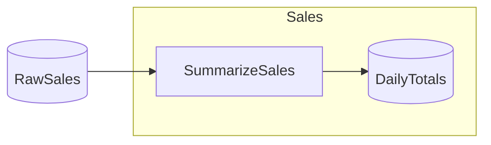

# GoogleSheets Starter

> [!NOTE]
> How do I read from and write to a Google Sheet through the Catalog?

This project demonstrates binding Catalog Items to native Sheets tables via `ItemFactory.Enumerable.GoogleSheets<TRow>(...)`, reading one table, transforming it, and replacing another — all offline against a local JSON file.

This project:

- Reads a raw sales table from a spreadsheet, totals it by day, and writes the result back to a second table in the same spreadsheet.
- Binds both tables by `(spreadsheetId, table name)` — a stable native-table name, not a fragile cell range.
- Obtains the `ISheetsGateway` by injection, the same way a database-backed catalog takes an injected context, so the catalog never sees a credential.
- Runs end-to-end with no Google account and no network by registering a file-backed gateway at the swap point and seeding the input table.

Assumes you've worked through [Minimal](https://github.com/chaoticgoodcomputing/flowthru/tree/main/examples/starter/Minimal).

## Getting Started

```bash
dotnet run
```

The flow reads the seeded `RawSales` table, totals each day's sales, and writes a `DailyTotals` table back to the spreadsheet — created from the schema on first write. No Google account or network required. The whole spreadsheet is a local file, `sheet.json` (gitignored), written in the project directory; open it after a run to see `RawSales` alongside the created `DailyTotals`.

To point the example at a real spreadsheet, see [Connecting to a real spreadsheet](#connecting-to-a-real-spreadsheet) below.

## Connecting to a real spreadsheet

The example runs offline by default. To talk to a real Google Sheet you swap the file-backed gateway for an authenticated one — the catalog, flow, and steps don't change, only the swap point in [`Program.cs`](./Program.cs). The extension owns no credentials: `AddGoogleSheets` takes a `SheetsService` you build, however you choose to build it.

### Service account (recommended)

A service account is a non-human Google identity with its own key — the right fit for unattended ETL. It can only touch spreadsheets you explicitly share with it, which keeps the blast radius tight.

1. **Create a project and enable the API.** In the [Google Cloud Console](https://console.cloud.google.com), create or pick a project and enable the **Google Sheets API**.
2. **Create a service account and key.** *IAM & Admin → Service Accounts → Create service account*, then *Keys → Add key → Create new key → JSON* and download it. Keep the JSON out of source control.
3. **Share the sheet with it.** Open your Google Sheet, click **Share**, and add the service account's email (`…@….iam.gserviceaccount.com`) as **Editor**. This is the step people miss — without it the API returns `403`.
4. **Build a `SheetsService` and swap it in.** Replace the file-backed block in `Program.cs`:

```csharp
using Google.Apis.Auth.OAuth2;
using Google.Apis.Services;
using Google.Apis.Sheets.v4;

var credential = GoogleCredential
    .FromFile("service-account.json")
    .CreateScoped(SheetsService.Scope.Spreadsheets);

var sheetsService = new SheetsService(new BaseClientService.Initializer
{
    HttpClientInitializer = credential,
    ApplicationName = "google-sheets-starter",
});

services.AddFlowthru(flowthru =>
{
    flowthru.AddGoogleSheets(sheetsService);   // builds the production gateway (retry-on-429 wrapped)
    flowthru.RegisterCatalog(sp =>
        new Catalog(sp.GetRequiredService<ISheetsGateway>(), "<your-spreadsheet-id>"));
    // RegisterFlow / ConfigureMetadata unchanged
});
```

Set `<your-spreadsheet-id>` to the id from the sheet's URL (`docs.google.com/spreadsheets/d/<id>/edit`) and drop `SeedFixture` — the real sheet already holds the `RawSales` data (add a header row + rows on a tab, or let an upstream Flow write it). `DailyTotals` is still created-if-absent on the first write.

> **Other credential sources.** Because the extension just consumes a `SheetsService`, anything that builds one works: OAuth user credentials (`GoogleWebAuthorizationBroker`) for an individual without a service account, or Application Default Credentials on GCP infrastructure (no key file). `GoogleCredential.FromFile` is being deprecated in newer SDKs in favor of `CredentialFactory` — use whichever your SDK version exposes.

### No Google Cloud project? Verify with Apps Script

Apps Script can't *run* this .NET example — the example authenticates through a `SheetsService`, and Apps Script runs inside Google, not in your process. But if you have no GCP project and just want to **confirm native Tables behave as the extension expects**, or **inspect the table Flowthru created**, you can do it with zero project setup: open your sheet's *Extensions → Apps Script* editor and run [`spikes/google-sheets-tables/AppsScript.gs`](../../../spikes/google-sheets-tables). It creates and reads a typed table the same way the extension does, under your own account. (A deployed Apps Script *Web App* as a connection backend was considered and rejected on security grounds — see ADR-0018.)

## Concepts

- **[`ItemFactory.Enumerable.GoogleSheets<TRow>(...)`](./Data/_01_Raw/Catalog.Raw.cs):** binds a Catalog Item to a native Sheets table addressed by `(spreadsheetId, table name)`. Read matches the table's columns to `TRow`'s properties by name and coerces each cell to the property's declared type.
- **[The "Raw Data" output table](./Data/_03_Primary/Catalog.Primary.cs):** Flowthru owns one table, created from the schema if absent and atomically replaced every run, scoped to its own tab so sibling formula tabs are never clobbered. Replace is the upsert.
- **[`ISheetsGateway` by injection](./Data/Catalog.cs):** the catalog takes the gateway through its constructor — auth lives in DI, never in the catalog or the DAG.
- **[`AddGoogleSheets(gateway)` — the swap point](./Program.cs):** registers the gateway (retry-on-429 wrapped by default). The same call site takes a live `SheetsService` in production or the offline file-backed gateway here.
- **[`JsonFileSheetsGateway` seeding](./Program.cs):** a local JSON file stands in for the spreadsheet; `RegisterSpreadsheet` makes it reachable and `Seed` populates a table, so the example is deterministic with no live API and leaves an inspectable `sheet.json` behind.
- **[Typed flat columns](./Data/_01_Raw/Schemas/RawSaleSchema.cs):** a `[FlowthruSchema]` flat record maps each property to one typed column — text, date, and number columns round-trip through the gateway.

## Structure

### Diagram

<!-- flowthru:mermaid:start -->

<!-- flowthru:mermaid:end -->

### Files

<!-- flowthru:filetree:start -->
```
GoogleSheets/
├── Program.cs  # entry point
├── Data/
│   ├── _01_Raw/
│   │   └── Schemas/
│   │       └── RawSaleSchema.cs
│   └── _03_Primary/
│       └── Schemas/
│           └── DailyTotalSchema.cs
└── Flows/
    └── Sales/
        └── Steps/
            └── SummarizeSalesStep.cs
```
<!-- flowthru:filetree:end -->
