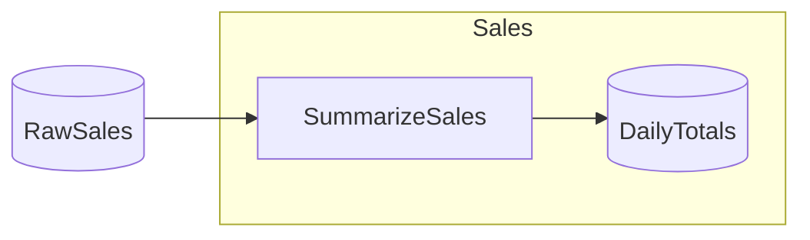

# GoogleSheets Starter

> [!NOTE]
> How do I read from and write to a Google Sheet through the Catalog?

This project demonstrates binding Catalog Items to native Sheets tables via `ItemFactory.Enumerable.GoogleSheets<TRow>(...)`, reading one table, transforming it, and replacing another — all offline against the in-memory gateway.

This project:

- Reads a raw sales table from a spreadsheet, totals it by day, and writes the result back to a second table in the same spreadsheet.
- Binds both tables by `(spreadsheetId, table name)` — a stable native-table name, not a fragile cell range.
- Obtains the `ISheetsGateway` by injection, the same way a database-backed catalog takes an injected context, so the catalog never sees a credential.
- Runs end-to-end with no Google account and no network by registering the in-memory gateway at the swap point and seeding the input table.

Assumes you've worked through [Minimal](https://github.com/chaoticgoodcomputing/flowthru/tree/main/examples/starter/Minimal).

## Getting Started

```bash
dotnet run
```

The flow reads the seeded `RawSales` table, totals each day's sales, and writes a `DailyTotals` table back to the in-memory spreadsheet — created from the schema on first write. To talk to a real spreadsheet instead, swap the in-memory gateway block in [`Program.cs`](./Program.cs) for `builder.AddGoogleSheets(sheetsService)` over an authenticated `SheetsService`; the catalog, flow, and steps do not change.

## Concepts

- **[`ItemFactory.Enumerable.GoogleSheets<TRow>(...)`](./Data/_01_Raw/Catalog.Raw.cs):** binds a Catalog Item to a native Sheets table addressed by `(spreadsheetId, table name)`. Read matches the table's columns to `TRow`'s properties by name and coerces each cell to the property's declared type.
- **[The "Raw Data" output table](./Data/_03_Primary/Catalog.Primary.cs):** Flowthru owns one table, created from the schema if absent and atomically replaced every run, scoped to its own tab so sibling formula tabs are never clobbered. Replace is the upsert.
- **[`ISheetsGateway` by injection](./Data/Catalog.cs):** the catalog takes the gateway through its constructor — auth lives in DI, never in the catalog or the DAG.
- **[`AddGoogleSheets(gateway)` — the swap point](./Program.cs):** registers the gateway (retry-on-429 wrapped by default). The same call site takes a live `SheetsService` in production or the offline gateway here.
- **[`InMemorySheetsGateway` seeding](./Program.cs):** `RegisterSpreadsheet` makes a spreadsheet reachable and `Seed` populates a table, so the example is deterministic with no live API.
- **[Typed flat columns](./Data/_01_Raw/Schemas/RawSaleSchema.cs):** a `[FlowthruSchema]` flat record maps each property to one typed column — text, date, and number columns round-trip through the gateway.

## Structure

### Diagram

<!-- flowthru:mermaid:start -->

<!-- flowthru:mermaid:end -->

### Files

<!-- flowthru:filetree:start -->
```
GoogleSheets/
├── Program.cs  # entry point
├── Data/
│   ├── _01_Raw/
│   │   └── Schemas/
│   │       └── RawSaleSchema.cs
│   └── _03_Primary/
│       └── Schemas/
│           └── DailyTotalSchema.cs
└── Flows/
    └── Sales/
        └── Steps/
            └── SummarizeSalesStep.cs
```
<!-- flowthru:filetree:end -->
