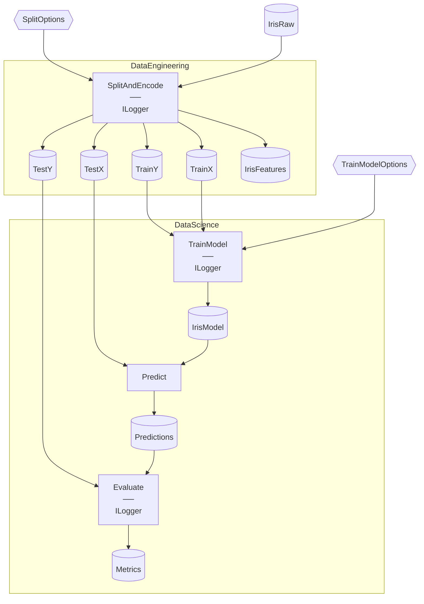

# Iris Starter

> [!NOTE]
> How do I train and evaluate a model end-to-end in Flowthru?

This project demonstrates training and evaluating a multi-class classifier end-to-end in Flowthru.

This project:

- Splits and one-hot-encodes the raw iris dataset via `DataEngineering`.
- Trains a multi-class classifier, predicts on the test set, and evaluates accuracy via `DataScience`.
- Emits the final accuracy metrics as a small JSON report.

Modeled after [`kedro-org/kedro-starters`](https://github.com/kedro-org/kedro-starters)' Iris starter.

## Getting Started

```bash
dotnet run
```

The metrics file lands at [`Data/_08_Reporting/Datasets/metrics.json`](./Data/_08_Reporting/Datasets/metrics.json).

## Concepts

- **[Step](./Flows/DataEngineering/Steps/SplitAndEncodeStep.cs):** a single logical unit of work, declared as a `[FlowthruStep]`-annotated factory. Iris has four Steps total across the two Flows.
- **[Schema](./Data/_01_Raw/Schemas/IrisRawSchema.cs):** the typed shape of data, declared once and reused by the producing Step and the Catalog Item that holds it. `IrisRawSchema` declares the five iris features as required properties, with `[SerializedLabel]` mapping to the JSON field names.
- **[Catalog](./Data/Catalog.cs):** the typed registry of Items shared across both Flows, split into `Catalog.<Category>.cs` partials matching the Data categories.
- **[Catalog Item](./Data/_01_Raw/Catalog.Raw.cs):** a named handle binding a value to its backing. The Raw partial declares `IrisRaw`, JSON-backed at `iris.json`.
- **[Data category](./Data/):** the `_NN_<Name>/` directories indicating where each Item sits in the Flow lifecycle — [`_01_Raw`](./Data/_01_Raw) through [`_08_Reporting`](./Data/_08_Reporting).
- **[FlowBuilder](./Flows/DataEngineering/DataEngineeringFlow.cs):** assembles Steps into a Flow via `FlowBuilder.CreateFlow(...).AddStep<...>(...)`. The single-Step DataEngineering Flow is the simpler of the two registrations in this project.

## Structure

### Diagram

<!-- flowthru:mermaid:start -->

<!-- flowthru:mermaid:end -->

### Files

<!-- flowthru:filetree:start -->
```
Iris/
├── Program.cs  # entry point
├── Data/
│   ├── _01_Raw/
│   │   ├── Datasets/
│   │   │   └── iris.json
│   │   └── Schemas/
│   │       └── IrisRawSchema.cs
│   ├── ...
│   └── _08_Reporting/
│       ├── Datasets/
│       │   └── metrics.json
│       └── Schemas/
│           └── MetricsSchema.cs
└── Flows/
    ├── DataEngineering/
    │   └── Steps/
    │       └── SplitAndEncodeStep.cs
    └── DataScience/
        └── Steps/
            ├── EvaluateModelStep.cs
            ├── PredictStep.cs
            └── TrainModelStep.cs
```
<!-- flowthru:filetree:end -->
