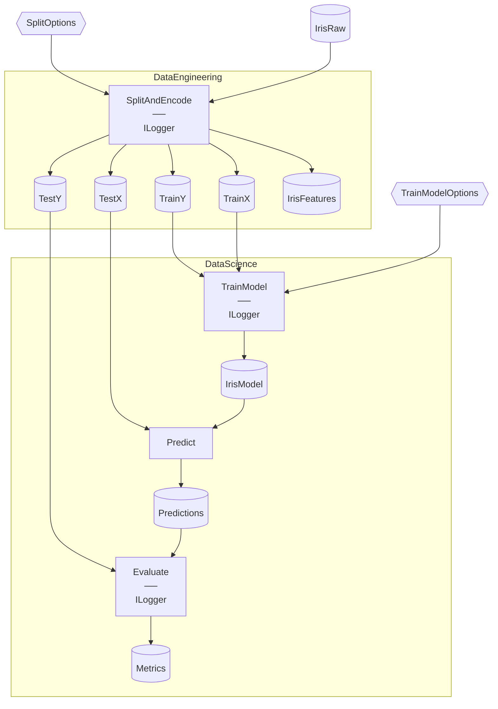

# IrisFUnit Starter

> [!NOTE]
> How do I unit-test Flowthru Steps with FUnit?

This project demonstrates co-locating Step-scoped unit tests inside Step source files using `Flowthru.FUnit`, with NUnit as the test runner.

This project:

- Mirrors vanilla Iris exactly — same Flows, Steps, Schemas, and Catalog.
- Adds a nested `Tests : FUnitContext` class inside each `*Step.cs` source file.
- Gates test classes behind a Debug-only `#if FUNIT_ENABLED` compilation flag, so Release builds carry no test code.
- Runs nine unit tests across the four Steps via `dotnet test`.

Assumes you've worked through [Iris](https://github.com/chaoticgoodcomputing/flowthru/tree/main/examples/starter/Iris), which models [`kedro-org/kedro-starters`](https://github.com/kedro-org/kedro-starters)' Iris starter.

## Getting Started

```bash
dotnet run     # run the Flows
dotnet test    # run the FUnit step tests
```

The metrics file lands at [`Data/_08_Reporting/Datasets/metrics.json`](./Data/_08_Reporting/Datasets/metrics.json). Step tests are discovered from the compiled Debug assembly — no separate test project.

## Concepts

- **[`FUnitContext`](./Flows/DataEngineering/Steps/SplitAndEncodeStep.cs):** the base class for FUnit test classes. Provides `Invoke()` (calls a Step's `Func` with tuple inputs), `Samples` (fluent test-data construction), and DI access. Each Step's nested `Tests` class inherits from it.
- **[`[FUnitStepTest]`](./Flows/DataScience/Steps/TrainModelStep.cs):** the attribute marking test methods. Takes the Step type as a parameter so the FUnit source generator can link the test to its Step at compile time.
- **[Test co-location](./Flows/):** each Step's tests nest inside the same `.cs` file as a `Tests : FUnitContext` class — no separate `*Tests.cs` file. All four `*Step.cs` files in `Flows/` follow this shape.
- **[`#if FUNIT_ENABLED`](./IrisFUnit.csproj):** a Debug-only `DefineConstants` flag gating all test classes. In Release builds, the test code compiles out entirely.
- **[`Samples`](./Flows/DataScience/Steps/PredictStep.cs):** fluent builder for test fixtures. `Samples.Generate(n, factory)` and `Samples.Of(...)` produce ad-hoc data shaped to the input Schema, without snapshot files.
- **[`Invoke()`](./Flows/DataScience/Steps/EvaluateModelStep.cs):** helper that calls the Step's returned `Func` with the supplied tuple input — the same shape FlowBuilder uses at runtime.

## Structure

### Diagram

<!-- flowthru:mermaid:start -->

<!-- flowthru:mermaid:end -->

### Files

<!-- flowthru:filetree:start -->
```
IrisFUnit/
├── Program.cs  # entry point
├── Data/
│   ├── _01_Raw/
│   │   ├── Datasets/
│   │   │   ├── iris.csv
│   │   │   └── iris.json
│   │   └── Schemas/
│   │       └── IrisRawSchema.cs
│   ├── ...
│   └── _08_Reporting/
│       ├── Datasets/
│       │   └── metrics.json
│       └── Schemas/
│           └── MetricsSchema.cs
└── Flows/
    ├── DataEngineering/
    │   └── Steps/
    │       └── SplitAndEncodeStep.cs
    └── DataScience/
        └── Steps/
            ├── EvaluateModelStep.cs
            ├── PredictStep.cs
            └── TrainModelStep.cs
```
<!-- flowthru:filetree:end -->
