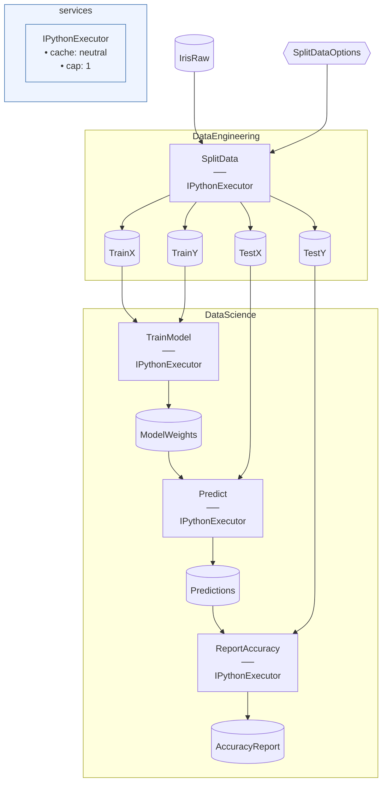

# IrisPython Starter

> [!NOTE]
> How do I write my Flowthru Steps in Python?

This project demonstrates implementing all of an Iris Flow's Steps as Python functions, with C#-declared Catalog Items and Schemas providing the typed interface.

This project:

- Mirrors vanilla Iris's Flow structure — same `DataEngineering` and `DataScience` Flows, same Schemas, same Catalog.
- Implements every Step in Python instead of C# — each is a `@step`-decorated function in a `.py` file.
- Manages the Python environment via [`uv`](https://docs.astral.sh/uv/) (declared in `pyproject.toml`, locked in `uv.lock`).
- Marshals DataFrames between C# and Python via Apache Arrow IPC — transparent to user code.

Assumes you've worked through [Iris](https://github.com/chaoticgoodcomputing/flowthru/tree/main/examples/starter/Iris), which models [`kedro-org/kedro-starters`](https://github.com/kedro-org/kedro-starters)' Iris starter.

## Getting Started

Requires Python 3.10+ and the [`uv`](https://docs.astral.sh/uv/) CLI (install via [`uv`'s installer](https://docs.astral.sh/uv/getting-started/installation/) if you don't already have it). Bootstrap the Python environment, then run:

```bash
uv sync
dotnet run
```

The accuracy report lands at [`Data/_08_Reporting/Datasets/accuracy_report.json`](./Data/_08_Reporting/Datasets/accuracy_report.json).

## Concepts

- **[`@step` decorator](./Flows/DataEngineering/Steps/split_data.py):** declares a Python function as a Flowthru Step. The decorator's `inputs=[...]` and `outputs=[...]` arguments bind the function to Schema names declared in C#.
- **[DataFrame I/O](./Flows/DataScience/Steps/train_model.py):** Python Steps consume and produce `pandas.DataFrame`s; the framework marshals them to and from C# Catalog Items via Apache Arrow IPC.
- **[Schema-name binding](./Flows/DataScience/Steps/predict.py):** the C#-Python contract is by Schema *name*, validated at Step invocation. A name typo or shape mismatch surfaces as a runtime error — Flowthru's design-time safety doesn't reach across the language boundary.
- **[`UsePython` configuration](./Program.cs):** points the Flowthru harness at the Python virtual environment and module search paths. Flowthru spawns the interpreter on demand via `IPythonExecutor`.
- **[`pyproject.toml`](./pyproject.toml):** declares the Python dependency set (`pandas`, `pyarrow`, `numpy`) and the minimum Python version. `uv sync` materializes the venv from `uv.lock`.
- **[Options binding](./Flows/DataEngineering/Schemas/SplitDataOptions.cs):** a C# `SplitDataOptions` Schema declares the Python Step's hyperparameters. The Catalog Item flows in as a typed input alongside the DataFrame.

## Structure

### Diagram

<!-- flowthru:mermaid:start -->

<!-- flowthru:mermaid:end -->

### Files

<!-- flowthru:filetree:start -->
```
IrisPython/
├── Program.cs  # entry point
├── Data/
│   ├── _01_Raw/
│   │   ├── Datasets/
│   │   │   └── iris.csv
│   │   └── Schemas/
│   │       └── IrisRawSchema.cs
│   ├── ...
│   └── _08_Reporting/
│       ├── Datasets/
│       │   └── accuracy_report.json
│       └── Schemas/
│           └── AccuracyReportSchema.cs
└── Flows/
    ├── DataEngineering/
    │   ├── Schemas/
    │   │   └── SplitDataOptions.cs
    │   └── Steps/
    │       ├── __init__.py
    │       ├── split_data.py
    │       └── __pycache__/
    │           ├── __init__.cpython-310.pyc
    │           └── split_data.cpython-310.pyc
    └── DataScience/
        └── Steps/
            ├── __init__.py
            ├── predict.py
            ├── report_accuracy.py
            ├── train_model.py
            └── __pycache__/
                ├── __init__.cpython-310.pyc
                ├── predict.cpython-310.pyc
                ├── report_accuracy.cpython-310.pyc
                └── train_model.cpython-310.pyc
```
<!-- flowthru:filetree:end -->
