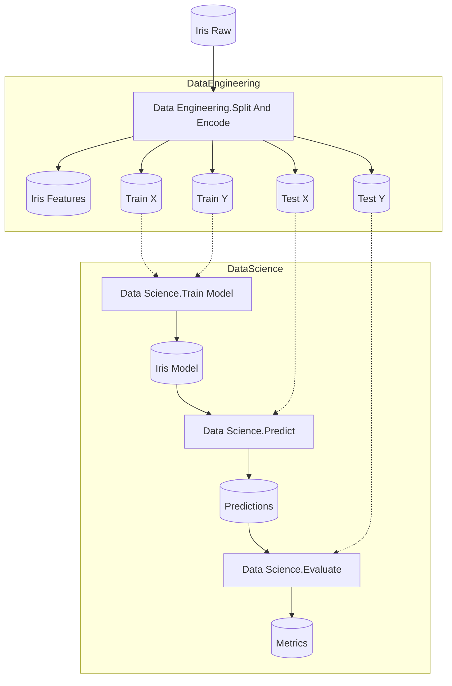

# KedroIris Starter

A Flowthru starter project modeled off of the [Kedro Iris Starter](https://github.com/kedro-org/kedro-starters/tree/main/astro-airflow-iris). 

## Getting Started

In order to execute this pipeline, move into this directory and run:

```bash
dotnet run
```

This will run both the Data Engineering and Data Science flows in sequence, generating the final [model metrics output.](./Data/_08_Reporting/Datasets/metrics.json)

Once you've confirmed your flow runs successfully, you can begin:

1. Adding new data, steps, and flows to your project; and
2. Using the [Flowthru service](./Program.cs) to run your Flowthru flows from other .NET projects.

## Project Structure

### Flow Structure




### File Structure

```
KedroIris/
├── Program.cs                      # Program entry point
├── Data/                           # 8-layer data organization
│   ├── _01_Raw/                   # Immutable source data
│   │   └── Datasets/iris.csv
│   ├── ...
│   └── _08_Reporting/             # Metrics and visualizations
├── Flows/
│   ├── DataEngineering/           # Data splitting and encoding
│   └── DataScience/               # Model training and evaluation
```
