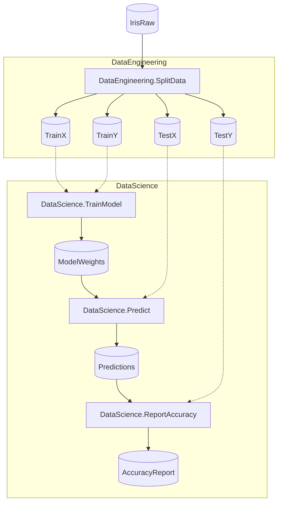

```mermaid
flowchart TB

    %% External Data Inputs
    IrisRaw[("IrisRaw")]

    subgraph DataEngineering["DataEngineering"]
        DataEngineering_SplitData["DataEngineering.SplitData"]
        TrainX[("TrainX")]
        TrainY[("TrainY")]
        TestX[("TestX")]
        TestY[("TestY")]

        DataEngineering_SplitData --> TrainX
        DataEngineering_SplitData --> TrainY
        DataEngineering_SplitData --> TestX
        DataEngineering_SplitData --> TestY
    end

    subgraph DataScience["DataScience"]
        DataScience_TrainModel["DataScience.TrainModel"]
        DataScience_Predict["DataScience.Predict"]
        DataScience_ReportAccuracy["DataScience.ReportAccuracy"]
        ModelWeights[("ModelWeights")]
        Predictions[("Predictions")]
        AccuracyReport[("AccuracyReport")]

        DataScience_TrainModel --> ModelWeights
        ModelWeights --> DataScience_Predict
        DataScience_Predict --> Predictions
        Predictions --> DataScience_ReportAccuracy
        DataScience_ReportAccuracy --> AccuracyReport
    end

    %% External Data to Pipeline Edges
    IrisRaw --> DataEngineering_SplitData

    %% Cross-Pipeline Data Flow
    TrainX -.-> DataScience_TrainModel
    TrainY -.-> DataScience_TrainModel
    TestX -.-> DataScience_Predict
    TestY -.-> DataScience_ReportAccuracy
```
