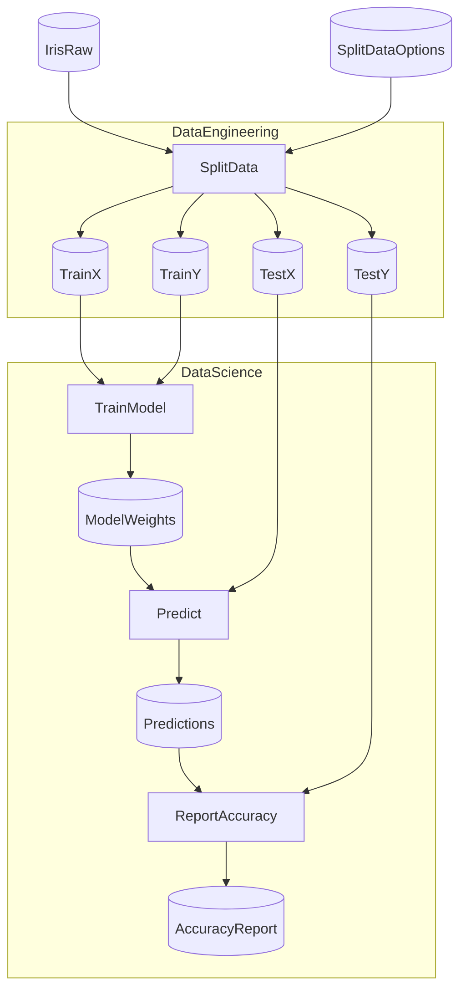

# Kedro Iris (Python Steps)

A Flowthru example demonstrating Python node integration using the classic [Iris classification problem](https://en.wikipedia.org/wiki/Iris_flower_data_set) from the [Kedro Iris starter](https://github.com/kedro-org/kedro-starters/tree/main/astro-airflow-iris).

## Overview

This project replicates the Kedro Iris data science pipeline using Flowthru's Python node extension. It demonstrates:

- **Mixed C#/Python pipelines** — Python nodes for data splitting and ML training
- **Multi-output patterns** — 1×4 split (train_x, train_y, test_x, test_y)
- **Apache Arrow marshalling** — Efficient DataFrame exchange via Arrow IPC
- **Pre-flight validation** — Schema mismatches caught before execution
- **Auto-generated Python schemas** — Type-safe imports from `flowthru_schemas`
- **Custom ML implementation** — Multi-class logistic regression from scratch (numpy)

## Project Structure

<!-- flowthru:filetree:start -->
```
KedroIrisPython/
├── Program.cs  # entry point
├── Data/
│   ├── _01_Raw/
│   │   ├── Datasets/
│   │   │   └── iris.csv
│   │   └── Schemas/
│   │       └── IrisRawSchema.cs
│   ├── ...
│   └── _08_Reporting/
│       ├── Datasets/
│       │   └── accuracy_report.json
│       └── Schemas/
│           └── AccuracyReportSchema.cs
└── Flows/
    ├── DataEngineering/
    │   ├── Schemas/
    │   │   └── SplitDataOptions.cs
    │   └── Steps/
    │       ├── __init__.py
    │       ├── split_data.py
    │       └── __pycache__/
    │           ├── __init__.cpython-310.pyc
    │           └── split_data.cpython-310.pyc
    └── DataScience/
        └── Steps/
            ├── __init__.py
            ├── predict.py
            ├── report_accuracy.py
            ├── train_model.py
            └── __pycache__/
                ├── __init__.cpython-310.pyc
                ├── predict.cpython-310.pyc
                ├── report_accuracy.cpython-310.pyc
                └── train_model.cpython-310.pyc
```
<!-- flowthru:filetree:end -->

## Setup

Requires Python 3.10+. Install with `uv`:

```bash
cd examples/starter/KedroIrisPython
uv sync
```

## Running

```bash
dotnet run
```

Or via NX:

```bash
nx run KedroIrisPython:run
```

## Python Steps

All data processing and ML logic is implemented in Python:

- **Data Engineering Flow:**
  - `split_data` — Split iris.csv into train/test sets (1×4 outputs)

- **Data Science Flow:**
  - `train_model` — Train multi-class logistic regression (numpy)
  - `predict` — Generate predictions on test set
  - `report_accuracy` — Compute and save accuracy metrics

## Flows

### Data Engineering

Reads raw iris data and splits it into training and test sets with one-hot encoded target labels:
- **Input**: Raw iris CSV (150 samples × 5 columns)
- **Outputs**: train_x, train_y, test_x, test_y (80/20 split)

### Data Science

Trains a multi-class logistic regression model from scratch using numpy:
- **Input**: Training data (train_x, train_y)
- **Output**: Model weights (numpy array)
- **Prediction**: Applies model to test_x
- **Reporting**: Calculates accuracy and saves metrics JSON

## Schema Generation

C# schemas in `Data/` are automatically exported to Python:

```bash
dotnet build  # Generates _generated/flowthru_schemas/
```

Python nodes import the generated schemas:

```python
from flowthru import node

@node(inputs=["IrisRawSchema"], outputs=["TrainXSchema", "TrainYSchema", "TestXSchema", "TestYSchema"])
def split_data(data: pd.DataFrame) -> dict:
    # Returns dict with keys: train_x, train_y, test_x, test_y
    ...
```

## Parameters

Hyperparameters are hardcoded in the Python node implementations:
- Test data ratio: 0.2 (20% test, 80% train)
- Training iterations: 10,000
- Learning rate: 0.01

<!-- flowthru:mermaid:start -->

<!-- flowthru:mermaid:end -->
