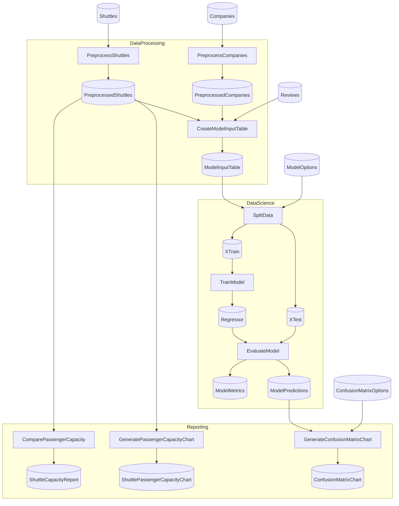

# KedroIris Starter

A Flowthru starter project modeled off of the [Kedro Spaceflights Starter](https://github.com/kedro-org/kedro-starters/tree/main/spaceflights-pandas). 

## Getting Started

In order to execute this pipeline, move into this directory and run:

```bash
dotnet run
```

This will run both the Data Engineering and Data Science pipelines in sequence, generating the final [model outputs and visualizations.](./Data/_08_Reporting/Datasets)

Once you've confirmed your pipeline runs successfully, you can begin:

1. Adding new data, nodes, and pipelines to your project; and
2. Using the [Flowthru service](./Program.cs) to run your Flowthru pipelines from other .NET projects.

## Project Structure

### Flow Structure

<!-- flowthru:mermaid:start -->

<!-- flowthru:mermaid:end -->

### File Structure

```
KedroSpaceflights/
├── Program.cs                      # Program entry point
├── Data/                           # Organized data catalog
│   ├── _01_Raw/                    # Raw input data
│   │   ├── Datasets/companies.csv
│   │   ├── Datasets/reviews.csv
│   │   └── Datasets/shuttles.xlsx
│   ├── ...
│   └── _08_Reporting/              # Metrics and visualizations
├── Flows/
│   ├── DataEngineering/            # Data splitting and encoding
│   ├── DataScience/                # Model training and evaluation
│   └── Reporting/                  # Final reports
```

