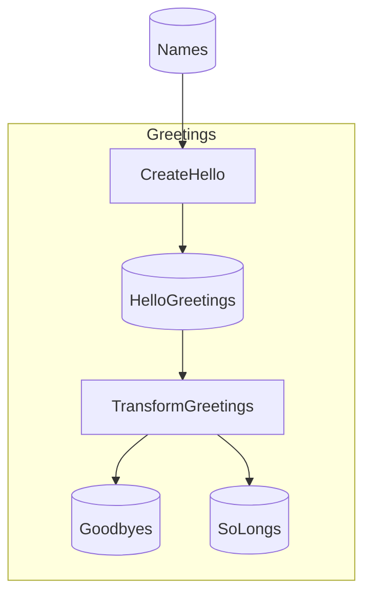

# Minimal Starter

> [!NOTE]
> How do I write my first Flowthru Flow?

This project demonstrates the smallest useful Flowthru Flow — Schema, Step, Catalog Item, and FlowBuilder connected end-to-end.

This project:

- Reads a CSV of names from `_01_Raw`.
- Produces `"Hello, {name}!"` greetings into an intermediate file via `CreateHello`.
- Splits those into two final outputs — `"Goodbye, ..."` and `"So long, ..."` — via `TransformGreetings`.
- Exercises only the Raw, Intermediate, and Primary Data categories.

## Getting Started

```bash
dotnet run
```

The two final outputs land at [`Data/_03_Primary/Datasets/goodbyes.csv`](./Data/_03_Primary/Datasets/goodbyes.csv) and [`Data/_03_Primary/Datasets/solongs.csv`](./Data/_03_Primary/Datasets/solongs.csv).

## Concepts

- **[Step](./Flows/Greetings/Steps/CreateHelloStep.cs):** a single logical unit of work, declared as a `[FlowthruStep]`-annotated factory. Minimal has two Steps in its one Flow.
- **[Schema](./Data/_01_Raw/Schemas/NameSchema.cs):** the typed shape of data, declared once and reused by both the producing Step and the Catalog Item that holds it. `NameSchema` is a single-field record — the smallest useful Schema.
- **[Catalog](./Data/Catalog.cs):** the typed registry of Items in this project, split into `Catalog.<Category>.cs` partials matching the Data categories.
- **[Catalog Item](./Data/_01_Raw/Catalog.Raw.cs):** a named handle binding a value to its backing. The Raw partial declares `Names`, CSV-backed at `names.csv`.
- **[Data category](./Data/):** the `_NN_<Name>/` directories indicating where each Item sits in the Flow lifecycle. Minimal uses only [`_01_Raw`](./Data/_01_Raw), [`_02_Intermediate`](./Data/_02_Intermediate), and [`_03_Primary`](./Data/_03_Primary) — no model, no reporting.
- **[FlowBuilder](./Flows/Greetings/GreetingsFlow.cs):** assembles Steps into a Flow via `FlowBuilder.CreateFlow(...).AddStep<...>(...)`. The Greetings Flow is the only one in this project — a two-Step chain with one input that fans out into two outputs.

## Structure

### Diagram

<!-- flowthru:mermaid:start -->

<!-- flowthru:mermaid:end -->

### Files

<!-- flowthru:filetree:start -->
```
Minimal/
├── Program.cs  # entry point
├── Data/
│   ├── _01_Raw/
│   │   ├── Datasets/
│   │   │   └── names.csv
│   │   └── Schemas/
│   │       └── NameSchema.cs
│   ├── ...
│   └── _03_Primary/
│       ├── Datasets/
│       │   ├── goodbyes.csv
│       │   └── solongs.csv
│       └── Schemas/
│           ├── GoodbyeSchema.cs
│           └── SoLongSchema.cs
└── Flows/
    └── Greetings/
        └── Steps/
            ├── CreateHelloStep.cs
            └── TransformGreetingsStep.cs
```
<!-- flowthru:filetree:end -->
