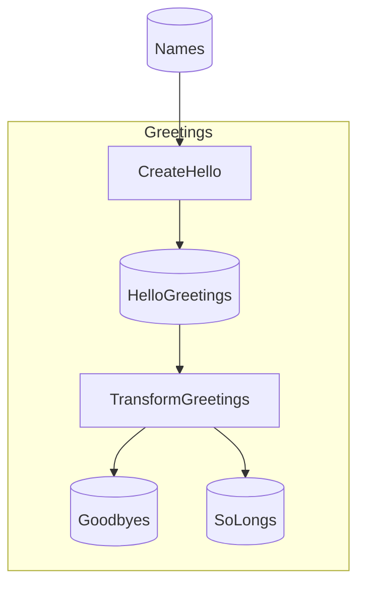

# Minimal Flowthru Example

A minimal greeting transformation pipeline demonstrating Flowthru's core concepts.

## What This Flow Does

This pipeline demonstrates a simple three-stage transformation:

1. **Input**: A CSV file containing 10 names
2. **Step 1**: Transform each name to "Hello, {name}!"
3. **Step 2**: Split into two outputs:
   - "Goodbye, {name}!" 
   - "So long, {name}!"

## Project Structure

```
Minimal/
├── Program.cs                      # Application entry point
├── appsettings.json                # Configuration
├── Data/
│   ├── Catalog.cs                  # Root catalog class
│   ├── _01_Raw/
│   │   ├── Catalog.Raw.cs          # Raw data catalog entries
│   │   ├── Schemas/
│   │   │   └── NameSchema.cs       # Schema for input names
│   │   └── Datasets/
│   │       └── names.csv           # Input data
│   ├── _02_Intermediate/
│   │   ├── Catalog.Intermediate.cs
│   │   └── Schemas/
│   │       └── GreetingSchema.cs   # Schema for "Hello" greetings
│   └── _03_Primary/
│       ├── Catalog.Primary.cs
│       └── Schemas/
│           ├── GoodbyeSchema.cs    # Schema for "Goodbye" greetings
│           └── SoLongSchema.cs     # Schema for "So long" greetings
└── Flows/
    └── Greetings/
        ├── GreetingsFlow.cs    # Flow definition
        └── Steps/
            ├── CreateHelloStep.cs  # Step 1: name → "Hello, name!"
            └── TransformGreetingsStep.cs  # Step 2: 1→2 transformation
```

## Running the Flow

Build and run:

```bash
dotnet build
dotnet run
```

View generated greetings in:
- `Data/_02_Intermediate/Datasets/hello_greetings.csv`
- `Data/_03_Primary/Datasets/goodbye_greetings.csv`
- `Data/_03_Primary/Datasets/solong_greetings.csv`

## Key Concepts Demonstrated

- **Type-safe schemas** with `[FlowthruSchema]`
- **Catalog entries** connecting schemas to files
- **Simple node functions** with pure transformations
- **Multiple outputs** from a single node (1→2)
- **Flow construction** with `FlowBuilder`

<!-- flowthru:mermaid:start -->

<!-- flowthru:mermaid:end -->
