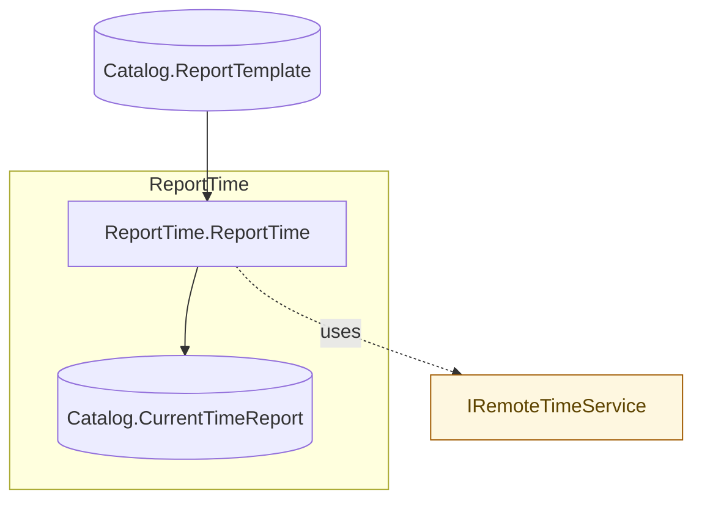

# SimpleEffectsExample Starter

A minimal Flowthru example demonstrating the **effect-as-step** pattern — a
single step that calls an external service (a public time API) and writes a
formatted text report.

## Getting Started

```bash
dotnet run -- --flow ReportTime
```

The flow reads the format string from
[Data/_01_Raw/Datasets/report-template.txt](Data/_01_Raw/Datasets/report-template.txt),
fetches the current UTC time from `timeapi.io`, and writes the formatted result
to `Data/_08_Reporting/Datasets/current-time.txt`.

## Flow Structure



## Patterns Demonstrated

### 1. `[FlowthruStep]`-attributed step factory with service injection

[ReportTimeStep.cs](Flows/Reporting/Steps/ReportTimeStep.cs) declares the step
as a `[FlowthruStep]`-attributed `static class` whose `Create(...)` factory
accepts the service dependency and returns the transform delegate:

```csharp
[FlowthruStep(IsIdempotent = true, HasSideEffects = true)]
public static class ReportTimeStep
{
  public static Func<string, Task<string>> Create(IRemoteTimeService timeService) =>
    async template => string.Format(
      template,
      (await timeService.GetCurrentUtcAsync()).ToString("yyyy-MM-ddTHH:mm:ssZ")
    );
}
```

The `[FlowthruStep]` attribute triggers the source-gen
`ReportTimeStep_Metadata` companion, which records `IRemoteTimeService` as a
service dependency. That metadata flows through to
`FlowStep.ServiceDependencies`, drives preflight inspection, and renders the
service node + dashed edge in the Mermaid diagram above.

### 2. Pre-flight reachability via `AddFlowthruInspect<TService>`

[Program.cs](Program.cs) registers a sidecar inspector that probes the service
before any step executes:

```csharp
services.AddFlowthruInspect<IRemoteTimeService>((svc, ct) =>
  FlowIO.LiftAsync<ValidationResult>(async cancel =>
    /* ping the upstream; return ValidationResult.Success/Failure */));
```

If the upstream is unreachable, the flow fails fast with a clear diagnostic
**before** any compute runs.

### 3. FUnit unit test with `[FUnitStubContainer]`

The bottom of [ReportTimeStep.cs](Flows/Reporting/Steps/ReportTimeStep.cs) shows
the recommended unit-testing pattern: a `[FUnitStubContainer]`-attributed
nested type registers a deterministic fake service, and a `[StepTest]` method
exercises the transform without hitting the network.

```csharp
[FUnitStubContainer]
internal static class TestStubs
{
  public static void Configure(IServiceCollection services) =>
    services.AddSingleton<IRemoteTimeService, FixedTimeService>();
}
```

Run the test:

```bash
dotnet test
```

## Adapting to Your Own Service

The pattern in this example transfers directly to any external system —
Mailchimp, NetSuite, an internal HTTP API. The recipe is always the same:

1. Define the service interface and a real implementation in `Services/`.
2. Write a `[FlowthruStep]` factory that takes the interface as a parameter.
3. Register the implementation in DI; attach an `AddFlowthruInspect<T>` probe.
4. Inject the resolved service into the flow's `Create(catalog, service)`
   factory and pass the transform into `pipeline.AddStep(...)`.

No Flowthru-specific extension package is required — your own service drops
into the pipeline.
