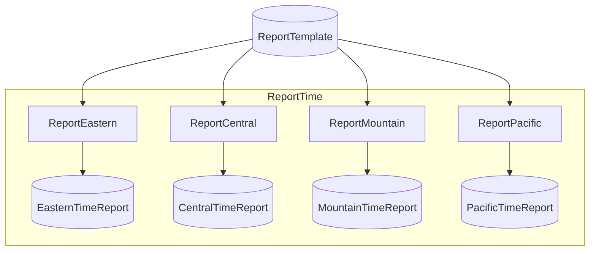

# SimpleEffectsExample Starter

> [!NOTE]
> How do I write Steps that take an injected service as a dependency?

This project demonstrates the **effect-as-step** pattern — Steps that consume both Catalog Items and a DI-registered service, with a pre-flight inspector verifying service reachability before any Step runs.

This project:

- Defines one Flow, `ReportTime`, with four Steps — each reports the current time in a different US timezone (Eastern, Central, Mountain, Pacific).
- Shares a single `IRemoteTimeService` (an HTTP client for `timeapi.io`) across all four Steps via standard `IServiceCollection` DI; the metadata renderer collapses the shared service so the DAG shows one input Item fanning to four Steps, not a service-node-plus-four-edges.
- Registers `AddFlowServiceInspector<IRemoteTimeService>(...)` to ping the upstream service at startup and fail the run before any Step executes if it's unreachable.
- Includes inline FUnit tests that use a `FixedTimeService` stub so test runs are deterministic and offline-safe.

Assumes you've worked through [Iris](https://github.com/chaoticgoodcomputing/flowthru/tree/main/examples/starter/Iris) and [IrisFUnit](https://github.com/chaoticgoodcomputing/flowthru/tree/main/examples/starter/IrisFUnit).

## Getting Started

Requires internet access — the pre-flight `AddFlowServiceInspector` (see Concepts) will abort the run if `timeapi.io` is unreachable.

```bash
dotnet run      # run the ReportTime Flow
dotnet test     # run the inline FUnit tests (offline-safe, uses FixedTimeService)
```

Four per-timezone report files land under [`Data/_08_Reporting/Datasets/`](./Data/_08_Reporting/Datasets/) — `eastern-time.txt`, `central-time.txt`, `mountain-time.txt`, and `pacific-time.txt`.

## Concepts

- **[Service interface](./Services/IRemoteTimeService.cs):** a plain C# interface (`Task<DateTimeOffset> GetCurrentUtcAsync(CancellationToken)`) that abstracts the upstream effect. The Step depends on the interface, not the implementation — a real client (`TimeApiClient`) is wired in production, a stub (`FixedTimeService`) in tests.
- **[HTTP client implementation](./Services/TimeApiClient.cs):** a concrete `IRemoteTimeService` backed by `HttpClient`, calling `timeapi.io` with a 10-second timeout. Registered as a singleton in `Program.cs`.
- **[Effect-as-step factory](./Flows/Reporting/Steps/ReportTimeStep.cs):** `ReportTimeStep.Create(IRemoteTimeService, TimeZoneInfo, string)` returns the Step's `Func`. Unlike a vanilla Iris-style Step — where every dependency arrives through the typed input tuple — services arrive as factory parameters and live in the Step's closure, so each invocation calls `timeService.GetCurrentUtcAsync()` inside its own scope. The same factory is invoked four times in [`ReportTimeFlow.cs`](./Flows/Reporting/ReportTimeFlow.cs) with different `TimeZoneInfo` arguments.
- **[DI registration](./Program.cs):** standard `services.AddSingleton<IRemoteTimeService, TimeApiClient>()` in `Program.cs`. Flowthru picks up service-typed Step parameters from the same container — no extra Flowthru-side wiring.
- **[Pre-flight service inspector](./Program.cs):** `flowthru.AddFlowServiceInspector<IRemoteTimeService>(...)` registers a startup probe. If `timeapi.io` is unreachable, the harness aborts the run before invoking any Step — fail-fast at the effect boundary.
- **[Metadata service-node collapse](./Program.cs):** the metadata renderer recognizes `IRemoteTimeService` as a shared effect across all four Steps and elides it from the rendered DAG — automatic, no opt-in needed. Only the Catalog inputs and outputs appear in the diagram, keeping the DAG focused on data flow rather than dependency wiring.
- **[FixedTimeService stub](./Flows/Reporting/Steps/ReportTimeStep.cs):** the nested `Tests : FUnitContext` class inside `ReportTimeStep.cs` uses a fixed-time implementation of `IRemoteTimeService` so test runs don't depend on network access or wall-clock drift.

## Structure

### Diagram

<!-- flowthru:mermaid:start -->

<!-- flowthru:mermaid:end -->

### Files

<!-- flowthru:filetree:start -->
```
SimpleEffectsExample/
├── Program.cs  # entry point
├── Data/
│   ├── _01_Raw/
│   │   └── Datasets/
│   │       └── report-template.txt
│   └── _08_Reporting/
│       └── Datasets/
│           ├── central-time.txt
│           ├── eastern-time.txt
│           ├── mountain-time.txt
│           └── pacific-time.txt
├── Flows/
│   └── Reporting/
│       ├── ReportTimeFlow.cs
│       └── Steps/
│           └── ReportTimeStep.cs
└── Services/
    ├── IRemoteTimeService.cs
    └── TimeApiClient.cs
```
<!-- flowthru:filetree:end -->
