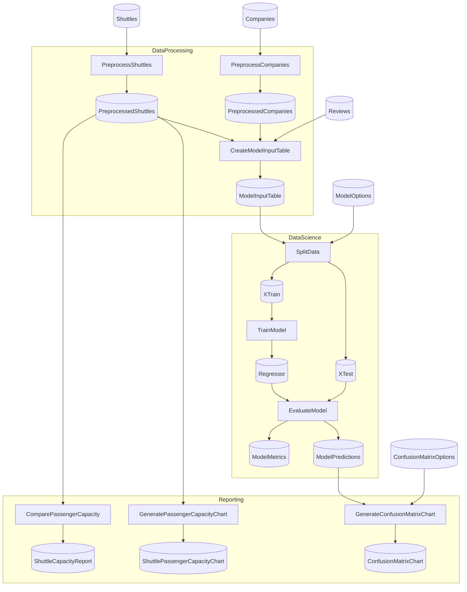

# Spaceflights Starter

> [!NOTE]
> How do I assemble a multi-Flow ETL → ML → Reporting project in Flowthru?

This project demonstrates assembling a multi-Flow ETL → ML → Reporting project on top of Flowthru's vanilla primitives.

This project:

- Ingests raw CSV and Excel shuttle data via `DataProcessing`.
- Trains a regression model on the joined output via `DataScience`.
- Emits a JSON capacity report and chart Items via `Reporting`.
- Exercises all eight `Data/_NN_<Name>/` categories.

Modeled after [`kedro-org/kedro-starters`](https://github.com/kedro-org/kedro-starters)' Spaceflights tutorial.

## Getting Started

```bash
dotnet run
```

The capacity report lands at [`Data/_08_Reporting/Datasets/shuttle_capacity_report.json`](./Data/_08_Reporting/Datasets/shuttle_capacity_report.json).

## Concepts

- **[Step](./Flows/DataProcessing/Steps/PreprocessCompaniesStep.cs):** a single logical unit of work, declared as a `[FlowthruStep]`-annotated factory. Spaceflights has nine Steps across the three Flows.
- **[Schema](./Data/_01_Raw/Schemas/CompanySchema.cs):** the typed shape of data, declared once and reused by both the producing Step and the Catalog Item that holds it. The Raw schemas are the simplest in this project.
- **[Catalog](./Data/Catalog.cs):** the typed registry of Items shared across all three Flows, split into eight `Catalog.<Category>.cs` partials matching the Data categories.
- **[Catalog Item](./Data/_01_Raw/Catalog.Raw.cs):** a named handle binding a value to its backing. The Raw partial declares file-backed CSV inputs (`Companies`, `Reviews`) and an Excel sheet (`Shuttles`).
- **[Data category](./Data/):** the `_NN_<Name>/` directories indicating where each Item sits in the Flow lifecycle — [`_01_Raw`](./Data/_01_Raw) through [`_08_Reporting`](./Data/_08_Reporting).
- **[FlowBuilder](./Flows/DataProcessing/DataProcessingFlow.cs):** assembles Steps into a Flow via `FlowBuilder.CreateFlow(...).AddStep<...>(...)`. The DataProcessing registration is the simplest of the three in this project.

## Structure

### Diagram

<!-- flowthru:mermaid:start -->

<!-- flowthru:mermaid:end -->

### Files

<!-- flowthru:filetree:start -->
```
Spaceflights/
├── Program.cs  # entry point
├── Data/
│   ├── _01_Raw/
│   │   ├── Datasets/
│   │   │   ├── companies.csv
│   │   │   ├── NOTICE
│   │   │   ├── reviews.csv
│   │   │   └── shuttles.xlsx
│   │   └── Schemas/
│   │       ├── CompanySchema.cs
│   │       ├── ReviewSchema.cs
│   │       └── ShuttleSchema.cs
│   ├── ...
│   └── _08_Reporting/
│       ├── Datasets/
│       │   └── shuttle_capacity_report.json
│       └── Schemas/
│           └── ShuttleCapacityReport.cs
└── Flows/
    ├── DataProcessing/
    │   └── Steps/
    │       ├── CreateModelInputTableStep.cs
    │       ├── PreprocessCompaniesStep.cs
    │       └── PreprocessShuttlesStep.cs
    ├── DataScience/
    │   └── Steps/
    │       ├── EvaluateModelStep.cs
    │       ├── SplitDataStep.cs
    │       └── TrainModelStep.cs
    └── Reporting/
        └── Steps/
            ├── ComparePassengerCapacityStep.cs
            ├── CreateConfusionMatrixStep.cs
            ├── GeneratePassengerCapacityChartStep.cs
            └── PlotlyImageExportStep.cs
```
<!-- flowthru:filetree:end -->
