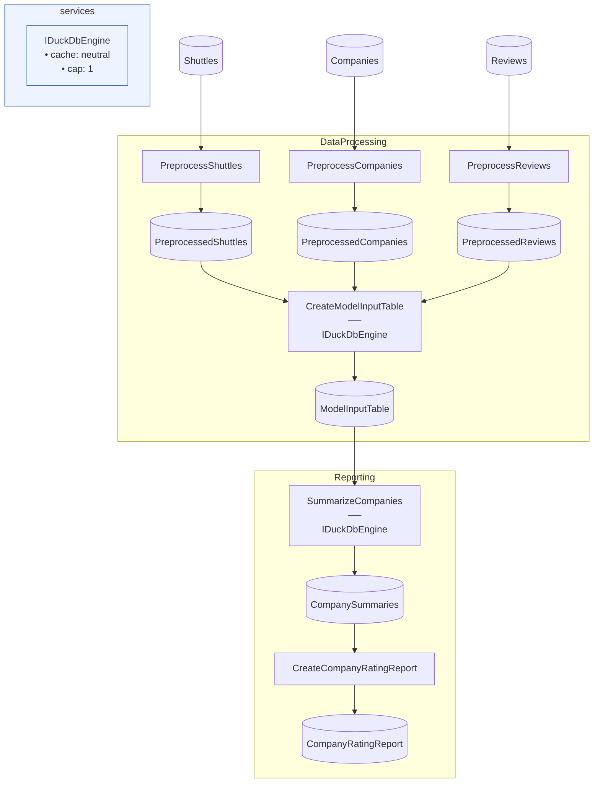

# SpaceflightsDuckDB Starter

> [!NOTE]
> How do I write the set-oriented stages of my Flow as SQL, executed inside an embedded engine?

This project demonstrates delegating a Flow's wide transforms — the three-way join and the per-company aggregate — to SQL running inside the embedded DuckDB engine via `Flowthru.Extensions.DuckDB`, wired between ordinary Parquet Catalog Items.

This project:

- Preprocesses the raw CSV inputs into typed Parquet Items with three narrow C# Steps via `DataProcessing`.
- Joins shuttles, companies, and reviews into the model input table with SQL — the joined rows never enter the .NET process.
- Aggregates per-company summaries engine-side and formats a small top-rated-companies JSON report via `Reporting`.
- Schema-checks every SQL query before any Step runs, and again from `dotnet test`, so a schema-breaking SQL edit fails fast.

Assumes you've worked through [Spaceflights](https://github.com/chaoticgoodcomputing/flowthru/tree/main/examples/starter/Spaceflights). Modeled after [`kedro-org/kedro-starters`](https://github.com/kedro-org/kedro-starters)' Spaceflights tutorial.

## Getting Started

```bash
dotnet run     # run the Flows
dotnet test    # run the FUnit tests, including the SQL schema checks
```

The report lands at [`Data/_08_Reporting/Datasets/company_rating_report.json`](./Data/_08_Reporting/Datasets/company_rating_report.json).

## Concepts

- **[Engine-side SQL join](./Flows/DataProcessing/DataProcessingFlow.cs):** `AddDuckDbTransform` wires a SQL query between Parquet Items. Each input binds to a relation name (`shuttles`, `companies`, `reviews`), the query is the Step body, and the result is written straight to the output Item's file. On the DAG it schedules and renders like any other Step — only its execution happens inside the engine.
- **[Engine-side SQL aggregate](./Flows/Reporting/ReportingFlow.cs):** the single-input overload names the relation after the Item's label. Aggregates widen in DuckDB (`SUM` over an integer column comes back as a 128-bit integer), so the query `CAST`s each aggregate onto the type the output Schema declares.
- **[`UseDuckDb()` registration](./Program.cs):** registers the embedded engine in DI (tunable via the `Flowthru:DuckDb` section of [`appsettings.json`](./appsettings.json)) plus the pre-flight check below. Flows take the engine as an ordinary factory parameter: `RegisterFlow<Catalog, IDuckDbEngine, ILogger>(...)`.
- **[SQL pre-flight validation](./Flows/DataProcessing/DataProcessingFlow.cs):** before any Step runs, each query is bound against empty in-engine tables built from the declared input Schemas and its result is verified against the output Schema — no data is read. The join's SQL carries a commented-out misspelling (`company_ratings`); uncomment it in place of the correct line and the Flow fails pre-flight before any step runs, like this:

  ```text
  ✗ preflight:external:duckdb: [FTDDB3001] duckdb: DuckDB transform 'CreateModelInputTable' SQL
  does not prepare against its declared input schemas [relation 'shuttles' (item
  'PreprocessedShuttles', schema PreprocessedShuttleSchema), relation 'companies' (item
  'PreprocessedCompanies', schema PreprocessedCompanySchema), relation 'reviews' (item
  'PreprocessedReviews', schema PreprocessedReviewSchema)]: Binder Error: Table "companies"
  does not have a column named "company_ratings"

  Candidate bindings: : "company_rating"

  LINE 12:   companies.company_ratings,
             ^
  ```

- **[Design-time SQL check](./Flows/DataProcessing/DataProcessingFlow.cs):** each Flow co-locates an FUnit test that runs the same schema check via `flow.ValidateDuckDbTransforms()`, so the misspelling above also fails `dotnet test` — the SQL is guarded even when nobody runs the Flow.
- **[Wide vs narrow split](./Flows/DataProcessing/Steps/PreprocessReviewsStep.cs):** per-row parsing stays in ordinary C# Steps, and the small ranked report is [formatted in C#](./Flows/Reporting/Steps/CreateCompanyRatingReportStep.cs) too; only the wide work — the join and the aggregate, where every output row depends on many input rows — goes to SQL. Column names in the SQL are the Schemas' serialized labels, i.e. the column names in the Parquet files.
- **[Parquet endpoints only](./Data/_02_Intermediate/Catalog.Intermediate.cs):** the engine reads and writes Parquet Items exclusively, which is why the raw CSVs pass through the C# preprocessing Steps before SQL can touch them. This example keeps every Item on local files; the same wiring works over `s3://`-backed Items — see the [extension README](https://github.com/chaoticgoodcomputing/flowthru/tree/main/src/extensions/Flowthru.Extensions.DuckDB) for the full surface.

## Structure

### Diagram

<!-- flowthru:mermaid:start -->

<!-- flowthru:mermaid:end -->

### Files

<!-- flowthru:filetree:start -->
```
SpaceflightsDuckDB/
├── Program.cs  # entry point
├── Data/
│   ├── _01_Raw/
│   │   ├── Datasets/
│   │   │   ├── companies.csv
│   │   │   ├── NOTICE
│   │   │   ├── reviews.csv
│   │   │   └── shuttles.csv
│   │   └── Schemas/
│   │       ├── CompanySchema.cs
│   │       ├── ReviewSchema.cs
│   │       └── ShuttleSchema.cs
│   ├── ...
│   └── _08_Reporting/
│       ├── Datasets/
│       │   ├── company_rating_report.json
│       │   └── company_summaries.parquet
│       └── Schemas/
│           ├── CompanyRatingReport.cs
│           └── CompanySummarySchema.cs
└── Flows/
    ├── DataProcessing/
    │   └── Steps/
    │       ├── PreprocessCompaniesStep.cs
    │       ├── PreprocessReviewsStep.cs
    │       └── PreprocessShuttlesStep.cs
    └── Reporting/
        └── Steps/
            └── CreateCompanyRatingReportStep.cs
```
<!-- flowthru:filetree:end -->
