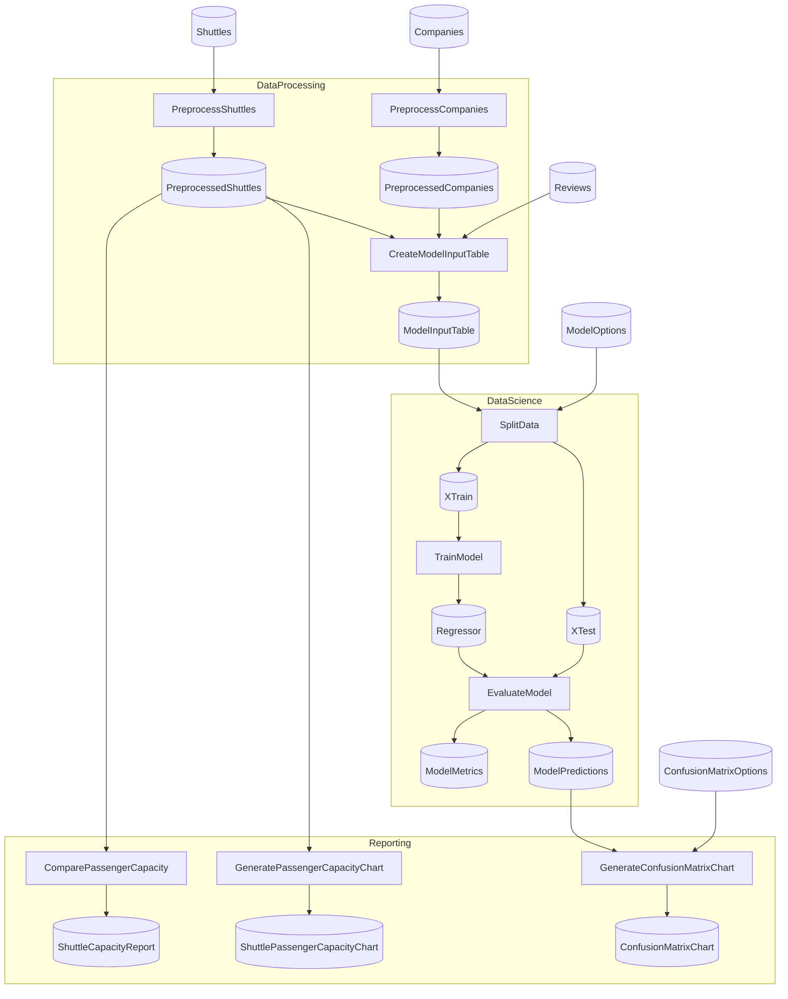

# EFCore Integration Example

This example demonstrates using `Flowthru.Extensions.EFCore` to read and write data from a SQLite database.

## What This Demonstrates

- ✅ FlowthruSchemas work unchanged as EF entities
- ✅ Database catalog entries as pipeline seeds (Layer 0 inputs)
- ✅ Injected DbContext lifecycle management
- ✅ Reading and writing entities via EFCore adapter
- ✅ Partial class pattern for extending `Items` from external package

## Project Structure

<!-- flowthru:filetree:start -->
```
SpaceflightsEFCore/
├── Program.cs  # entry point
├── Data/
│   ├── spaceflights.db
│   ├── SpaceflightsDbContext.cs
│   ├── _01_Raw/
│   │   ├── Datasets/
│   │   │   ├── companies.csv
│   │   │   ├── NOTICE
│   │   │   ├── reviews.csv
│   │   │   └── shuttles.xlsx
│   │   └── Schemas/
│   │       ├── CompanySchema.cs
│   │       ├── ReviewSchema.cs
│   │       └── ShuttleSchema.cs
│   ├── ...
│   └── _08_Reporting/
│       ├── Datasets/
│       │   └── shuttle_capacity_report.json
│       └── Schemas/
│           └── ShuttleCapacityReport.cs
└── Flows/
    ├── DataProcessing/
    │   └── Steps/
    │       ├── CreateModelInputTableStep.cs
    │       ├── PreprocessCompaniesStep.cs
    │       └── PreprocessShuttlesStep.cs
    ├── DataScience/
    │   └── Steps/
    │       ├── EvaluateModelStep.cs
    │       ├── SplitDataStep.cs
    │       └── TrainModelStep.cs
    └── Reporting/
        └── Steps/
            ├── ComparePassengerCapacityStep.cs
            ├── CreateConfusionMatrixStep.cs
            ├── GeneratePassengerCapacityChartStep.cs
            └── PlotlyImageExportStep.cs
```
<!-- flowthru:filetree:end -->

## Running the Example

```bash
cd examples/efcore-integration
dotnet run
```

## Key Code Snippets

### 1. FlowthruSchema as EF Entity

```csharp
// Data/CompanySchema.cs
[FlowthruSchema]
public record CompanySchema(
    int Id,
    string Name,
    string Industry,
    int EmployeeCount,
    DateTime Founded
);

// Automatically implements IFlatSchema, IStructuredSerializable
// Works with both EFCore and file-based catalogs (CSV, JSON, etc.)
```

### 2. DbContext Configuration

```csharp
// Data/AppDbContext.cs
public class AppDbContext : DbContext
{
    public DbSet<CompanySchema> Companies { get; set; }
    
    protected override void OnConfiguring(DbContextOptionsBuilder options)
        => options.UseSqlite("Data Source=companies.db");
}
```

### 3. EFCore Catalog Entries

```csharp
// Catalog/DataCatalog.cs
public static partial class DataCatalog
{
    // Database source (seed)
    public static IItem<IEnumerable<CompanySchema>> SourceCompanies(DbContext db) =>
        Items.Enumerable.EFCore<CompanySchema>("source_companies", db, readOnly: true);
    
    // Database destination (output)
    public static IItem<IEnumerable<CompanySchema>> ProcessedCompanies(DbContext db) =>
        Items.Enumerable.EFCore<CompanySchema>("processed_companies", db);
}
```

### 4. Flow Using EFCore

```csharp
// Program.cs
using var db = new AppDbContext();
await db.Database.MigrateAsync();

var pipeline = new FlowBuilder("CompanyETL")
    .AddStep("extract", catalog => new ExtractCompaniesStep(
        inputs: catalog.SourceCompanies(db),
        outputs: catalog.RawCompanies()
    ))
    .AddStep("transform", catalog => new TransformCompaniesStep(
        inputs: catalog.RawCompanies(),
        outputs: catalog.ProcessedCompanies(db)
    ))
    .Build();

await pipeline.ExecuteAsync();
```

## Notes

- **Migrations:** Run before pipeline execution
- **Transactions:** Each Save() is an independent transaction
- **Read-Only:** Source catalog prevents accidental writes to production
- **Seedable:** Database tables are automatically detected as Layer 0 seeds

## Next Steps

- Try different database providers (SQL Server, PostgreSQL)
- Implement upsert semantics in a custom node
- Use factory-based DbContext for scoped patterns
- Combine EFCore with CSV/Parquet exports

<!-- flowthru:mermaid:start -->

<!-- flowthru:mermaid:end -->
