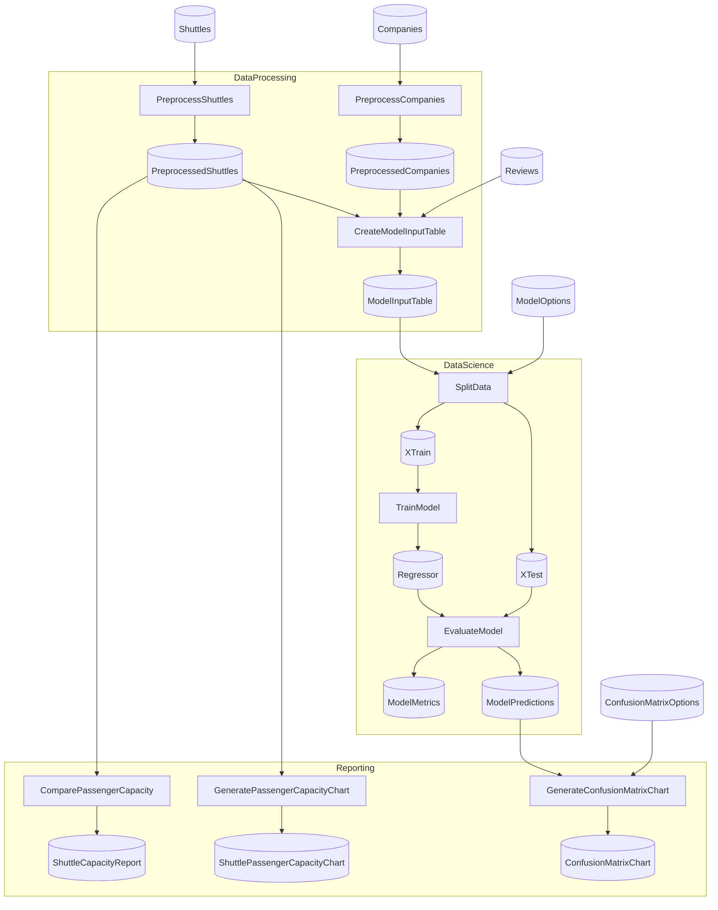

# SpaceflightsEFCore Starter

> [!NOTE]
> How do I back my Catalog Items with a relational database via EFCore?

This project demonstrates persisting intermediate Catalog Items to a SQLite database via the `Flowthru.Extensions.EFCore` storage adapter — the same Spaceflights Flows, with file-backed Parquet swapped for EF-managed tables.

This project:

- Mirrors vanilla Spaceflights — same three Flows, Steps, and Schemas.
- Adds a `SpaceflightsDbContext`, registered via `AddDbContextFactory<>()` in DI, with the schema created lazily by `EnsureCreated()` on first run.
- Replaces file-backed Parquet Items in `_02_Intermediate` and `_03_Primary` with EFCore-backed Items via the `.EFCoreQuery()`, `.EFCoreTable()`, and `.EFCoreEntity()` builders.
- Uses `.WithQuery()` to push predicates and ordering down to the database before materialization.
- Keeps the Schemas unchanged — no EF data annotations; entity configuration lives in `OnModelCreating`.

Assumes you've worked through [Spaceflights](https://github.com/chaoticgoodcomputing/flowthru/tree/main/examples/starter/Spaceflights). Modeled after [`kedro-org/kedro-starters`](https://github.com/kedro-org/kedro-starters)' Spaceflights tutorial.

## Getting Started

```bash
dotnet run
```

First run creates an empty SQLite database at [`Data/spaceflights.db`](./Data/spaceflights.db) and stages the schema; subsequent runs reuse the same file. To start from a clean database, delete `Data/spaceflights.db` before running. The capacity report lands at [`Data/_08_Reporting/Datasets/shuttle_capacity_report.json`](./Data/_08_Reporting/Datasets/shuttle_capacity_report.json).

## Concepts

- **[`DbContext` registration](./Program.cs):** the EF context is registered through `AddDbContextFactory<SpaceflightsDbContext>()` in DI. Step runs receive fresh contexts per operation via the factory pattern, with no shared change-tracker state across Steps.
- **[`SpaceflightsDbContext`](./Data/SpaceflightsDbContext.cs):** declares `DbSet<T>` properties for each persisted Schema and configures entity mapping in `OnModelCreating` — shadow keys for owned types, JSON column conversions, and the SQLite connection string. `EnsureCreated()` (called once at startup) creates the schema if absent but does **not** migrate it on subsequent runs — schema changes require deleting the `.db` file.
- **[`.EFCoreQuery<T, TContext>()`](./Data/_02_Intermediate/Catalog.Intermediate.cs):** Catalog Item builder for collections that compose lazily over a `DbSet`. Use when downstream Steps may filter, sort, or join via `.WithQuery()` — the query composes against EF before iterating.
- **[`.EFCoreTable<T, TContext>()`](./Data/_05_ModelInput/Catalog.ModelInput.cs):** Catalog Item builder for fully-materialized tables. Use when a Step wants the entire table in memory as `IEnumerable<T>`.
- **[`.EFCoreEntity<T, TContext>()`](./Data/_06_Models/Catalog.Models.cs):** Catalog Item builder for singleton-row entities. Use for Items that are conceptually a single object — here, the trained model, persisted as one row in the `Models` table.
- **[`.WithQuery(q => ...)`](./Data/_03_Primary/Catalog.Primary.cs):** composes an `IQueryable` modifier (filter, sort, project) onto an EFCore-backed Item before materialization. Lets Catalog Items push their query shape down to the database.
- **[Schemas without EF attributes](./Data/_02_Intermediate/Schemas/PreprocessedCompanySchema.cs):** the Schema records carry only `[FlowthruSchema]` and serialization attributes — no `[Key]`, `[Required]`, or other EF data annotations. Entity configuration lives entirely in the `DbContext`.

## Structure

### Diagram

<!-- flowthru:mermaid:start -->

<!-- flowthru:mermaid:end -->

### Files

<!-- flowthru:filetree:start -->
```
SpaceflightsEFCore/
├── Program.cs  # entry point
├── Data/
│   ├── spaceflights.db
│   ├── SpaceflightsDbContext.cs
│   ├── _01_Raw/
│   │   ├── Datasets/
│   │   │   ├── companies.csv
│   │   │   ├── NOTICE
│   │   │   ├── reviews.csv
│   │   │   └── shuttles.xlsx
│   │   └── Schemas/
│   │       ├── CompanySchema.cs
│   │       ├── ReviewSchema.cs
│   │       └── ShuttleSchema.cs
│   ├── ...
│   └── _08_Reporting/
│       ├── Datasets/
│       │   └── shuttle_capacity_report.json
│       └── Schemas/
│           └── ShuttleCapacityReport.cs
└── Flows/
    ├── DataProcessing/
    │   └── Steps/
    │       ├── CreateModelInputTableStep.cs
    │       ├── PreprocessCompaniesStep.cs
    │       └── PreprocessShuttlesStep.cs
    ├── DataScience/
    │   └── Steps/
    │       ├── EvaluateModelStep.cs
    │       ├── SplitDataStep.cs
    │       └── TrainModelStep.cs
    └── Reporting/
        └── Steps/
            ├── ComparePassengerCapacityStep.cs
            ├── CreateConfusionMatrixStep.cs
            ├── GeneratePassengerCapacityChartStep.cs
            └── PlotlyImageExportStep.cs
```
<!-- flowthru:filetree:end -->
