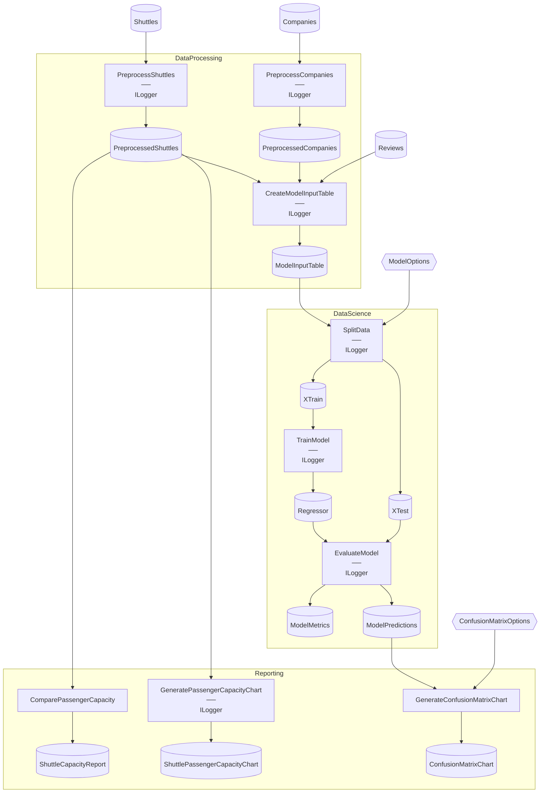

# SpaceflightsFUnit Starter

> [!NOTE]
> How do I unit-test multi-input and options-bound Steps with FUnit?

This project demonstrates testing Steps that consume tuple inputs (joins) and configuration-bound options with `Flowthru.FUnit`, extending the co-location pattern from IrisFUnit to more complex Step shapes.

This project:

- Mirrors vanilla Spaceflights exactly — same three Flows, Steps, Schemas, and Catalog.
- Adds 22 FUnit tests across the project's Steps, following the `Tests : FUnitContext` co-location pattern.
- Tests a 3-way join in `CreateModelInputTableStep` and a configuration-bound option in `SplitDataStep` — patterns IrisFUnit's single-input Steps don't cover.
- Runs via `dotnet test`.

Assumes you've worked through [Spaceflights](https://github.com/chaoticgoodcomputing/flowthru/tree/main/examples/starter/Spaceflights) and [IrisFUnit](https://github.com/chaoticgoodcomputing/flowthru/tree/main/examples/starter/IrisFUnit). Modeled after [`kedro-org/kedro-starters`](https://github.com/kedro-org/kedro-starters)' Spaceflights tutorial.

## Getting Started

```bash
dotnet run     # run the Flows
dotnet test    # run the 22 FUnit step tests (1 skipped by default — see Concepts)
```

The capacity report lands at [`Data/_08_Reporting/Datasets/shuttle_capacity_report.json`](./Data/_08_Reporting/Datasets/shuttle_capacity_report.json). Step tests are discovered from the compiled Debug assembly — no separate test project.

## Concepts

- **[Multi-input Step testing](./Flows/DataProcessing/Steps/CreateModelInputTableStep.cs):** Steps that take N inputs are tested with `Invoke(Create(), (input1, input2, input3))`. `CreateModelInputTableStep` exercises a 3-way join across `Companies`, `Shuttles`, and `Reviews` — the tuple input shape extends IrisFUnit's single-input pattern.
- **[Options-bound Step testing](./Flows/DataScience/Steps/SplitDataStep.cs):** when a Step consumes a Catalog Item backed by `appsettings.json` configuration, the test constructs the options inline and passes them as part of the input tuple — the same shape FlowBuilder uses at runtime.
- **[Pragmatic coverage for opaque outputs](./Flows/Reporting/Steps/GeneratePassengerCapacityChartStep.cs):** Reporting Steps that produce chart objects or rendered images get thinner coverage (1–2 tests each), since their outputs aren't amenable to value assertions. The PNG image-export test is skipped by default — rendered image bytes aren't deterministic across backends, so the assertion has been intentionally left out of the default run.

## Structure

### Diagram

<!-- flowthru:mermaid:start -->

<!-- flowthru:mermaid:end -->

### Files

<!-- flowthru:filetree:start -->
```
SpaceflightsFUnit/
├── Program.cs  # entry point
├── Data/
│   ├── _01_Raw/
│   │   ├── Datasets/
│   │   │   ├── companies.csv
│   │   │   ├── NOTICE
│   │   │   ├── reviews.csv
│   │   │   └── shuttles.xlsx
│   │   └── Schemas/
│   │       ├── CompanySchema.cs
│   │       ├── ReviewSchema.cs
│   │       └── ShuttleSchema.cs
│   ├── ...
│   └── _08_Reporting/
│       ├── Datasets/
│       │   └── shuttle_capacity_report.json
│       └── Schemas/
│           └── ShuttleCapacityReport.cs
└── Flows/
    ├── DataProcessing/
    │   └── Steps/
    │       ├── CreateModelInputTableStep.cs
    │       ├── PreprocessCompaniesStep.cs
    │       └── PreprocessShuttlesStep.cs
    ├── DataScience/
    │   └── Steps/
    │       ├── EvaluateModelStep.cs
    │       ├── SplitDataStep.cs
    │       └── TrainModelStep.cs
    └── Reporting/
        └── Steps/
            ├── ComparePassengerCapacityStep.cs
            ├── CreateConfusionMatrixStep.cs
            └── GeneratePassengerCapacityChartStep.cs
```
<!-- flowthru:filetree:end -->
