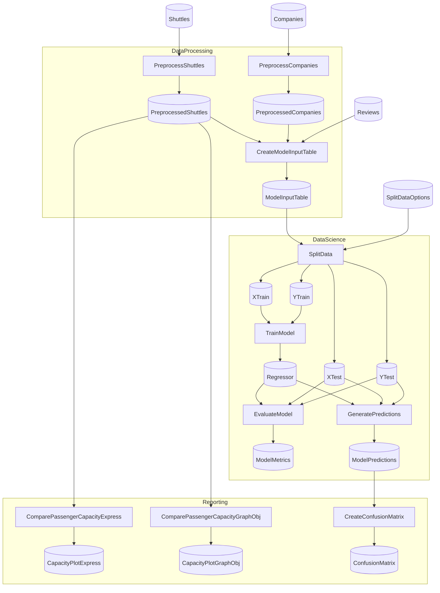

# Kedro Spaceflights (Python Steps)

A Flowthru example demonstrating Python node integration using the [Kedro Spaceflights](https://github.com/kedro-org/kedro-starters) tutorial as a reference.

## Overview

This project replicates the Kedro Spaceflights data science pipeline using Flowthru's Python node extension. It demonstrates:

- **Mixed C#/Python pipelines** — Python nodes for data preprocessing and ML training
- **Multi-I/O patterns** — 3×1 joins, 1×4 splits, 2×1 training operations
- **Apache Arrow marshalling** — Efficient DataFrame exchange via Arrow IPC
- **Pre-flight validation** — Schema mismatches caught before execution
- **Auto-generated Python schemas** — Type-safe imports from `flowthru_schemas`

## Project Structure

<!-- flowthru:filetree:start -->
```
SpaceflightsPython/
├── Program.cs  # entry point
├── Data/
│   ├── _01_Raw/
│   │   ├── Datasets/
│   │   │   ├── companies.csv
│   │   │   ├── NOTICE
│   │   │   ├── reviews.csv
│   │   │   └── shuttles.xlsx
│   │   └── Schemas/
│   │       ├── CompanySchema.cs
│   │       ├── ReviewSchema.cs
│   │       └── ShuttleSchema.cs
│   ├── ...
│   └── _08_Reporting/
│       ├── Datasets/
│       │   ├── shuttle_passenger_capacity_plot_exp.json
│       │   └── shuttle_passenger_capacity_plot_go.json
│       └── Images/
│           └── confusion_matrix.png
└── Flows/
    ├── DataProcessing/
    │   └── Steps/
    │       ├── __init__.py
    │       ├── create_model_input_table.py
    │       ├── preprocess_companies.py
    │       ├── preprocess_shuttles.py
    │       └── __pycache__/
    │           ├── __init__.cpython-310.pyc
    │           ├── create_model_input_table.cpython-310.pyc
    │           ├── preprocess_companies.cpython-310.pyc
    │           └── preprocess_shuttles.cpython-310.pyc
    ├── DataScience/
    │   ├── Schemas/
    │   │   └── SplitDataOptions.cs
    │   └── Steps/
    │       ├── evaluate_model.py
    │       ├── generate_predictions.py
    │       ├── split_data.py
    │       ├── train_model.py
    │       └── __pycache__/
    │           ├── evaluate_model.cpython-310.pyc
    │           ├── generate_predictions.cpython-310.pyc
    │           ├── split_data.cpython-310.pyc
    │           └── train_model.cpython-310.pyc
    └── Reporting/
        └── Steps/
            ├── __init__.py
            ├── compare_passenger_capacity.py
            ├── create_confusion_matrix.py
            └── __pycache__/
                ├── __init__.cpython-310.pyc
                ├── compare_passenger_capacity.cpython-310.pyc
                └── create_confusion_matrix.cpython-310.pyc
```
<!-- flowthru:filetree:end -->

## Setup

Requires Python 3.10+. Install with `uv`:

```bash
cd examples/starter/SpaceflightsPython
uv sync
```

## Running

```bash
dotnet run
```

Or via NX:

```bash
nx run SpaceflightsPython:run
```

## Python Steps

All data preprocessing, ML, and visualization logic is implemented in Python:

- **Data Processing Flow:**
  - `preprocess_companies` — Clean company data
  - `preprocess_shuttles` — Clean shuttle data
  - `create_model_input_table` — Join datasets (3×1 inputs)

- **Data Science Flow:**
  - `split_data` — Split into train/test sets (1×4 outputs)
  - `train_model` — Train linear regression (2×1 inputs)
  - `evaluate_model` — Compute metrics (3×1 inputs)

- **Reporting Flow:**
  - `compare_passenger_capacity_exp` — Generate Plotly Express bar chart
  - `compare_passenger_capacity_go` — Generate Plotly Graph Objects bar chart
  - `create_confusion_matrix` — Generate matplotlib/seaborn confusion matrix heatmap

## Schema Generation

C# schemas in `Data/` are automatically exported to Python:

```bash
dotnet build  # Generates _generated/flowthru_schemas/
```

Python nodes import the generated schemas:

```python
from flowthru import node
from flowthru_schemas import CompanyRawSchema, CompanyPreprocessedSchema

@node(inputs=[CompanyRawSchema], outputs=[CompanyPreprocessedSchema])
def preprocess_companies(companies: pd.DataFrame) -> pd.DataFrame:
    # ...
```

<!-- flowthru:mermaid:start -->

<!-- flowthru:mermaid:end -->
