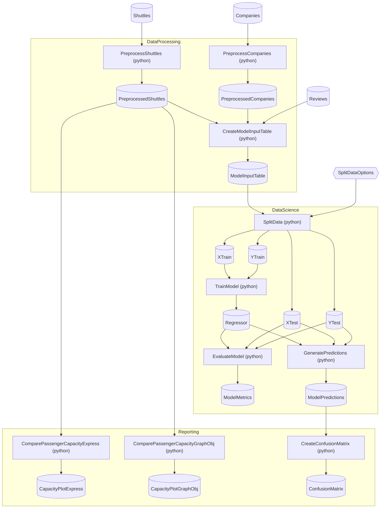

# SpaceflightsPython Starter

> [!NOTE]
> How do I write Python Steps that join data, consume options, and produce visualizations?

This project demonstrates Python Steps with multi-input joins, configuration-bound options, and visualization outputs (PNG bytes and Plotly JSON) — extending the single-input pattern from IrisPython to the richer Step shapes Spaceflights demands.

This project:

- Mirrors vanilla Spaceflights's Flow structure — same three Flows, Steps, Schemas, and Catalog.
- Implements every Step in Python instead of C# — same `@step` decorator and `uv`-managed environment as IrisPython.
- Adds a 3-way pandas merge in `create_model_input_table.py`, configuration-bound options in `split_data.py`, a confusion-matrix PNG export in `create_confusion_matrix.py`, and dual Plotly serializations in `compare_passenger_capacity.py`.
- Lands reports as PNG bytes in `Data/_08_Reporting/Images/` and Plotly JSON in `Data/_08_Reporting/Datasets/`.

Assumes you've worked through [Spaceflights](https://github.com/chaoticgoodcomputing/flowthru/tree/main/examples/starter/Spaceflights) and [IrisPython](https://github.com/chaoticgoodcomputing/flowthru/tree/main/examples/starter/IrisPython). Modeled after [`kedro-org/kedro-starters`](https://github.com/kedro-org/kedro-starters)' Spaceflights tutorial.

## Getting Started

Requires Python 3.10+ and the [`uv`](https://docs.astral.sh/uv/) CLI (install via [`uv`'s installer](https://docs.astral.sh/uv/getting-started/installation/) if you don't already have it). Bootstrap the Python environment, then run:

```bash
uv sync
dotnet run
```

The confusion matrix PNG lands at [`Data/_08_Reporting/Images/confusion_matrix.png`](./Data/_08_Reporting/Images/confusion_matrix.png); the Plotly figure JSONs land in [`Data/_08_Reporting/Datasets/`](./Data/_08_Reporting/Datasets/).

## Concepts

- **[Multi-input Python Step](./Flows/DataProcessing/Steps/create_model_input_table.py):** the `@step(inputs=[...])` decorator accepts a list of Schema names. `create_model_input_table` joins three Catalog Items (`PreprocessedShuttles`, `PreprocessedCompanies`, `Reviews`) via a pandas `.merge()` chain — the multi-input shape extends IrisPython's single-input pattern.
- **[Options bound from configuration](./Flows/DataScience/Steps/split_data.py):** a Python Step can receive an Options Schema whose values come from `appsettings.json` rather than from an upstream Step. `split_data` consumes [`SplitDataOptions`](./Flows/DataScience/Schemas/SplitDataOptions.cs); Python reads `TestSize`, `RandomState`, and `Features` as PascalCase dict keys, mirroring the C# property names.
- **[PNG visualization output](./Flows/Reporting/Steps/create_confusion_matrix.py):** Python Steps can return raw `bytes` for image outputs. `create_confusion_matrix` renders a matplotlib heatmap to PNG bytes; Flowthru persists the result through a file-backed Catalog Item.
- **[Plotly JSON serialization](./Flows/Reporting/Steps/compare_passenger_capacity.py):** the same file declares two sibling `@step` functions to demonstrate both Plotly authoring styles — `plotly.express` and `plotly.graph_objects` — each serializing to JSON via `pio.to_json()` for downstream rendering in JS dashboards or notebooks.

## Structure

### Diagram

<!-- flowthru:mermaid:start -->

<!-- flowthru:mermaid:end -->

### Files

<!-- flowthru:filetree:start -->
```
SpaceflightsPython/
├── Program.cs  # entry point
├── Data/
│   ├── _01_Raw/
│   │   ├── Datasets/
│   │   │   ├── companies.csv
│   │   │   ├── NOTICE
│   │   │   ├── reviews.csv
│   │   │   └── shuttles.xlsx
│   │   └── Schemas/
│   │       ├── CompanySchema.cs
│   │       ├── ReviewSchema.cs
│   │       └── ShuttleSchema.cs
│   ├── ...
│   └── _08_Reporting/
│       ├── Datasets/
│       │   ├── shuttle_passenger_capacity_plot_exp.json
│       │   └── shuttle_passenger_capacity_plot_go.json
│       └── Images/
│           └── confusion_matrix.png
└── Flows/
    ├── DataProcessing/
    │   └── Steps/
    │       ├── __init__.py
    │       ├── create_model_input_table.py
    │       ├── preprocess_companies.py
    │       ├── preprocess_shuttles.py
    │       └── __pycache__/
    │           ├── __init__.cpython-310.pyc
    │           ├── create_model_input_table.cpython-310.pyc
    │           ├── preprocess_companies.cpython-310.pyc
    │           └── preprocess_shuttles.cpython-310.pyc
    ├── DataScience/
    │   ├── Schemas/
    │   │   └── SplitDataOptions.cs
    │   └── Steps/
    │       ├── evaluate_model.py
    │       ├── generate_predictions.py
    │       ├── split_data.py
    │       ├── train_model.py
    │       └── __pycache__/
    │           ├── evaluate_model.cpython-310.pyc
    │           ├── generate_predictions.cpython-310.pyc
    │           ├── split_data.cpython-310.pyc
    │           └── train_model.cpython-310.pyc
    └── Reporting/
        └── Steps/
            ├── __init__.py
            ├── compare_passenger_capacity.py
            ├── create_confusion_matrix.py
            └── __pycache__/
                ├── __init__.cpython-310.pyc
                ├── compare_passenger_capacity.cpython-310.pyc
                └── create_confusion_matrix.cpython-310.pyc
```
<!-- flowthru:filetree:end -->
